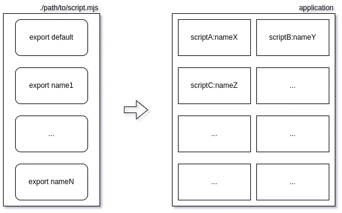

# ES6 `export` as code `brick`

---

What is a software `brick` in modern ES2015+ applications? Variable, function, class, module? My answer is `export`.
Currently, we place our JavaScript code into ES6-modules (files) and bind modules with each other using the `import`
statement:

```javascript
import {export1, export2} from "module-name";
```

So, every `export` is a minimal code object which can be used by developers in complex programs (applications).

---

## Script Files

Generally, all code is placed into separate files — `script files` in JavaScript. This post focuses on the modern
ES2015+ (ES6) approach, so these script files are called ES6-modules. Unlike Java, an ES6-module can contain more than
one class (function, object, etc.) in a single file. The JS engine executes every ES6-module on `import` and saves the
results in the module’s scope. Other ES6-modules can access these results if they
are [exported](https://developer.mozilla.org/en-US/docs/Web/JavaScript/Reference/Statements/export) by the module:

```javascript
// module 'cube.mjs'
export default function cube(x) {
    return x * x * x;
}
```

But first, we need to know the path to the script file in our application. Only then can we address any `export` from
outside code:

```javascript
// module 'main.mjs'
import cube from './cube.mjs';

const y = cube(2); // 8
```

Paths to script files can be absolute or relative:

```javascript
// absolute
import cube from '/home/alex/cube.mjs'; // for server-side
import cube from 'https://domain.com/cube.mjs'; // for browser
  ```

```javascript
// relative
import cube from './cube.mjs'; // both for server & browser
  ```

For server-side (Node.js), you can also use package-style imports:

```javascript
import cube from '@vendor/package/path/to/cube.mjs';
```

However, relative paths must always begin with `./`:

```javascript
import cube from 'cube.mjs'; // failure
```

Error example from Chrome browser:

```
Relative references must start with either "/", "./", or "../".
```

---

## The First `import` Execution

All code inside an ES6-module runs just once — on the first `import` of the module. The resulting `exports` are then
used to bind this module's code with other modules.

---

## Module Scope

An ES6-module can export a `hello` function that prints a hello message and saves the addressee (`to`) as the new
addresser (`from`):

```javascript
// ./sub.mjs
console.log(`es6-module is imported.`);
let from = 'module';

export function hello(to) {
    console.log(`Hello to ${to} from ${from}.`);
    from = to;
}
```

Even if imported multiple times, the string `"es6-module is imported."` will be printed just once:

```javascript
import {hello} from './sub.mjs';

hello('main');
hello('again');
```

Output:

```
es6-module is imported.
Hello to main from module.
Hello to again from main.
```

---

## Asynchronous Import

An ES6-module can also perform asynchronous operations and compose its `exports`:

```javascript
console.log(`es6-module is imported.`);
const init = new Promise((resolve) => {
    setTimeout(() => {
        function hello(to) {
            console.log(`Hello to ${to} from ${from}.`);
            from = to;
        }

        resolve(hello);
    }, 3000);
});
let from = 'module';

/** @type {function(to: string)} */
const hello = (await init);

console.log(`'hello' function is created.`);
export {hello}
```

Code execution will pause on the first `import` and wait for the asynchronous result:

```javascript
import {hello} from './async.mjs';

hello('main');
hello('again');
```

Output:

```
es6-module is imported.
'hello' function is created. // after 3 seconds
Hello to main from module.
Hello to again from main.
```

---

## `Zero` Export

It’s possible for an ES6-module to perform some useful work without exporting anything:

```javascript
function cleanUpFiles() {}

setInterval(() => {
    cleanUpFiles();
}, 60 * 1000);
```

In this case, you can still import the module:

```javascript
import './cleaner.mjs';
```

Even if imported multiple times, the cleanup function will only start once — on the first `import`.

---

## Summary

Every reusable component (`brick`) we use to build an application (`wall`) is an `export` in some ES6-module:



I imagine all available code fragments (classes, functions, objects) as exports of ES6-modules and can address every
fragment using the notation `Path_To_File.exportName`. I can do it in documentation for my apps and, more importantly, I
can do it in code of my apps. Typical class constructor in my own code:

```javascript
class Demo {
    constructor(spec) {
        /** @type {TeqFw_Core_Shared_Util_Cast.castInt|function} */
        const castInt = spec['TeqFw_Core_Shared_Util_Cast.castInt'];

        /** @type {TeqFw_Core_Shared_Util_Cast.castStr|function} */
        const castStr = spec['TeqFw_Core_Shared_Util_Cast.castStr'];
    }
}
```

This pure JavaScript example demonstrates my Dependency Injection container `@teqfw/di`, which helps compose complex
applications (`walls`) from individual exports (`bricks`).

---

I believe that JavaScript needs namespaces (as seen in other `serious` languages) to better organize exports. I hope to
write more about this in future posts.
