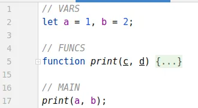

# Recursive structure of JS code

---

JavaScript is a very flexible programming language, so every JS developer should have some rules to organize their own
code to be successful. In this post, I describe my own very simple rules that I use to structure my code. This is not an
action guide, but rather a systematization of my observations.

---

## npm-package

Packages are top-level `bricks` of any large enough JS project, but package-level code is out of the scope of this post.
It is JSON code rather than JS code.

---

## ES6 module

An ES6-module is a building block for npm-packages. JS does not restrict how many code elements (constants, variables,
functions, …) can be placed in one ES6-module. I distinguish the following code areas at the module level:

- **IMPORT**: all import statements.
- **VARS**: variables and constants.
- **FUNCS**: all functions.
- **CLASSES**: all classes.
- **MAIN**: any calculations on the module level.
- **EXPORT**: the stuff that the module exports.

### Example:

```javascript
// IMPORT
import {link} from "node:fs";

// VARS
const PI = 3.14;
let r, l, s;

// FUNCS
function print(msg) {}

// CLASSES
class Printer {}

// MAIN
r = 4;
l = 2 * PI * r;
s = PI * r * r;

// EXPORT
export {r, l, s, print, Printer}
```

Two areas are specific for ES6-modules only:

- **IMPORT**
- **EXPORT**

Other areas are common areas, and they can be used in any scope (module, function, statement). For example:

```javascript
// VARS
let a, b;

// MAIN
if (a === b) {
// CLASSES
    class Printer {
        out(data) {
            console.log(data);
        }
    }

// MAIN
    const p = new Printer();
    p.out('Hello World!');
}
```

Nonetheless, I exclude the **CLASSES** area from common areas and use it on the module level only — I don’t use classes
inside other classes, functions, or statement scopes in my code.

---

## Scope

These 3 areas can be used in any scope (module, function, statement):

- **VARS**
- **FUNCS**
- **MAIN**

I use this order because it is convenient for me. I prefer to know what stuff (vars, const, funcs) can be used in
calculations (**MAIN**). There is a feature
called [hoisting](https://developer.mozilla.org/en-US/docs/Glossary/Hoisting) in JS — all declarations in scope will be
available in this scope regardless of declaration’s place, so I just use a natural order here.

Since every scope can contain nested scopes, we have recursion for JS code structure for these 3 areas:

```javascript
// VARS
let a = 1, b = 2;

// FUNCS
function print(c, d) {
// VARS
    let x, y;

// FUNCS
    const norm = (z) => `${z}`.padStart(2, '0');

// MAIN
    x = norm(c);
    y = norm(d);
    console.log(`first: ${x}; second: ${y}`);
}

// MAIN
print(a, b);
```

---

## Resume

In my opinion, the same structure for the code in the project helps the developer understand code faster and better.
Short comments with names of the areas in large scripts make the developer more efficient (especially in large scripts
with nested scopes).

