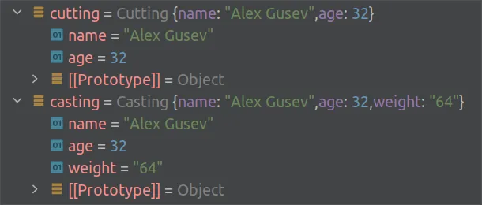

## DTO in JavaScript

Information systems are designed to process data, and
DTO ([Data Transfer Object](https://en.wikipedia.org/wiki/Data_transfer_object)) is an important concept in modern
development. In the “_classical_” sense, DTOs are simple objects (without logic) that describe data structures that are
transferred “_over the network_” between remote processes. If data is transferred between application layers within the
same process, then such DTOs are called _[local DTOs](https://martinfowler.com/bliki/LocalDTO.html)_.

The key objectives of a DTO are:

- **Data structuring**: making it easier for the application developers to work with.
- **Data transformation**: transform the data from the format used for transfer (e.g., JSON, XML, YAML) into the
  internal format used by the application (e.g., JavaScript Object).

Here, I will outline the principles I follow when building DTOs in my JavaScript applications.

---

## Simple DTO

In a simple case, the DTO is a flat structure where each attribute is
a [primitive](https://developer.mozilla.org/en-US/docs/Glossary/Primitive) data type, such as a string or integer:

   ```javascript
   class Simple {
    /** @type {boolean} */
    aBool;

    /** @type {number} */
    aNumber;

    /** @type {string} */
    aString;
}
   ```

It’s about data structuring (the first objective). The second objective is data transformation. We need to be able to
parse some input `data` and convert it into our structure while casting data types:

   ```javascript
   class Simple {
    constructor(data) {
        this.aBool = Boolean(data?.aBool);
        this.aNumber = Number.parseFloat(data?.aNumber);
        this.aString = String(data?.aString);
    }
}
   ```

---

## Complex DTO

A complex DTO consists of other DTOs (complex and simple) and primitives:

   ```javascript
   class Complex {
    /** @type {Simple} */
    aDto;

    /** @type {string} */
    aString;

    constructor(data) {
        this.aDto = new Simple(data?.aDto);
        this.aString = String(data?.aString);
    }
}
   ```

‘_JSON-to-DTO_’ transformation in this case looks like this:

   ```javascript
   const dto = new Complex({
    aDto: {
        aBool: true,
        aNumber: 16,
        aString: 'simple',
    },
    aString: 'complex',
});
   ```

---

## Waterfall Type Casting

For waterfall casting of types in complex objects, we need to connect the code sources with import-export:

   ```javascript
   // simple.mjs
export default class Simple {}

// complex.mjs
import Simple from './simple.mjs';

export default class Complex {}
   ```

This approach helps manage the complexity of nested DTOs. Each DTO handles its own data parsing and type casting,
allowing us to divide responsibilities among independent modules. By connecting the sources, we ensure that any changes
in one component (e.g., `Simple`) don’t disrupt the overall structure of the application.

---

## Cutting vs. Casting

Let’s say we have JSON data:

   ```json
   {
  "name": "Alex Gusev",
  "age": "32",
  "weight": "64"
}
   ```

And a DTO for this data:

   ```javascript
   class Person {
    /** @type {string} */
    name;

    /** @type {number} */
    age;
}
   ```

In general, we may receive data that differs from what we are prepared to process. In such cases, there are two ways to
convert the data to a DTO:

### Strategy 1: Cutting Off Extra Data

   ```javascript
   class Person {
    constructor(data) {
        this.name = String(data?.name);
        this.age = Number.parseInt(data?.age);
    }
}
   ```

### Strategy 2: Casting Types for Known Attributes

   ```javascript
   class Person {
    constructor(data) {
        Object.assign(this, data);
        this.name = String(data?.name);
        this.age = Number.parseInt(data?.age);
    }
}
   ```

Here is the result for both cases:



If our code is the final DTO handler, it is better to eliminate any unnecessary data. If it is an intermediate handler,
it is better to handle the casting of data types that we directly interact with and leave any unfamiliar data unchanged.

---

## Resume

- DTO is a simple object that describes the data structure being transferred between remote processes or application
  layers.
- The main goals of a DTO are data organization and type casting.
- DTOs can have nested structures, making them capable of forming complex structures.
- In input data conversion to a DTO, data can either be cut off or have its types casted for known properties.

---
