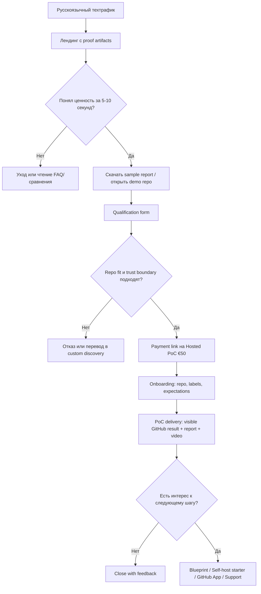
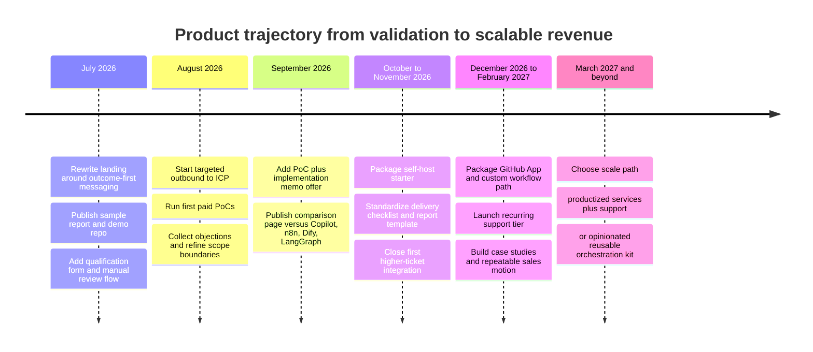

# Продвижение и траектория бизнеса для PoC for agent orchestration positioning

## Executive summary

Текущая идея сильна не как самостоятельный micro-SaaS, а как **платный validation wedge**: ты продаёшь не “ещё одного агента”, а быстрый и ограниченный способ проверить на своём репозитории, нужен ли вообще паттерн event-driven agent orchestration. Это особенно важно, потому что крупные игроки уже продают либо сами agent runtimes и orchestration primitives, либо GitHub-native coding agents, либо визуальные workflow builders; значит, твоя выгодная позиция — не “мы тоже orchestrate agents”, а “мы даём дешёвую, наблюдаемую и vendor-conscious проверку до build/buy/self-host решения”. citeturn7view3turn8view1turn8view2turn8view0turn7view4

Для такой категории продукта нужен не классический SaaS funnel, а **trust funnel для технического покупателя**: evidence-first лендинг, public artifact вместо абстрактного lead magnet, короткая qualification, маленький платный вход, затем blueprint/self-host/custom integration. Это согласуется и с логикой developer-tools GTM: self-service снижает трение, технический buyer лучше реагирует на конкретную ценность, а usage-based/product usage signals сильнее обычных marketing leads. citeturn8view6turn8view8turn8view10turn8view11

Цена входа около €50 разумна как фильтр, но почти наверняка слаба как unit-economics продукт. Экономика появится только если PoC станет механизмом отбора и конверсии в более дорогие предложения: implementation blueprint, self-host starter, GitHub App/custom workflow, recurring support. Для AI/agent products это естественно: рынок всё чаще платит за выполненную работу и измеримый результат, а не только за доступ к tool. citeturn8view7turn8view9

Ниже — практическая схема: как переписать лендинг, построить воронку, ввести методику оценки усилий, упаковать deliverables и превратить первые 1–3 платных PoC в правильную траекторию бизнеса.

## Стратегический диагноз

Твой продукт по сути находится между тремя категориями. Первая — frameworks и infra для orchestration, где покупателю продают capability layer: state, durable execution, routing, deployment, observability. Вторая — hosted workflow builders, где продают сборку приложений и workflow через визуальный canvas или low-code abstraction. Третья — GitHub-native coding agents, где пользователь делегирует задачу агенту прямо из GitHub, issue, dashboard или automations. citeturn7view3turn6search12turn8view0turn7view4turn8view1turn8view2

Из этого следует жёсткий вывод: твой продукт нельзя подавать как “инструмент для AI orchestration” в общем виде. В этой рамке тебя мгновенно сравнят с LangGraph, Dify, n8n и GitHub Copilot Agents, и ты проиграешь по масштабу, узнаваемости и широте возможностей. LangGraph прямо продаёт durable execution и human-in-the-loop; Dify продаёт production-ready agentic workflows, RAG и observability; n8n продаёт AI agents and workflows “you can see and control”; GitHub уже даёт cloud agent, custom agents и старт с issues/dashboard/automations. citeturn7view3turn0search1turn8view0turn7view4turn8view1turn8view2

Значит, твоя категория должна звучать иначе: **paid proof-of-work for repository-level orchestration evaluation**. Не “tool”, а “bounded paid experiment”. Не “AI agent”, а “observable event loop on your repo”. Не “автоматизация разработки”, а “сначала проверь, нужен ли тебе этот orchestration pattern, прежде чем тратить дни на webhooks, runner’ы, keys, sandboxing и safety limits”.

Финансово продукт имеет смысл только как ступенька. Если на PoC уходит хотя бы 2–4 часа человеческого времени, то €50 почти не оставляет маржи ещё до инфраструктурных и inference costs. Но как entry price он полезен: он отсеивает праздное любопытство, создаёт product usage signal и превращает лид в PQL по сути, а не по маркетинговой декларации. OpenView отдельно подчёркивает, что product-qualified signals конвертируют лучше обычных MQL, а Bessemer рекомендует для AI pricing мыслить outcome’ами, а не только доступом. citeturn8view10turn8view7

Практический вывод: целевая траектория бизнеса должна быть такой. Сначала — 1–3 платных PoC ради learning loop. Затем — packaging вокруг “what should we build next?”. Потом — два денежных пути: проектный integration path и лёгкий recurring support. Если этого не сделать, продукт останется умной, но маломаржинальной услугой.

## Позиционирование против конкурентов

Главная задача сообщения — не спорить с конкурентами на их поле, а использовать их существование как фон, на котором твой offer выглядит более безопасным и быстрым первым шагом.

### Как формулировать отличие

Лучшее ядро сообщения выглядит так:

> **Не ещё один framework и не ещё один coding agent.  
> Это маленький платный тест на твоём GitHub-репозитории, который показывает, нужен ли тебе вообще event-driven agent orchestration — до того, как ты будешь строить или покупать инфраструктуру.**

Эта формулировка работает по четырём причинам. Во-первых, она снимает ложное ожидание “полной автоматизации”. Во-вторых, она подчёркивает реальный объект продажи: решение об investment, а не сам runtime. В-третьих, она защищает тебя от прямого сравнения по feature matrix. В-четвёртых, она делает €50 логичным: это цена не за “агента”, а за быстрый технический ответ на вопрос “стоит ли это развивать у меня”. Логика “focus on value, not features” для onboarding и self-service здесь особенно релевантна. citeturn8view8turn8view6

### Таблица конкурентных предложений и позиционирования

| Игрок | Что на самом деле продаёт | Как выглядит вход | Где твой зазор | Как эксплуатировать это в сообщении |
|---|---|---|---|---|
| **LangGraph / LangSmith Deployment** | Orchestration primitives и production infra: durable execution, streaming, human-in-the-loop, deployment infrastructure для long-running agent workloads. citeturn7view3turn6search12turn7view6 | Framework/infrastructure mindset; deployment runs billed separately; enterprise path кастомный. citeturn7view6turn6search0 | Слишком “build-first” для ICP, который сначала хочет понять, стоит ли вообще собирать эту систему. | “Не строй orchestration stack вслепую. Сначала проверь паттерн на своём репозитории.” |
| **Dify** | Platform для production AI apps: workflows, chatflows, RAG, integrations, observability; визуальный canvas, self-host через Docker. citeturn4search0turn8view0turn7view5 | Cloud entry ~ $59/мес Professional; self-host доступен, но это уже platform adoption. citeturn1search2turn7view2turn7view5 | Это builder/platform decision, а не дешёвый repo-specific validation. | “Тебе пока не нужен ещё один platform decision. Тебе нужен ответ, имеет ли смысл orchestration именно для твоего GitHub workflow.” |
| **n8n** | AI workflow automation platform; workflows “you can see and control”; cloud и self-hosted Community Edition. citeturn7view4turn4search10 | От €20/мес Starter и €50/мес Pro; self-host community edition free. citeturn7view1turn4search10 | n8n хорош как general workflow engine, но покупатель всё равно должен сам проектировать смысл и boundary-логику под свой repo. | “Не начинай с универсального workflow engine, если ещё не доказал, какой repo-event loop тебе вообще нужен.” |
| **GitHub Copilot Cloud Agent** | GitHub-native coding agent platform: issues, agents tab, dashboard, automations, custom agents, PR path, paid plans. citeturn8view1turn8view2turn7view0 | Pro $10/мес, Pro+ $39/мес; usage-based billing по AI Credits с июня 2026. citeturn7view0turn9view0 | GitHub продаёт “агента в GitHub”, но не твой vendor-neutral evaluation path, не твой explicit report, и не твой self-host/custom workflow next step. | “Если тебе хватает GitHub-native agent — отлично. Если ты хочешь понять orchestration boundary, observability и self-host path до серьёзной интеграции — наш PoC закрывает именно это.” |

Практически это означает следующее. На лендинге тебе не нужно длинно сравнивать features. Достаточно одной честной секции “Почему не просто Copilot / n8n / Dify / LangGraph?”, где ответ будет не defensive, а рамочный: **“потому что ты пока не выбираешь платформу — ты выбираешь, строить ли вообще этот класс workflow для своего repo.”**

## Лендинг и предложение

### Что сейчас должно стать первым экраном

Первый экран должен продавать не agent orchestration как тему, а **измеримый результат на репозитории**. Технические buyers приходят не за идеологией, а за сокращением времени на decision-making и setup. Heavybit пишет, что результативный devtools content выигрывает, когда отвечает на реальные вопросы рынка, а Pendo отдельно подчёркивает: лучше вести пользователя к value, чем устраивать feature tour. citeturn8view11turn8view8

Рекомендуемый основной вариант hero:

**Заголовок**  
**Проверь event-driven agent orchestration на своём GitHub-репозитории за €50**

**Подзаголовок**  
GitHub issue → bounded agent run → labels, короткий brief и run report. Небольшой hosted PoC, чтобы понять, нужен ли тебе этот паттерн до self-hosted и custom integration.

**Primary CTA**  
**Запросить hosted PoC — €50**

**Secondary CTA**  
**Нужен сразу self-hosted или custom path?**

**Microcopy под CTA**  
Подходит для technical founders, lead devs, maintainers и маленьких dev-команд с GitHub-репозиториями.

Альтернативный, ещё более жёсткий вариант:

**Не строй агентную инфраструктуру вслепую**  
Сначала посмотри, как GitHub event запускает bounded agent loop и возвращает наблюдаемый результат обратно в GitHub.

Этот вариант сильнее бьёт по боли и лучше отстраивает тебя от framework/platform messaging.

### Какие секции должны идти после hero

Порядок секций стоит сделать таким, чтобы каждая следующая снимала одно конкретное возражение.

| Секция | Что должна доказать | Приоритет | Ресурс | Ожидаемый эффект |
|---|---|---:|---:|---|
| Hero с outcome-first copy | Это не “AI вообще”, а конкретный repo experiment | high | 4–6 ч | +30–70% к пониманию offer на первом экране; вероятный рост CTA click-through за счёт снижения когнитивного трения |
| Visual chain `event → agent run → observable GitHub result → report` | Продукт понятен за 5 секунд | high | 3–5 ч | +20–40% к scroll depth и section-to-section progression |
| “Что ты увидишь в GitHub” со скриншотом/GIF | Есть реальное evidence, а не обещание | high | 6–10 ч | +25–50% к доверию и form-start rate |
| “Что входит за €50” | Цена перестаёт казаться абстрактной | high | 2–3 ч | +15–30% к CTA-to-form-start |
| “Что не входит” | Снижение ложных ожиданий и waste leads | high | 2–3 ч | -20–40% нецелевых заявок; выше qualification rate |
| “Почему не Copilot / n8n / Dify / LangGraph” | Убирает неправильное сравнение | medium | 4–6 ч | +10–25% к qualified lead rate |
| “Access & safety boundary” | Для тех-аудитории это trust signal, а не legal appendix | high | 2–4 ч | +10–20% к конверсии в private/test repo conversations |
| FAQ | Отрабатывает возражения без ручного пресейла | medium | 3–4 ч | +10–20% к form submit rate |

Ниже — рабочая структура текста секций.

**Почему этот PoC существует**  
Не повторять “мы любим AI-agents”. Писать в логике: “ты и сам можешь это собрать, но не хочешь тратить дни на webhooks, runner’ы, prompts, LLM keys, logs и safety limits, прежде чем понять, нужен ли этот паттерн”.

**Что ты реально увидишь**  
Нужен конкретный proof strip:  
`GitHub issue created` → `agent run started` → `label applied` → `short comment posted` → `report delivered`.

**Что входит за €50**  
Один repo, до 5 test issues, ограниченное число processed events, visible GitHub outputs, run evidence, короткий report. Это воспринимается как технический experiment, а не “маленький consulting package”.

**Чего здесь нет**  
No bug fixing, no PR creation, no code changes, no unlimited hosting, no SLA. Эта секция не ослабляет предложение, а повышает доверие: GitHub buyer всё равно быстро увидит подвох, если ты это не назовёшь прямо.

### Лучший lead magnet для этого ICP

Тебе не нужен обычный PDF-свинец в стиле “10 трендов агентного ИИ”. Для developer audience сильнее работают **артефакты**, а не общие е-книги. Heavybit советует строить technical content вокруг лучших ответов на реальные вопросы; значит, лучший magnet — это не теоретический док, а proof artifact. citeturn8view11turn8view5

Рекомендую такую связку:

| Артефакт | Роль | Приоритет | Ресурс | Ожидаемый эффект |
|---|---|---:|---:|---|
| **Public demo repo** с упрощённым сценарием | Главное доказательство, что цепочка реальна | high | 8–16 ч | сильнейший trust signal; может удвоить долю “серьёзных” лидов по сравнению с текстовым лендингом |
| **Sanitized sample report** | Показывает, что покупатель получит после PoC | high | 4–6 ч | +20–40% к решению “да, это стоит €50” |
| **Repo-fit checklist** | Самоквалификация до контакта | high | 2–4 ч | -20–35% нерелевантных заявок; +10–25% qualified lead rate |
| **Короткое 3–5 мин demo video** | Быстро объясняет смысл без созвона | high | 6–10 ч | +20–50% к конверсии из тёплого трафика |
| **Статья “Когда тебе не нужен этот PoC”** | Trust-building через честное отсеивание | medium | 4–6 ч | рост доверия; меньше пустых диалогов |

Если выбирать только один артефакт, делай **sample report + reproducible demo repo**. Это самая сильная комбинация для твоей аудитории.

## Воронка, квалификация и операционная оценка

### Воронка продаж

Для твоего масштаба и текущей архитектуры лучше всего работает **manual-first funnel**. Это соответствует и твоему текущему bounded approach: без тяжёлой CRM, без третьесторонних трекеров, без иллюзии масштабируемости до того, как подтверждён спрос. Self-service важен, но не в форме free trial; в твоём случае self-service — это ясный landing, public artifact, repo-fit checklist и очень короткий qualification flow. citeturn8view6turn8view10turn8view8

Смысл этой воронки в том, что платёж идёт **после qualification**, а не сразу. Это снижает refund/friction risk и одновременно сохраняет €50 как intent filter.

### Qualification flow и onboarding

Рекомендую такой порядок формы и последующего ручного маршрута.

| Шаг | Что спрашивать | Приоритет | Ресурс | Ожидаемый эффект |
|---|---|---:|---:|---|
| Qualification form | Repo URL, public/private/test, use case, кто будет создавать test issues, что считается полезным результатом | high | 3–5 ч | даёт критерии accept/redirect без созвона |
| Manual review | 5–10 минут на проверку repo fit и trust boundary | high | 1–2 ч на лид | удерживает PoC в bounded scope |
| Payment request | Только qualified leads получают платёжную ссылку | high | 1–2 ч setup | снижает случайные оплаты и плохие ожидания |
| Onboarding email | Что будет происходить, какие доступы нужны, что не вставлять, как создавать test issues | high | 3–4 ч на шаблоны | меньше operational noise |
| Delivery email | report + demo video + next-step options | high | 2–3 ч на шаблоны | выше upsell readiness |

### Email sequence

Даже при ручной модели нужны короткие шаблоны. Pendo рекомендует “meet users where they are” и строить onboarding вокруг value, а не feature overload; это очень подходит к короткой серии технических писем. citeturn8view8

| Письмо | Когда | Содержание | Приоритет | Ресурс | Ожидаемый эффект |
|---|---|---|---:|---:|---|
| Confirm + qualify | сразу после формы | Спасибо, что запрашиваешь PoC; вот что проверим перед запуском | high | 1–2 ч | ускоряет первую реакцию |
| Accepted + payment | после ревью | Подходит/не подходит; ссылка на оплату; кратко scope | high | 1–2 ч | повышает pay rate среди qualified leads |
| Kickoff | после оплаты | Что нужно от тебя, как создавать issues, какие limits | high | 1–2 ч | снижает ошибки в доставке |
| Delivery | после PoC | report, video, screenshot, 3 варианта next step | high | 2–3 ч | основной trigger на upsell |
| Follow-up | через 5–7 дней | Что из увиденного оказалось полезным? нужен blueprint/self-host/custom? | medium | 1–2 ч | +10–25% к upsell conversations |

### Pricing tiers

Точные upsell prices у тебя **не указаны**, поэтому здесь лучше не делать вид, что “идеальная цена” уже известна. Нужно предложить ступени, которые понятны по результату.

| Пакет | Что продаётся | Цена | Комментарий |
|---|---|---:|---|
| **Hosted PoC** | bounded test на одном repo | **€50** | текущий filter и entry product |
| **PoC + implementation memo** | PoC плюс короткий blueprint “что строить дальше и почему” | **вариант: €150–290** | хороший bridge между тестом и проектом |
| **Self-host starter** | установка/настройка базового self-host path под один workflow | **не указано; вариант: €900–1,500** | первая реальная монетизация |
| **Custom workflow / GitHub App path** | кастомная интеграция, labels/routing/rules, возможно app-level оформление | **не указано; вариант: €2,500–6,000+** | проектный revenue tier |
| **Recurring support** | наблюдение, корректировки prompts/rules, мелкие улучшения, monthly review | **не указано; вариант: €150–600/мес** | база для повторяемой выручки |

Логика тут такая: €50 продаёт decision signal, а не внедрение. Developer-tool pricing лучше всего заходит, когда buyer видит рост продуктивности или снижение waste. Heavybit подчёркивает, что productivity — главный мотиватор для покупки dev tools, поэтому и upsell надо привязывать к скорости, контролю и сокращению лишней инженерной работы. citeturn8view9

### Шаблон оценки усилий

Ниже — рекомендованный scorecard, который надо использовать до принятия каждого PoC.

| Проверка | Что именно оценивать | Time estimate | Gating criteria | Если не проходит |
|---|---|---:|---|---|
| Repo fit | Есть ли реальный GitHub repo и понятный issue flow | 0.25–0.5 ч | repo существует; issue workflow понятен; buyer готов создать test issues | отказ или перевод в discovery |
| Trust boundary | public / private / test repo; чувствительность данных | 0.25 ч | private repo допускается только при явном согласии и узком доступе | предложить test/public repo |
| Use-case clarity | Что должен делать агент в первом сценарии | 0.25–0.5 ч | один узкий сценарий, не “автоматизируй всё” | сузить scope или отказ |
| Expected result | Какие labels/comments/report buyer считает полезными | 0.25–0.5 ч | buyer может описать “полезный observable output” | запросить уточнение асинхронно письмом |
| Label rules | Decision labels и правила их выдачи | 0.5–1 ч | не больше 3–5 decision states | упрощение taxonomy |
| Prompt baseline | Базовый prompt/template и boundaries | 0.5–1 ч | no code-writing, no unsafe access, no vague tasks | правка шаблона |
| Runtime limits | token/runtime caps, concurrency, issue/event limits | 0.25–0.5 ч | caps заданы и понятны buyer’у | без этого PoC не запускать |
| Observability/reporting | Что попадёт в report и какие logs можно показать | 0.5–1 ч | report template определён, sanitized logs возможны | сузить deliverables |
| Smoke test | 1–2 тестовых прогона на control issues | 0.5–1.5 ч | базовый loop работает end-to-end | чинить до клиента |
| Delivery prep | финальный report, screenshots, video clip | 0.75–1.5 ч | все артефакты готовы до отправки | не отправлять “сырое” |

**Итоговая оценка:**  
Лёгкий PoC: **3–5 часов**  
Средний PoC: **5–8 часов**  
Если выходит за **8 часов**, это уже не entry PoC, а либо discovery, либо upsell-проект.

Жёсткое правило: **не принимать в €50 PoC всё, что требует custom coding, сложной taxonomy, нестандартного доступа, buyer-provided keys, multi-repo scope или ожидания PR/code changes.**

## Упаковка PoC, апсейлы и roadmap

### Что должно входить в deliverables

Сейчас твой deliverable должен быть оформлен так, чтобы он одновременно закрывал PoC и подготавливал upsell. То есть покупатель не просто получает “мы что-то попробовали”, а получает **decision package**.

Рекомендованный комплект:

| Deliverable | Что внутри | Приоритет | Ресурс | Ожидаемый эффект |
|---|---|---:|---:|---|
| Visible GitHub outcome | labels + short issue brief/comment | high | already in product | базовое доказательство value |
| Run report | status, runtime, token/inference summary, sanitized logs, prompt/template version, examples of accepted/rejected events | high | 4–6 ч на шаблон, потом 20–40 мин на клиента | повышает доверие и создаёт основу для upsell |
| Demo video | 3–5 минут: issue → run → result → report → next-step interpretation | high | 6–10 ч setup, потом 15–30 мин на запись | +20–40% к конверсии в следующий разговор |
| Reproducible repo | минимальный публичный demo repo со sample issues и expected outputs | high | 10–20 ч | strongest proof asset для новых лидов |
| Implementation memo | “Стоит / не стоит развивать дальше; если да — в каком направлении” | high | 30–60 мин на клиента | переводит PoC в platform/service decision |

### Шаблон report

Рекомендую фиксированный report template:

1. **Context** — какой repo, какой use case, какие ограничения.  
2. **Configured loop** — какие events приняты, какие ignored/blocked.  
3. **Observable outputs** — labels, briefs, comments.  
4. **Run evidence** — runtime, token usage, session count, log excerpts.  
5. **Failure modes** — где агент неуверен, где rules надо ужесточить.  
6. **Decision** — полезен ли паттерн для этого repo.  
7. **Next step options** — stop / repeat / blueprint / self-host starter / custom integration.

Это очень важно: report должен отвечать не на вопрос “что сделал агент?”, а на вопрос **“что нам теперь делать с этим наблюдением?”**

### Business trajectory

Ниже — правильная траектория, если цель не просто продать несколько микросделок, а вырастить устойчивую линейку.

### Таблица roadmap с задачами, сроками и приоритетами

| Задача | Срок | Приоритет | Ресурс | Ожидаемый эффект |
|---|---|---:|---:|---|
| Переписать hero и первый экран | 1 неделя | high | 8–12 ч | рост ясности и CTA |
| Сделать sample report | 1 неделя | high | 4–6 ч | повышает доверие к €50 offer |
| Подготовить sanitized demo repo | 1–2 недели | high | 10–20 ч | главный proof asset |
| Ввести qualification scorecard | 3–5 дней | high | 3–5 ч | меньше waste leads |
| Настроить manual email sequence | 3–5 дней | high | 3–4 ч | меньше friction между form и оплатой |
| Провести первые 1–3 paid PoCs | 4–8 недель | high | 1–2 дня на клиента | реальная валидация offer |
| Добавить PoC + implementation memo | 4–6 недель | high | 4–8 ч packaging | лучший bridge в upsell |
| Упаковать self-host starter | 6–10 недель | high | 20–40 ч | первый существенный revenue tier |
| Подготовить comparison content | 4–6 недель | medium | 6–10 ч | снимает competitive confusion |
| Оформить GitHub App/custom workflow path | 2–4 месяца | medium | 40–80 ч | проектный revenue и differentiation |
| Ввести recurring support | после 2–3 внедрений | medium | 6–10 ч packaging | появление повторяемой выручки |
| Решить, нужен ли продуктовый scale path | после 5–10 клиентов | low | стратегическая работа | защита от преждевременного productization |

### Что считать MVP, v1 и scale

**MVP** — не кодовая зрелость, а способность продать 1–3 bounded PoC и получить повторяющиеся возражения.  
**v1** — когда есть repeatable packaging: landing, demo repo, report template, qualification, implementation memo, self-host starter.  
**Scale** — не обязательно SaaS. Реалистичнее два пути:  
либо **productized service** для repo owners,  
либо **opinionated orchestration kit** после накопления достаточного числа одинаковых сценариев.

До этого момента не стоит пытаться строить full platform. Крупные игроки уже заняли platform layer. Твоя сила сейчас — velocity, specificity и trust.

## Каналы и KPI

### Каналы

Для первых 1–3 платных PoC тебе не нужен широкий marketing mix. Нужны несколько каналов, которые дают **качественный intent**, а не много шума. Для developer-first audience хороший контент работает, когда отвечает на реальные вопросы и даёт артефакты, а не общие обещания. citeturn8view11turn8view5

| Канал | Как использовать | Приоритет | Ресурс | Ожидаемый эффект |
|---|---|---:|---:|---|
| **Собственный лендинг** | основной conversion surface | high | 1–2 недели | база всей воронки |
| **GitHub demo repo** | proof asset, который можно показывать везде | high | 1–2 недели | самый сильный pre-sales evidence |
| **Адресный outreach** | founders, maintainers, lead devs из тёплой сети и релевантных open-source/indie circles | high | 4–8 ч/нед | самый быстрый путь к первым оплатам |
| **Техническая статья** | “Когда нужен bounded orchestration PoC, а когда нет” | high | 6–10 ч | создаёт квалифицированный контентный трафик |
| **Русскоязычные dev-площадки** | Habr/Telegram/комьюнити-посты вокруг workflow, GitHub, coding agents | medium | 4–8 ч/канал | хорошие тесты message-market fit в русскоязычном контексте |
| **Сравнительный контент** | Copilot vs custom orchestration, n8n vs repo-specific loop, Dify vs evaluation path | medium | 6–12 ч | помогает тёплому трафику понять твой wedge |
| **Партнёры** | DevOps/consulting/agency с клиентами, у которых есть GitHub repos и AI curiosity | medium | 1–2 дня setup | медленнее, но может давать лучшие проекты |

На старте я бы не тратил время на широкую платную рекламу. Для очень узкого ICP и большой зависимости от trust/evidence это почти всегда преждевременно.

### KPI

Ниже — не отраслевые нормы, а **рабочие стартовые цели** для твоего типа funnel и узкой ICP.

| Метрика | Стартовая цель | Что означает |
|---|---:|---|
| Hero CTA click-through | 8–15% | лендинг понятен и offer не выглядит расплывчато |
| Form start rate | 4–8% от всех сессий | посетитель увидел enough value, чтобы начать qualification |
| Form completion | 50–70% от начавших | форма не перегружена |
| Qualified leads | 40–60% от заявок | нормальная фильтрация без чрезмерного шума |
| Paid PoC conversion | 20–40% от qualified leads | предложение и price filter работают |
| Delivery-to-upsell conversation | 30–60% | deliverables действительно открывают следующий шаг |
| Upsell close rate | 15–30% от delivery conversations | packaging следующего уровня жизнеспособен |

С точки зрения бизнеса цель первых 8–12 недель должна быть такой:  
**не “максимум лидов”, а “3 платных PoC, 1–2 сильных кейса, 1 первый апсейл”.**

### Что я бы сделал первым

Если сжать всё до короткого порядка действий, то приоритет такой:

| Что сделать | Приоритет | Ресурс | Почему это первое |
|---|---|---:|---|
| Переписать hero и первый экран под repo outcome | high | 1 день | без этого весь traffic перерабатывается плохо |
| Сделать sample report | high | 0.5–1 день | это самый короткий путь к доверию |
| Подготовить demo repo / walkthrough | high | 1–2 дня | лучше тысячи слов объясняет, что ты продаёшь |
| Ввести qualification scorecard | high | 0.5 дня | защищает unit economics |
| Запустить 20–40 адресных outreach attempts по ICP | high | 1 неделя | для первых продаж это эффективнее SEO/ads |
| После 1–3 PoC упаковать implementation memo и self-host starter | high | 1–2 недели | здесь начинается реальная экономика |

Главный стратегический принцип такой: **тебе не нужно победить конкурентов по продукту. Тебе нужно стать самым дешёвым, честным и технически наглядным способом принять правильное build/buy/self-host решение на реальном GitHub-репозитории.** Именно это и есть твоя позиция. Она совместима и с твоим текущим €50 entry offer, и с дальнейшим ростом в blueprint, интеграции и recurring support. citeturn8view6turn8view7turn8view9turn8view10turn8view11