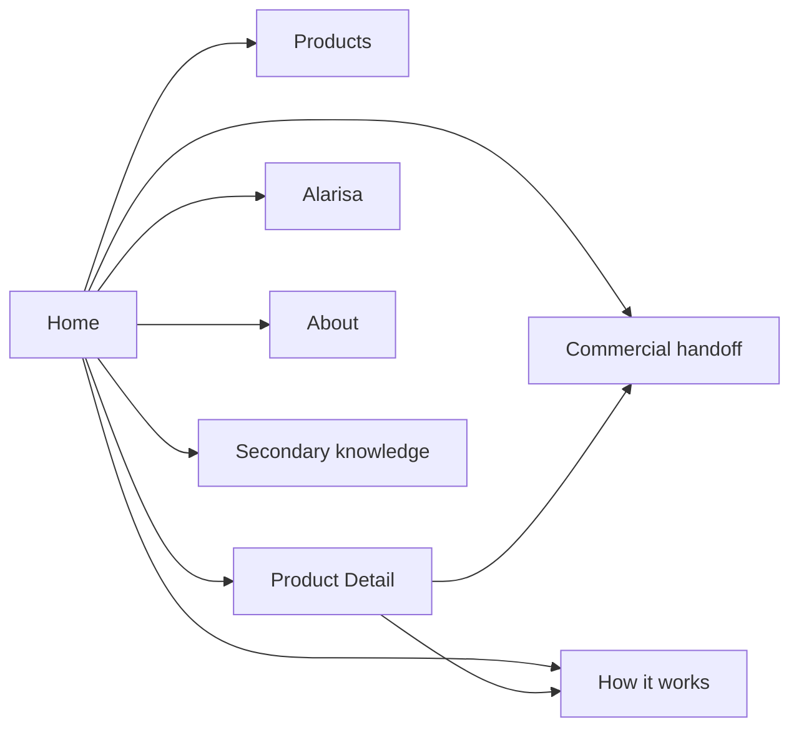

# Home Page Content Composition

- Path: `ctx/docs/product/home-page-composition.md`
- Template Version: `20260909`
- Changed: `20260909`

## Purpose

Define the accepted content architecture and semantic desktop and mobile wireframes for the redesigned wiredgeese.com Home page. This document makes Home concrete enough for a later English-copy task without approving final copy, translations, routes, components, CSS, media, or implementation.

## Authority And Boundary

This document refines the Home responsibility established in `information-architecture.md`. Where the current Home implementation differs, this document defines the target content composition and the implementation is legacy evidence only.

Home is a product-routing and commercial surface for software created by Alex Gusev. The public voice is Alex in the first person. Wired Geese is the brand under which Alex creates and offers the software; it must not sound like a large anonymous company. AI and LLM agents are real production participants, while Alex remains the accountable human maker.

The document approves:

- the order and responsibility of Home content;
- the relative prominence of products, adaptation, production model, vision, maker, evidence, and commercial action;
- desktop and mobile attention priorities;
- a reusable Home product-preview model;
- the semantic destinations of Home actions.

The document does not approve:

- final headlines, product names, button wording, body copy, metadata, or translations;
- exact routes, anchors, query parameters, form fields, or contact mechanics;
- pixels, breakpoints, CSS, HTML, components, illustrations, animation, or final visual grouping;
- changes to source, templates, generated pages, runtime, deployment, or redirects.

Short phrases below are hierarchy placeholders only. They are not approved public copy.

## Current Home Critique

The current Home is visually coherent but commercially ordered as a personal engineering-services page. Its opening proposition, proof chips, process diagram, value situations, engagement formats, technical advantage, broad evidence, and final action progressively answer `why hire Alex as an engineer?`. They do not answer `what product can I use or buy now?`.

The desktop first viewport gives approximately half of its attention to an engineering-process panel. The mobile opening is more problematic: biography, two service-oriented actions, professional proof chips, and the complete process panel all appear before the next section. A current product is absent from the page entirely. The visual system can support the target, but the information hierarchy cannot be retained.

### Current Section Disposition

| Current Home area | Disposition | Target treatment |
| --- | --- | --- |
| Engineer-centred hero | Repurpose | Make a short first-person product-maker proposition for people working with AI agents. Replace project-hiring language with immediate product discovery. |
| Engineering-process panel | Relocate and release its opening attention | Move the full process explanation to How it works. On desktop, use the released attention to expose a real product or a direct product-discovery path before significant scrolling; placing a featured product beside the hero is a preferred hypothesis, not a required geometry. On mobile, place the first product immediately after the short hero. |
| `Where I create value` | Remove from Home | Replace generic uncertainty, execution, and leverage situations with current product outcomes. Useful engineering reasoning may support How it works but does not survive as a Home section. |
| `Ways to work together` | Remove and distribute | Do not retain a consultancy catalogue. Put product-specific setup and adaptation on product journeys, shared production and extension meaning in How it works, and qualified discussion in the commercial handoff. |
| `My unfair advantage` | Merge and separate by meaning | Put accountable making and compact production-model meaning in How-it-works preview, Alarisa in its vision preview, and TeqFW or ADSM only where they provide proportionate trust. Exclude discontinued GitHub Flows semantics. |
| Portfolio-style Evidence | Demote and curate | Keep only product-relevant proof and responsibility evidence on Home. Preserve Projects, Library, Journal, Books, and broader history through secondary and contextual discovery. |
| Generic final `Work with me` action | Repurpose | End with a product-led handoff for discussing a current product, adaptation, or a closely related need. |

No major current commercial section is kept unchanged. Existing typography, cards, spacing, two-column contrast, dark/light surfaces, and responsive primitives may be reused when they express the new hierarchy.

## Target Content Strategy

Home must communicate the commercial sequence:

`product-maker proposition -> current product -> possible adaptation -> trust in how it is made -> broader direction -> accountable maker and selected proof -> qualified commercial action`

The ordering rules are:

1. Buyer value and real products precede methodology, technical lineage, biography, vision depth, and archive evidence.
2. The page speaks in Alex's first-person voice and names Wired Geese as the brand, without simulating a larger organization.
3. The hero identifies the class of software Alex makes and the people it serves; it does not explain TeqFW, ADSM, PDE, MCP, deployment, credentials, career history, or the full Alarisa idea.
4. The current-products region is a collection even when it contains one item. Telegram is current content, not permanent page architecture.
5. Shared Files or another capability appears as a product only after it passes the catalogue-entry gate in `product-system.md`.
6. Adaptation starts from an existing product or reusable capability; it does not reopen a generic consultancy catalogue.
7. How it works, Alarisa, maker identity, and evidence each answer a different visitor question and must not be collapsed into one undifferentiated technology or biography section.
8. Deployment control and self-hosting are available deeper in the decision path but never dominate the opening proposition.
9. Home is structurally identical across English, Russian, and Spanish. Content regions must tolerate longer labels and sentences without relying on unusually short English copy.

## Brand And Voice Direction

The public voice is Alex speaking in the first person. Wired Geese names the practice and product brand; it does not replace Alex with an anonymous corporate `we`. The legal company name SIA F. Lancer has no Home commercial responsibility and appears only where legal or administrative context requires it.

Internally, the name Wired Geese echoes Wild Geese: hired specialists become networked digital workers or agents operating in the digital environment. This metaphor may inform personality, imagery, or a deeper brand explanation, but Home and its products must remain understandable without the history. The literal word `mercenary` is not a hero requirement and must not be forced into public copy.

## Reusable Product-Preview Model

Each Home product preview represents one catalogue-eligible product, not a raw Desk, capability, technology, vision, experiment, or offer phrase treated as a permanent product name.

### Mandatory Core

A Home preview normally contains only:

1. **Product identity** — the current approved public identity or a clearly controlled working label; internal names are omitted unless they help the buyer.
2. **Buyer result or problem solved** — one compact statement of the recognizable problem and useful result, with the result carrying more prominence than the enabling technology.
3. **Two or three practical capabilities** — a small selection of concrete things the product can do, not a complete specification.
4. **Product-path action** — an action to learn more or enter the relevant product path, normally Product Detail.

The semantic approximation is `identity -> result -> 2-3 capabilities -> action`. It is a content-responsibility check, not a sentence order or public-copy template.

### Conditional Elements

- **Maturity or status:** show it when maturity materially changes buyer expectations or the decision to continue. Experimental, Early access, Available for pilot, or In development may be relevant meanings. A mature product does not need a redundant Available badge merely because a preview pattern can display one. Catalogue eligibility and truthful action rules still apply.
- **Fit or non-fit:** include a short qualification only when it materially prevents misunderstanding. Detailed fit and non-fit belong primarily to Product Detail.
- **Proof:** include a proof cue only when the preview needs it to support credibility. Deeper evidence belongs on Product Detail, in the maker/evidence region, or at a relevant technical destination. Do not create decorative proof to fill a card. Dogfooding must not be presented as market validation.

An optional product-specific commercial action may appear only when it is useful and truthful. It remains secondary to understanding the product and must preserve originating product context when it reaches the shared handoff.

### Mobile Content Limit

On mobile, a product preview is primarily `discovery + relevance + routing`, not a complete product explanation. It must stay compact enough for the result to be understood quickly and for the product-path action to remain visible without excessive scrolling. Methodology, general trust detail, deployment detail, extensive qualification, and proof must not accumulate inside the preview; Product Detail owns that depth.

### Current Telegram Application

The current preview uses the early-stage product that lets ChatGPT or another compatible AI agent work with a buyer's Telegram resources. Its experimental or early-access maturity changes buyer expectations and therefore must remain visible when this product appears on Home. Its content may demonstrate reading conversations or channels, summarizing large streams, retrieving relevant history where supported, sending messages, preparing posts, multi-channel publishing, and multilingual publishing. The preview selects only the few capabilities that best explain the result.

`Connect your ChatGPT to your Telegram` remains the current offer meaning, not an automatically permanent product name or Home heading.

### Catalogue Scale Behavior

- **One product:** use one recognizable featured preview with enough room for the mandatory core and any decision-relevant maturity. Do not render empty cells, fake future products, decorative proof, or a grid that visually looks incomplete.
- **Two products:** present two recognizable previews using the same model. One may occupy the opening product position because of current commercial relevance, but both retain clear product identity and catalogue status; ordering does not follow PDE lineage.
- **Five or more products:** use the same preview object in an ordered responsive collection. Home may select the products most useful for broad routing and then lead to the complete Products catalogue; it must not create header items or technology-specific Home sections for the larger catalogue.
- **Any count:** a new product changes collection content and editorial ordering, not the surrounding Home sequence. A non-PDE product uses the same preview model.

The exact number of previews shown when the catalogue is large is a later editorial and interface decision. The semantic rule is that the selection visibly represents a family of current products and the complete catalogue remains one direct action away.

## Desktop Semantic Contract And Wireframe Hypothesis

The normative desktop requirement is about attention and understanding, not geometry. Before significant scrolling, the opening composition must make the core Wired Geese and Alex proposition discoverable together with at least one real current product or a very direct product-discovery path. The visitor must not pass through methodology, biography, Alarisa, or evidence before discovering products. Showing a compact hero beside a featured product is the current preferred design hypothesis because it may satisfy this requirement efficiently, but a future interface design may use another composition without reopening product strategy.

In the sections below, purpose, message priority, content responsibility, actions, and relationships are normative. Every `Layout hypothesis` is provisional, including column count, card placement, visual grouping, hero/product adjacency, and responsive mechanics.

### 0. Shared Header

- **Layout hypothesis:** full-width shared shell; inline primary navigation where space permits.
- **Purpose:** expose the stable commercial hierarchy before page content.
- **Primary message:** Wired Geese is the product brand; Alex is the accountable maker where subordinate attribution is useful.
- **Content type:** brand/Home link, Products, How it works, Alarisa, distinct commercial action, and EN/ES/RU locale control.
- **Main action:** Products is the first content destination in navigation.
- **Secondary action:** the shared commercial action remains visually distinct.
- **Supporting evidence:** none; the header is navigation, not a proof strip.
- **Relationship to next section:** the hero answers what Alex makes, while the opening composition exposes real product discovery without an explanatory detour.

### 1. Hero: Product-Maker Proposition

- **Layout hypothesis:** use a compact hero beside the first current-product preview on wide screens. Another composition is valid when it preserves the opening attention contract and does not let the hero delay product discovery.
- **Purpose:** identify what Alex makes, who it is for, and why the visitor should continue.
- **Primary message:** semantic direction such as `I build software for people and their AI agents`, supported by one practical sentence about software that connects agents to real digital work.
- **Content type:** first-person eyebrow or maker attribution, headline-level proposition, one short supporting statement, and actions.
- **Main action:** explore Products.
- **Secondary action:** visit How it works.
- **Supporting evidence:** a real product may serve as opening evidence. Do not use career-duration chips, stack lists, methodology steps, or deployment claims in the hero.
- **Relationship to next section:** the visitor moves from the product class to one concrete current product without an explanatory detour.

### 2. Current Products Preview

- **Layout hypothesis:** place the leading product beside the hero on wide screens, with additional previews continuing in an ordered grid or equivalent collection. This placement is provisional; the durable requirement is early product visibility and direct routing.
- **Purpose:** prove immediately that usable products exist and route visitors to the relevant detail.
- **Primary message:** a current product produces a concrete result now; communicate maturity when it changes buyer expectations.
- **Content type:** reusable product previews defined above plus a collection-level introduction only when needed.
- **Main action:** open the relevant Product Detail.
- **Secondary action:** explore the complete Products catalogue.
- **Supporting evidence:** decision-relevant maturity and a proportionate proof cue may appear when needed; neither is decorative card inventory, and no broad portfolio belongs here.
- **Relationship to next section:** after identifying a close product, the page answers the visitor whose need differs slightly.

### 3. Adaptation Bridge

- **Layout hypothesis:** compact full-width band or concise two-part strip immediately after products; visually smaller than the product region.
- **Purpose:** retain qualified custom demand without restoring a service catalogue.
- **Primary message:** existing products are the starting point; configuration, another integration, a reusable extension, or related software may be possible when the need is close but not identical.
- **Content type:** one short question-led statement and a bounded explanation.
- **Main action:** discuss an adaptation or related need through the shared commercial handoff.
- **Secondary action:** How it works for visitors who need to understand the extension model first.
- **Supporting evidence:** no separate portfolio or list of engagement packages.
- **Relationship to next section:** the adaptation promise creates the question `how can one maker produce and extend this responsibly?`, which the next preview answers.

### 4. How-It-Works Preview

- **Layout hypothesis:** two-column section or compact contrast panel: concise explanation in the main column and no more than three cross-product trust principles in the supporting column.
- **Purpose:** create trust and curiosity about the production, control, and extension model without teaching the full stack.
- **Primary message:** Alex remains accountable; AI agents participate in real production; product boundaries, deployment, control, customization, and continued evolution are made explicit where relevant.
- **Content type:** short explanation plus selected principles such as accountable maker, controlled boundaries, and software that can be extended or transferred with bounded context when agreed.
- **Main action:** open How it works.
- **Secondary action:** none required; a product return link may be available contextually but must not compete with the explanation.
- **Supporting evidence:** TeqFW and ADSM may be named once as supporting platform and method when useful. PDE, MCP, credentials, hosting variants, and context-transfer detail remain on deeper pages.
- **Relationship to next section:** production method explains how work is done; Alarisa separately explains why this direction is being explored.

### 5. Alarisa Preview

- **Layout hypothesis:** distinct compact full-width or asymmetric section; visually recognizable as direction rather than another product card.
- **Purpose:** show that current products are connected to a broader human-and-agent exploration rather than being random automation scripts.
- **Primary message:** Alarisa is Alex's vision and development direction for coexistence and interaction among people, AI agents, and digital services.
- **Content type:** one short vision statement, one connection from exploration to independently useful outcomes, and an exploration action.
- **Main action:** explore Alarisa.
- **Secondary action:** none; Alarisa has no purchase action.
- **Supporting evidence:** a truthful reference to current exploration or a product genuinely discovered along the path may support the relationship without making that product a module of Alarisa.
- **Relationship to next section:** after the strategic direction is clear, the maker and selected proof establish who accepts responsibility for real outcomes.

### 6. Accountable Maker And Selected Evidence

- **Layout hypothesis:** two-column maker/trust block followed by or integrated with a compact proof row. It must not become a biography wall or equal-weight archive grid.
- **Purpose:** establish personal accountability and provide only the proof needed to reduce product and continuity uncertainty.
- **Primary message:** Alex directly creates, operates, adapts, and remains answerable for the software; long experience supports that responsibility rather than replacing the product proposition.
- **Content type:** short maker introduction and two or three claim-matched proof summaries.
- **Main action:** About for deeper maker context.
- **Secondary action:** a selected inspectable proof destination when it directly supports a claim.
- **Supporting evidence:** prioritize the working product and practical use; bounded experimental installations; inspectable TeqFW, `@teqfw/di`, ADSM, or code artifacts; and Santegra's long-lived production responsibility. Technical writing or history remains secondary.
- **Relationship to next section:** the visitor now has product, any necessary qualification, method, vision, and accountability context and can take a qualified commercial action.

### 7. Final Commercial Action

- **Layout hypothesis:** full-width high-contrast closing panel with one dominant action and optional low-emphasis return path.
- **Purpose:** convert informed interest into a product-led human conversation.
- **Primary message:** the next step concerns a current product, its adaptation, or a closely related need; it is not a generic invitation to hire an engineer for anything.
- **Content type:** concise expectation setting for the conversation, without form fields or delivery promises.
- **Main action:** shared commercial handoff carrying product or adaptation context where practical.
- **Secondary action:** return to Products when the visitor is not yet ready to discuss.
- **Supporting evidence:** none added here; proof belongs before the decision.
- **Relationship to next section:** the footer provides secondary discovery without competing with the completed commercial sequence.

### 8. Footer And Secondary Discovery

- **Layout hypothesis:** full-width footer with the accepted Discover, Knowledge, and Wired Geese semantic groups.
- **Purpose:** preserve routes into product discovery, knowledge, history, maker identity, and contact after primary content ends.
- **Primary message:** none; this is a stable navigation and attribution surface.
- **Content type:** collection-level links to Products, How it works, Alarisa, Project Archive, Library, Journal, Books, About, commercial handoff, maker attribution, and approved legal or external identity destinations.
- **Main action:** no dominant footer action.
- **Secondary action:** all footer links are secondary to the Home conversion path.
- **Supporting evidence:** collection identities, not a duplicate product catalogue or unfiltered archive.
- **Relationship to next section:** end of Home; retained content remains intentionally reachable.

## Mobile-First Semantic Wireframe

Mobile uses the same meanings but not a mechanically stacked desktop composition. Its content is shortened and reordered within sections to protect product discovery.

### 0. Compact Header

- Show the Wired Geese brand/Home relationship and compact navigation control.
- Keep Products, How it works, Alarisa, commercial action, and locale control available in the menu.
- Do not add Home as a competing text item when the brand already provides it.

### 1. First Viewport: Short Hero Followed By Product

- Use only the first-person product-maker proposition, one short supporting statement, a primary Products action, and a low-emphasis How-it-works action if it fits without pushing the product away.
- Remove professional proof chips, career duration, technology lists, process diagrams, biography, Alarisa explanation, and deployment language from the mobile opening.
- Place the first current-product preview immediately after the hero. On a common phone viewport, the product identity and outcome should begin before significant scrolling even when longer Russian or Spanish copy is used.
- Do not impose a desktop minimum-height hero on mobile.

### 2. Current Products

- Render the leading product as the first substantial content after the hero; a card treatment is optional.
- Keep the mandatory core together. Show maturity in the preview when it changes buyer expectations, as it does for an experimental or early-access offer. Add fit or proof only when needed to prevent misunderstanding or support credibility.
- Keep the product-path action visible without excessive scrolling. Do not accumulate methodology, general trust, deployment, detailed qualification, or deep evidence inside the card; Product Detail owns that explanation.
- Stack additional products in commercial order. When the Home preview does not include the full catalogue, place an explicit Products-catalogue action after the preview collection.
- Do not use a horizontal carousel as the only way to discover additional products; the content order must remain explicit and accessible.

### 3. Adaptation Bridge

- Follow the product collection immediately with a compact inline bridge.
- Reduce it to one short statement and one action for adaptation or a related integration.
- Keep the How-it-works path available as a text-level secondary action rather than adding another large explanatory card.

### 4. How-It-Works Preview

- Convert the desktop side principles into a short inline sequence of at most three items.
- Keep accountable maker, supervised agent participation, and explicit control/extensibility meanings.
- Defer TeqFW, ADSM, PDE, cognitive-context transfer, hosting variants, and credential detail to How it works unless one short term is necessary for credibility.
- Repeat the How-it-works action at the end of this preview; this is useful after the visitor has seen a product and adaptation path.

### 5. Alarisa Preview

- Place Alarisa after the product and production-model previews, never before the first product.
- Use one short paragraph and one exploration action.
- Do not render it with the same status or action treatment as a product card.

### 6. Maker And Evidence

- Make Alex's accountable-maker statement inline and concise; a portrait is optional and must not push proof or action far down the page.
- Keep no more than two compact proof summaries on Home mobile: one product/practical-use proof and one responsibility or inspectable-foundation proof.
- Route broader history, writing, projects, and biography to About and footer knowledge destinations.

### 7. Final Action And Footer

- Use one full-width product-led commercial action. A small Products return link may follow.
- Do not repeat a consultancy menu or generic project questionnaire.
- Follow with the same semantic footer groups as desktop, stacked into readable groups rather than flattened into one long link list.

## Explicit First-Viewport Tests

### Desktop

Before significant scrolling, a first-time visitor can understand:

- Alex makes software under the Wired Geese brand;
- the software is for people working with AI agents;
- real products exist;
- Products is the primary discovery action;

Ideally, the identity and result of at least one current product are already visible. When a visible product's maturity changes buyer expectations, that maturity is also visible. Pairing a compact hero with a featured product is the preferred provisional hypothesis, not a required two-column geometry. Whatever the composition, the current engineering-process panel, methodology, biography, Alarisa, and evidence must not displace product discovery from the opening attention.

### Mobile

Before significant scrolling, a first-time visitor can understand:

- Alex makes software for people and their AI agents;
- products exist and the Products action is available;
- the identity and outcome of the first current product begin immediately after the short hero.

The first product must not be preceded by professional proof chips, methodology, biography, Alarisa, evidence archives, or a second conceptual section. Longer localized copy may move part of the product detail below the first viewport, but it must not move the product itself behind another content responsibility.

## Section Responsibility Contracts

### Adaptation Bridge

The bridge captures the thought `this is close, but not exactly my need`. It sits immediately after products because the question arises while the product is mentally active. It may cover configuration, another service integration, a reusable PDE extension or Desk, a related application, or bounded custom software. It must keep the existing product or capability as the starting point, avoid package or hourly-service comparisons, and lead either to the shared handoff or to How it works for more explanation.

### How-It-Works Preview

The preview's only job is to create enough trust and curiosity to justify visiting How it works. It communicates accountable human ownership, real but supervised agent participation, explicit control and deployment boundaries, and the ability to customize or continue suitable software. It must not explain the full production system or require a buyer to learn TeqFW, ADSM, PDE, MCP, cognitive-context structure, credential architecture, or self-hosting before understanding a product.

### Alarisa Preview

The preview establishes a coherent broader direction behind the work. It connects independently useful products to exploration of human, agent, and digital-service coexistence without describing Alarisa as sellable, as a future monolith, or as a required conceptual gateway. Its only direct action is deeper exploration of Alarisa.

### Maker And Evidence

Maker identity answers `who is accountable?`; evidence answers `why should I believe the relevant claim?`. Home combines them compactly but does not merge them into a résumé. The current product and practical use are stronger evidence for product claims than broad career history. Long engineering experience, inspectable TeqFW or ADSM artifacts, long-lived systems, and writing support responsibility and depth. Home selects evidence by buyer uncertainty; archives preserve the rest.

### Final Commercial Action

The final action begins a human conversation about a current product, installation, adaptation, related integration, or another need that fits the product base. It should preserve originating context where practical and set only the expectation needed to start the conversation. It must not define credentials, scope, price, hosting, payment, provisioning, or form fields and must not return to the generic `what should I build for you?` proposition.

## Home Routing Breadboard

```text
Home
- brand -> Home
- Products action -> Products catalogue
- current product preview -> Product Detail
- product-specific action, when justified -> Commercial handoff with product context
- adaptation action -> Commercial handoff with adaptation context
- How-it-works action -> How it works
- Alarisa action -> Alarisa
- maker action -> About
- selected proof action -> Relevant proof destination
- final commercial action -> Commercial handoff
- footer collection link -> Selected secondary collection
[
  product-maker proposition;
  ordered current-product previews;
  adaptation bridge;
  How-it-works preview;
  Alarisa preview;
  accountable maker and selected evidence;
  final commercial action;
  secondary discovery
]
```

Every affordance has one semantic destination. Exact paths and context-passing mechanics remain migration and implementation decisions. Because Home is a public routing surface rather than a transactional workflow, failure-state design is limited to preserving valid localized destinations, intentional redirects, and the site's established localized not-found recovery during later implementation.



The diagram shows routing relationships only. The text breadboard remains authoritative for content and action conditions.

## Visitor Validation

| Visitor | Required route through Home | Validation |
| --- | --- | --- |
| Product lead: `I heard you can connect ChatGPT to Telegram.` | Opening current-product preview -> Product Detail | Passes without biography, methodology, or Alarisa prerequisites. |
| Future-product visitor: `I want AI to have persistent private memory.` | Products preview -> new qualifying product or complete Products catalogue | The same preview model accepts Shared Files only after catalogue eligibility; Home hierarchy does not change. |
| Custom need: `I need something similar, connected to another service.` | Current product -> adaptation bridge -> handoff, with optional How it works depth | Extension is visible without a generic consultancy catalogue. |
| Technical buyer: `How is this built and who controls credentials?` | Header, hero secondary action, product context, or adaptation bridge -> How it works | Technical and trust depth is directly reachable but absent from the hero burden. |
| Vision visitor: `What is this human and agent direction?` | Header or Alarisa preview -> Alarisa | Vision remains primary-navigation visible and has a dedicated non-purchase path. |
| Search visitor arriving on old technical content | Contextual current link or footer -> Products, How it works, Alarisa, or About | Secondary content remains useful and intentionally connected to current commercial meaning. |

## Three-Language Composition Rules

- The same semantic regions, actions, reading priority, and decision-relevant maturity meaning exist in English, Russian, and Spanish.
- Layout must tolerate longer headings, action labels, and capability descriptions without hiding information or changing region order.
- Cards must grow with content; meaning must not depend on fixed-height English copy.
- Mobile first-viewport protection is achieved by limiting content responsibility, not by truncating translated meaning.
- Final localized labels are idiomatic copy decisions. This document does not translate placeholders.

## Deliberately Open Copy And Interface Decisions

The next copy and UI tasks may decide:

- final English hero, section, body, CTA, and metadata wording;
- whether and how the Wired Geese / Wild Geese agent metaphor appears in brand personality or deeper explanation without burdening the hero;
- the permanent public name of the Telegram-connected product and whether the current offer phrase appears in its preview;
- final English maturity language and later idiomatic Russian and Spanish equivalents;
- exact capability selection and sentence length for the current product preview;
- exact number and editorial selection of Home previews when the catalogue becomes large;
- which approved proof items and destinations best support the final Home claims;
- whether desktop uses the preferred side-by-side hero and featured-product hypothesis or another composition that satisfies the opening attention contract;
- whether maker evidence uses a portrait, text treatment, artifact links, or another established visual primitive;
- exact visual grouping, card emphasis, imagery, color treatment, spacing, breakpoints, and motion within the current design language;
- exact routes and whether the hero Products action opens the catalogue or uses an additional in-page discovery affordance;
- how originating product or adaptation context reaches the commercial handoff;
- final footer labels and responsive disclosure behavior;
- final accessibility labels, focus order, and semantic markup after the component design is known.

These questions may change expression but must not reopen the accepted product-first hierarchy, section responsibilities, desktop/mobile attention order, or the distinction among products, adaptation, How it works, Alarisa, maker trust, and evidence.
