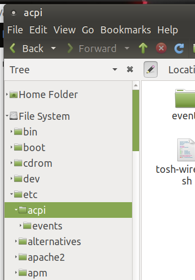
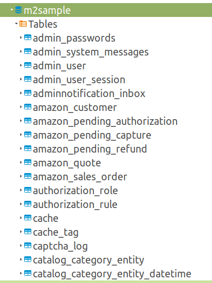

# Namespaces в базах данных

Когда я впервые столкнулся со структурой данных в базе [Magento](https://magento.com/), там было порядка двух сотен таблиц. Во всех Magento-проектах, в которых я участвовал, использовались плагины сторонних разработчиков, которые тоже добавляли таблиц в базу. Как и мои собственные плагины. Итого количество таблиц в базе Magento-магазина могло заваливать за три сотни:

SELECT

 count(*) AS total

FROM

 information_schema.tables

WHERE

 table_schema = 'm2sample';total|

-----|

 391|
Каким образом ориентироваться в таком количестве таблиц?

В проектах с большим количеством таблиц, таких как Magento, исторически сложились правила наименования таблиц:

TABLE_NAME |

----------------------------------------------------|

amasty_audit_... |

amasty_banner_... |

amasty_geoip_... |

aw_blog_... |

aw_faq_... |

aw_helpdesk_... |

mageworx_downloads_... |

mailchimp_... |

temando_... |
Компании, которые имели в своём активе одно-два расширения для Magento, просто добавляли префикс с названием компании к своим таблицам:

mailchimp_errors |

mailchimp_interest_group |

mailchimp_stores |

mailchimp_sync_batches |

mailchimp_sync_ecommerce |

mailchimp_webhook_request|
Компании, которые разработали десятки расширений для Magento (такие, как [Amasty](https://amasty.com/), [Aheadworks](https://www.aheadworks.com/), [Mageworx](https://www.mageworx.com/)) добавляли префиксы с названием компании и именем расширения (_amasty\_audit\_,_), группируя естественным образом таблицы по кластерам в древовидную структуру. Сравните с классической файловой системой:

Группировка файлов и каталогов в виде дерева.

Точно также можно было бы группировать таблицы в базе данных вместо их плоского представления:

Список таблиц в DBeaver 6.3.5

В MySQL нет разницы между верхним и нижним регистром, поэтому разделителем в названиях выступает символ подчёркивания:

mageworx_downloads_attachment

MAGEWORX_DOWNLOADS_ATTACHMENT
Аналогичный подход применялся в PHP до того, как там появились [namespaces](https://www.php.net/manual/ru/language.namespaces.php). Пример наименования класса в [Zend 1](https://github.com/zendframework/zf1/blob/master/library/Zend/Acl/Exception.php#L35):

class Zend_Acl_Exception extends Zend_Exception
Максимальная длина имени таблицы в Postgres’е — 63 байта (ASCII-символа), в [MariaDB](https://mariadb.com/kb/en/identifier-names/#maximum-length) (MySQL) — 64 символа. Таким образом, максимальное имя таблицы по длине выглядит примерно так:

123456789_123456789_123456789_123456789_123456789_123456789_1234
Вряд ли есть смысл применять namespaces при наименовании таблиц глобально ко всем таблицам во всём мире, как это делается с Java-классами:

import java.util.Scanner;
Тем не менее, в рамках отдельного проекта, если количество таблиц:

*   < 10–15: пространство имён скорее бесполезно;
*   10–30: пространство имён может облегчить навигацию и понимание структуры данных в базе;
*   > 30: отсутствие пространства имён значительно затрудняет навигацию и понимание структуры данных;

Также пространство имён должно быть в проектах, в которых в рамках одной базы размещаются таблицы разных команд разработчиков (Magento, Odoo, Wordpress, Liferay). То есть, для любого проекта, состоящего из переменного набора модулей.
