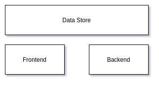
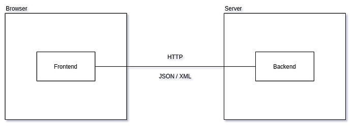

# Основы Web-приложений

Web Applications

Web Development

Ниже изложен примитивный (_высокоуровневый_) взгляд на Web-приложения (_Web Applications, WA_).

WA состоят из трёх частей:

*   **data store**(_хранилище_): все приложения оперируют с данными, данные должны где-то хранится (_в файлах, в базах данных, в оперативной памяти_); очень часто одно web-приложение использует несколько хранилищ данных (_RDBMS, filesystem, кэши, поисковые индексы_).
*   **backend** (_бэк_): располагается на удалённом сервере (_серверах_), содержит статику (_неизменяемый контент — исходный код для фронта, медиа-файлы, документы и т.п._) для раздачи на фронт, а также предоставляет набор сервисов для обработки данных, поступающих с фронта, их размещения в / получения из хранилища. Backend’ы различных web-приложений могут обмениваться данными друг с другом посредством этих сервисов. В backend’е также выполняются сервисные операции — периодическое обслуживание по cron’у или запуск команд через CLI.
*   **frontend** (_фронт_): располагается в браузере клиента (_мобильном или десктопном_), получает статику с бэка, собирает и поднимает приложение в браузере, используя предоставляемые браузером возможности по коммуникации с дальним (_через сеть_) и ближним (_операционная система и аппаратное обеспечение_) окружением, обеспечивает интерфейс взаимодействия с пользователем для обработки данных, получаемых из/отправляемых на backend.

WA — это распределённое приложение, существующее в сети Интернет. Основным способом связи между фронтом и бэком является HTTP-протокол, при этом данные передаются в формате JSON или XML.

Основным признаком web-приложения в контексте данной статьи является использование браузера для доступа к приложению. Именно возможностями браузера определяются технологии, применяемые при создании фронта, и особенности взаимодействия фронта с пользователем, устройством (_компьютером, планшетом, смартфоном_) и backend’ом.
