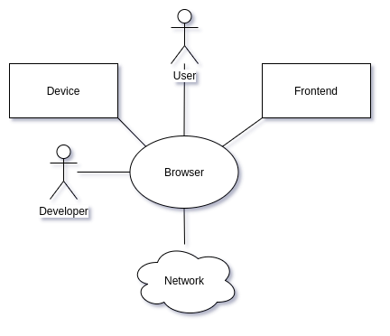
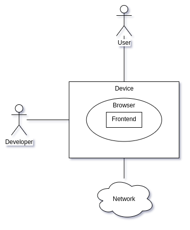

# Браузер, как среда для Web-приложений

[Фронт](https://medium.com/@alex_gusev/%D0%BE%D1%81%D0%BD%D0%BE%D0%B2%D1%8B-web-%D0%BF%D1%80%D0%B8%D0%BB%D0%BE%D0%B6%D0%B5%D0%BD%D0%B8%D0%B9-b71709ec4530) Web-приложения существует в браузере. Возможности фронта в очень сильной степени определяются возможностями браузера. Современный браузер, по сути, является для фронта своего рода “_операционной системой_”. Причём вне зависимости от того, на каком устройстве запущен сам браузер (_на смартфоне/планшете или десктопе/ноутбуке_) и в какой реальной операционной системе (_win/nix_).

В общем случае взаимодействие браузера с остальными акторами (_участниками_) можно выразить такой схемой:

*   **Device**: устройство, в котором работает браузер (_смартфон, планшет, десктоп, ноутбук, телевизор, …_).
*   **Frontend**: клиентская часть web-приложения, которая работает в браузере.
*   **Network**: сеть для доступа к удалённым ресурсам.
*   **User**: человек, использующий web-приложение в бизнес-целях.
*   **Developer**: человек, разрабатывающий или сопровождающий web-приложение.

Так как браузер является прослойкой между фронт-приложением и всеми остальными акторами, то схему можно изобразить в таком виде:

## Технологии для построения фронта

Базовые технологии — это “_большая тройка_”:

*   [HTML](https://developer.mozilla.org/en-US/docs/Web/HTML): структурирует информацию для её обработки в браузере.
*   [CSS](https://developer.mozilla.org/en-US/docs/Web/CSS): описывает правила отображения структурированной информации.
*   [JavaScript (_ECMAScript_](https://developer.mozilla.org/en-US/docs/Web/JavaScript)): основной язык программирования, который поддерживается почти всеми браузерами, браузер предоставляет возможности для программ на JavaScript манипулировать, как самой информацией, так и её отображением, а также использовать доступные ресурсы (_устройство и сеть_).

Другие технологии, такие как [Java-апплеты](https://en.wikipedia.org/wiki/Java_applet), [ActiveX](https://en.wikipedia.org/wiki/ActiveX), [Flash](https://en.wikipedia.org/wiki/Adobe_Flash), [Silverlight](https://en.wikipedia.org/wiki/Microsoft_Silverlight) и им подобные, не получили такого значения для web-приложений, как HTML/CSS/JS.

## Web API

Так как фронт-приложение существует в браузере, то для взаимодействия с другими акторами он использует инструменты, которые предоставляет ему браузер. Эти инструменты называются Web API и хорошо описаны на сайте [developer.mozilla.org](https://developer.mozilla.org/en-US/docs/Web/Reference/API).

Web API, по сути, это объекты и функции на языке JavaScript, которые можно использовать в коде фронт-приложения:

document.title

// "Editing Браузер, как среда для Web-приложений – Medium"
Я разделил самые полезные API на 5 групп:

*   **базовые**: практически всегда используются при построении фронта;
*   **дополнительные**: используются для специфических или сложных приложений (аудио, видео, drag-anf-drop, …);
*   **девелоперские**: используются разработчиками для лучшего использования приложениями доступных ресурсов, для контроля работы приложений или для выполнения специфических операций (связанных с безопасностью, например);
*   **мобильные**: для доступа к ресурсам мобильных устройств;
*   **перспективные**: экспериментальные и слабораспространённые API с полезным функционалом (анимация, выполнение платежей и т.п.);

### **Базовые Web API**

### Дополнительные Web API

### Девелоперские Web API

### Мобильные Web API

### Перспективные Web API

## Резюме

Фронт-приложения, в основном, создаются при помощи HTML/CSS/JS и взаимодействуют с окружающим миром (_пользователи, устройство, сеть_) через Web API (_интерфейсы_), предоставляемые браузером.
