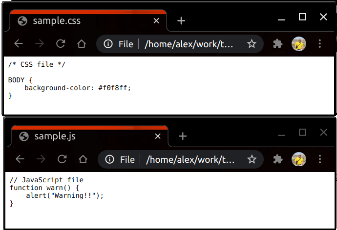
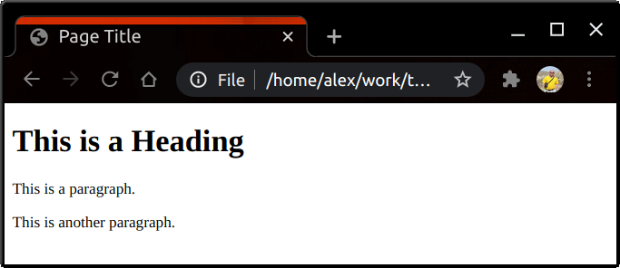
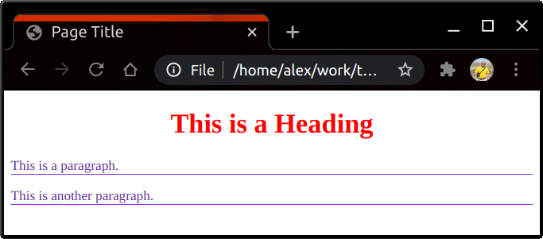
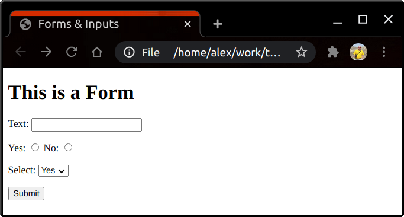
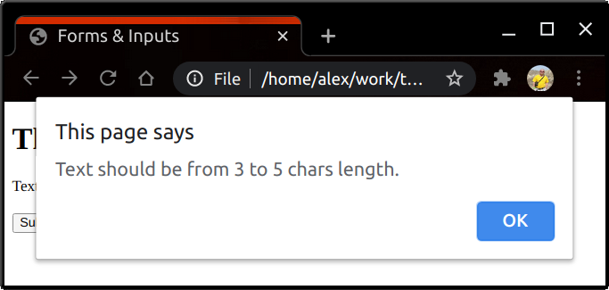

# HTML/CSS/JS в Web-приложениях

Web App Development

HTML

CSS

JavaScript

Web Applications

HTML, CSS, JS — это “большая тройка” технологий, которые используются в web-приложениях на стороне браузера.

*   [HTML](https://developer.mozilla.org/en-US/docs/Web/HTML): структурирует информацию.
*   [CSS](https://developer.mozilla.org/en-US/docs/Web/CSS): описывает правила отображения информации.
*   [JavaScript (_ECMAScript_](https://developer.mozilla.org/en-US/docs/Web/JavaScript)): манипулирует информацией, её отображением, а также использует доступные ресурсы (_компьютер/планшет/смартфон и сеть_).

Код CSS и JS-файлов отображается в браузере в виде текста:

CSS and JS in browser

но именно HTML превращает браузер [в среду для обитания web-приложений](https://medium.com/@alex_gusev/%D0%B1%D1%80%D0%B0%D1%83%D0%B7%D0%B5%D1%80-%D0%BA%D0%B0%D0%BA-%D1%81%D1%80%D0%B5%D0%B4%D0%B0-%D0%B4%D0%BB%D1%8F-web-%D0%BF%D1%80%D0%B8%D0%BB%D0%BE%D0%B6%D0%B5%D0%BD%D0%B8%D0%B9-66a3ef39b145?sk=7a7e2df3ca32d849ac5aba212abef56d). Начало любого web-приложения — это HTML-код.

В отличие от CSS/JS-файлов браузер показывает не сам HTML-код, а информацию, которая “зашита” в коде, и структуру этой информации. Например, [такой код](https://www.w3schools.com/whatis/whatis_html.asp):

<!DOCTYPE html>

<html lang="en">
<meta charset="utf-8">

<title>Page Title</title>

<body>

 <h1>This is a Heading</h1>

 
This is a paragraph.

 
This is another paragraph.

</body>

</html>

браузер превращает вот в такую картинку:

Simple HTML

Изначально HTML предназначался для форматирования документов (_текстов и иллюстраций к ним_) и связывания документов друг с другом при помощи ссылок. Именно поэтому загруженный в браузер HTML-код называют документом, а представление документа браузером — Document Object Model ([DOM](https://ru.wikipedia.org/wiki/Document_Object_Model)).

Со временем требования к визуальному оформлению документов возросли и на помощь HTML’у подтянулся CSS. CSS-код описывает правила визуального оформления документа. Один и тот же HTML-документ можно по-разному отобразить в браузере, применив к нему различные стили. При помощи CSS можно было изменять шрифт, цвет, отступы и межстрочные интервалы, задавать выравнивание текста (_в том числе и в ячейках таблиц_) и обрамление отдельных элементов документа.

Добавление вот таких CSS-правил оформления:

H1 {

 color: red;

 text-align: center;

 }P {

 color: #663399;

 border-bottom: #8a2be2 1px solid;

 }
заставляет браузер отображать тот же самый HTML-код, что и выше, вот таким образом:

Styled HTML

Одновременно со стилями появилась и профессия web-дизайнера.

Документы можно разделить на две большие группы — для чтения и для заполнения. Документы для заполнения называются формами. В HTML 2.0 появилась возможность не только выводить информацию пользователю, но и получать информацию от него — появились формы и поля ввода, появилась возможность отправить информацию на сервер:

<!DOCTYPE html>

<html lang="en">

<meta charset="utf-8">

<title>Forms & Inputs</title>

<body>

<h1>This is a Form</h1>

<form method="get" action="./save_data_on_server.html">

 

 <label for="id_text">Text</label>:

 <input type="text" id="id_text" name="name_text">

 

 

 <label for="id_radio_yes">Yes</label>:

 <input type="radio" id="id_radio_yes" name="name_radio"

 value="yes">

 <label for="id_radio_no">No</label>:

 <input type="radio" id="id_radio_no" name="name_radio"

 value="no">

 

 

 <label for="id_select">Select</label>:

 <select id="id_select" name="name_select">

 <option value="yes">Yes</option>

 <option value="no">No</option>

 </select>

 

 

 <input type="submit">

 

</form>

</body>

</html>
Форма в браузере выглядит вот так:

HTML Form

Как только появилось двустороннее взаимодействие с пользователем, появилась и необходимость в языке для программирования реакции “документа” на действия пользователя — появился JavaScript. Возможно, что одним из самых первых способов применения JavaScript’а была валидация данных, вводимых пользователем.

Вот скрипт, который запрещает отправку формы на сервер, если введённый текст меньше 3 или больше 5 символов:

<!DOCTYPE html>

<html lang="en">

<head>

 <meta charset="utf-8">

 <title>Forms & Inputs</title>

 

</head>

<body>

<h1>This is a Form</h1>

<form method="get" action="./save_data_on_server.html" onsubmit="return validate();">

 

 <label for="id_text">Text</label>:

 <input type="text" id="id_text" name="name_text">

 

 

 <input type="submit">

 

</form>

</body>

</html>
Вот результат работы скрипта для пустой строки:

JS alert

Сейчас web-приложения совсем не напоминают документы. Они способны обрабатывать аудио и видео контент, а также взаимодействовать с пользователем в режиме реального времени ([AJAX](https://en.wikipedia.org/wiki/Ajax_(programming)), [Web Socket](https://en.wikipedia.org/wiki/WebSocket)):

Но внутри **каждого** web-приложения находится всё та же триада — HTML/CSS/JS:

*   HTML — структура
*   CSS — визуализация
*   JavaScript — динамика
