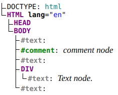
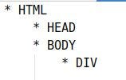

# DOM’ашние деревья

В IT-технологиях концепция “[дерева](https://ru.wikipedia.org/wiki/%D0%94%D1%80%D0%B5%D0%B2%D0%BE%D0%B2%D0%B8%D0%B4%D0%BD%D0%B0%D1%8F_%D1%81%D1%82%D1%80%D1%83%D0%BA%D1%82%D1%83%D1%80%D0%B0)” играет очень важную роль и встречается очень часто (например, файлы и каталоги в компьютере организованы в виде древовидной структуры). В браузерных приложениях “дерево” вообще является базовой концепцией, так как то, что отображается на экране, в памяти браузера представлено в виде “объектной модели документа” ([DOM](https://ru.wikipedia.org/wiki/Document_Object_Model)), являющейся как раз древовидной структурой. Про это хорошо написано на [Learn JavaScript](https://learn.javascript.ru/dom-nodes), я же зафиксирую основные моменты, которые важны в свете разработки браузерных приложений.

## Document

Чтобы взаимодействовать с пользователем через DOM, разработчик должен представлять себе всё, что видит пользователь на экране, в виде дерева. Точно так же, как браузер.

Корнем дерева является “[document](https://learn.javascript.ru/dom-navigation)”. Доступ к этому объекту осуществляется через глобальную область видимости (`window`):

const doc = window.document;
или просто:

const doc = document;
## Nodes and Elements

В [DOM API](https://developer.mozilla.org/en-US/docs/Web/API/Document_Object_Model) браузеров можно выделить два типа функций для работы с DOM через JavaScript:

*   как с набором узлов (nodes);
*   как с набором элементов (elements);

Если коротко, то каждый элемент — это узел, но не каждый узел — элемент.

Всё, что есть в HTML-коде, загружаемом в браузер, представляется в модели в виде узлов — тэги, текст между тэгами, комментарии.

Например, вот такой HTML-код:

<!DOCTYPE html>

<html lang="en">

<body>

<!-- comment node -->

Text node.

</body>

</html>
в памяти браузера [будет представлен](http://software.hixie.ch/utilities/js/live-dom-viewer/#) в виде такого дерева узлов:

DOM nodes

Здесь отражены 4 типа узлов:

*   DOCUMENT_TYPE_NODE
*   ELEMENT_NODE
*   TEXT_NODE
*   COMMENT_NODE

Переводы строк — это тоже узлы, текстовые.

Для более эффективной работы с DOM используют дерево элементов. Элементы — это узлы, которые соответствуют HTML-тэгам. Дерево элементов выглядит гораздо компактнее:

Текстовая информация доступна в элементах через свойство `innerText` :

document.body.getElementsByTagName("DIV")[0].innerText

// "Text node."
## Функции DOM API

Для манипуляции моделью документа на уровне узлов [DOM API](https://developer.mozilla.org/en-US/docs/Web/API/Document_Object_Model) предлагает такие свойства:

*   Node.childNodes
*   Node.firstChild
*   Node.lastChild
*   Node.nextSibling
*   Node.parentNode
*   Node.previousSibling

и методы:

*   Node.appendChild(childNode)
*   Node.cloneNode()
*   Node.getRootNode()
*   Node.hasChildNodes()
*   Node.insertBefore()
*   Node.isEqualNode()
*   Node.isSameNode()
*   Node.removeChild()
*   Node.replaceChild()
*   Document.createComment()
*   Document.importNode()
*   Element.querySelector()
*   Element.querySelectorAll()
*   ParentNode.append()
*   ParentNode.prepend()
*   ParentNode.querySelectorAll()
*   ParentNode.replaceChildren()
*   ChildNode.remove()
*   ChildNode.before()
*   ChildNode.after()
*   ChildNode.replaceWith()

Для манипуляции моделью документа на уровне элементов - свойства:

*   Node.parentElement
*   Document.documentElement
*   ParentNode.childElementCount
*   ParentNode.children
*   ParentNode.firstElementChild
*   ParentNode.lastElementChild

и методы:

*   Document.createElement()
*   Document.getElementsByClassName()
*   Document.getElementsByTagName()
*   Document.getElementsByTagNameNS()
*   Document.getElementById(String id)
*   Document.querySelector()
*   Document.querySelectorAll()
*   Document.getElementsByName()
*   DocumentOrShadowRoot.elementFromPoint()
*   DocumentOrShadowRoot.elementsFromPoint()
*   NonDocumentTypeChildNode.nextElementSibling
*   NonDocumentTypeChildNode.previousElementSibling
*   Element.closest()
*   Element.getElementsByClassName()
*   Element.getElementsByTagName()
*   Element.getElementsByTagNameNS()
*   Element.insertAdjacentElement()
*   ParentNode.querySelector()

## Резюме

В браузерных приложениях для организации взаимодействия с пользователем разработчик должен представлять модель документа так же, как и браузер — в виде дерева. Дерево узлов является более точным отражением документа, но избыточным. Предпочтительнее в браузерных приложениях использовать дерево элементов.
