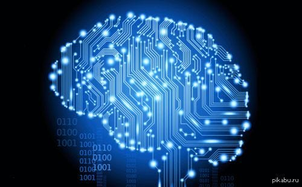
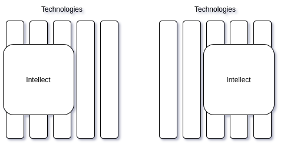
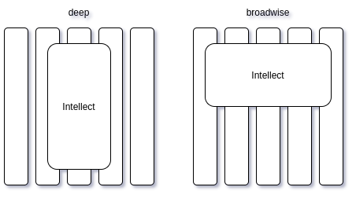

# Гипертимезия и эволюция в IT

Недавно открыл для себя термин “[гипертимезия](https://ru.wikipedia.org/wiki/%D0%93%D0%B8%D0%BF%D0%B5%D1%80%D1%82%D0%B8%D0%BC%D0%B5%D0%B7%D0%B8%D1%8F)” — способность личности помнить и воспроизводить предельно высокое количество информации о её собственной жизни. Гипертимезия считается нарушением памяти и значительно осложняет жизнь человеку. Вольно или невольно сосредотачиваясь на прошлом, он перестаёт уделять внимание настоящему и забывает о будущем. И чем дольше человек живёт, тем больше у него прошлого. Тем проще соскользнуть в него, тем сложнее удержаться в настоящем.

Человеческие возможности велики, но ограничены. По некоторым [прикидкам](https://www.nkj.ru/open/33286/) общий объём памяти нашего мозга может достигать 5 петабайт — это 5 тысяч терабайтов или 5 миллионов гигабайтов. Да, много. Но не бесконечно много. А ведь ещё нужно обрабатывать входящую/исходящую информацию (изображение, звук, запах, вкус, тактильные ощущения, речь, моторика), выполнять прошитые программы (инстинкты) и создавать новые (обучение) — это уже не просто память, а устройство обработки информации (процессор). Которое располагается там же, где и память — в мозге человека, и использует те же самые “аппаратные” ресурсы (нейроны и синапсы). То есть, вряд ли объём наше памяти дотягивает до этих самых 5-ти петабайт.

В оптимальном режиме работы память должна сохранять ровно столько информации, сколько нужно для принятия решений, способствующих выживанию как отдельной особи, так и группы, к которой особь принадлежит (для социальных животных). Малое количество информации в памяти (отсутствие опыта) может негативно повлиять на правильную оценку ситуации, слишком большое — на скорость принятия решения или даже на возможность самого принятия (в случае противоречивых входных данных).

Так как окружающая среда всё время изменяется, то в наилучшем положении находятся те особи, которые содержат свою память ([базу знаний](https://ru.wikipedia.org/wiki/%D0%91%D0%B0%D0%B7%D0%B0_%D0%B7%D0%BD%D0%B0%D0%BD%D0%B8%D0%B9)) в актуальном состоянии — соответствующем текущему состоянию окружающей среды. Устаревшие “правила” выкидываются, а новые добавляются, позволяя особи быстро принимать правильные решения. Процесс забывания информации — это эволюционная необходимость, позволяющая существовать в изменяющейся среде, а сбой этого процесса — патология.

Нашим предкам было проще, для них мир не менялся с такой скоростью, с какой он меняется для нас. Особенно это касается информационных технологий.

Ведь что я наблюдаю в области web-приложений? Во-первых, “война браузеров” породила кучу альтернативных технологий (JavaScript, Java applets, ActiveX, Flash, Dart), во-вторых, стандарты web’а (HTML, CSS, Browser API) представляют собой результат компромиссов между ведущими игроками, а разработчики вынуждены поддерживать различные имплементации функционала через те же [полифилы](https://ru.wikipedia.org/wiki/%D0%9F%D0%BE%D0%BB%D0%B8%D1%84%D0%B8%D0%BB). Разнообразные варианты доставки JS-кода в браузер — [CommonJS, AMD, CMD, UMD, ES6](https://programmer.group/module-format-common-js-amd-cmd-umd-es6.html). Славное прошлое ложится тяжким бременем на плечи современного web-разработчика. А ещё на них ложится и не менее славное настоящее — Angular, React, Vue, Svelte, Ember, … Микросервисы на различных языках программирования — Go, Java, Ruby, Python, PHP, NodeJS, C#, …

Современный разработчик должен быть в некотором роде гипертимезиком — помнить очень многое и знать ещё больше. Но гипертимезия — это паталогия, отклонение от нормы. Следствие гипертимезии — неспособность человека к адекватной оценке текущей ситуации вследствие повышенных временных затрат на анализ имеющейся информации. Наш накопленный в разработке опыт заставляет нас цепляться за него. Мы пытаемся адаптировать новые возможности под старые браузеры, а адаптировав, тянем наши наработки за собой в новые браузеры. Мы не можем отказаться от этих наших наработок — ведь это наши инвестиции (как минимум, времени).

Мы не забываем пройденное, мы накапливаем знания. Как снежный ком — HTML, CSS, JS, ES6, TypeScript, Web 2.0, SPA, PWA, SEO, SSR, headless, microservices, AWS, Docker, Kubernetes, … Мы уже не можем просто так создать HTML страницу и выложить в Сеть, мы должны сначала продумать вот это вот всё и принять решение, что чистого HTML’а будет достаточно. Насколько проще было принимать такое решение, когда мы только и знали, что HTML.

Чтобы эволюционировать дальше, разработчики должны научиться забывать устаревшую информацию. Должны ограничивать круг своих профессиональных интересов, ограничивать стек используемых технологий, ограничивать области применения своих навыков. Один человек не может охватить всё, что сейчас есть в IT — от создания микропроцессоров и до оркестрации микросервисов. Его возможностей хватит на ограниченный набор знаний — либо микропроцессоры, либо микросервисы:

Да, человек может либо глубже изучить меньшее количество технологий, либо большее количество технологий, но поверхностно:

В любом случае, возможности человеческого интеллекта ограничены (хотя бы скоростью чтения) и он не может одинаково успешно развиваться, как вширь, так и вглубь. Особенно в сравнении с подобными себе, но которые выбрали одно направление. Отсюда, кстати, и растут ноги у “[синдрома самозванца](https://ru.wikipedia.org/wiki/%D0%A1%D0%B8%D0%BD%D0%B4%D1%80%D0%BE%D0%BC_%D1%81%D0%B0%D0%BC%D0%BE%D0%B7%D0%B2%D0%B0%D0%BD%D1%86%D0%B0)” — всегда можно найти кого-то, кто лучше тебя разбирается в какой-то теме, либо найти тему, в которой кто-то разбирается лучше тебя.

Эволюция в IT сейчас похожа на сёрфинг — нужно поймать “волну” и держаться на ней, пока у той есть достаточно энергии:

Затем брать “доску” (интеллект) и искать новую “волну” (технологию).

А потом опять, опять и опять…

Благо, что “волн” становится только больше.
