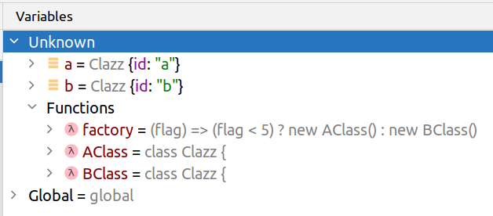
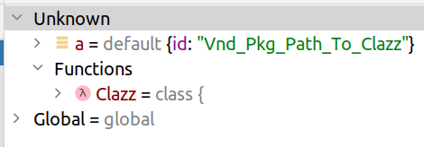
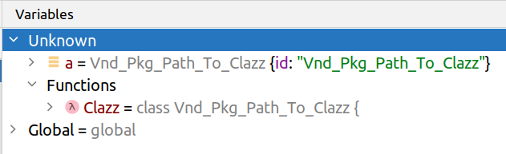
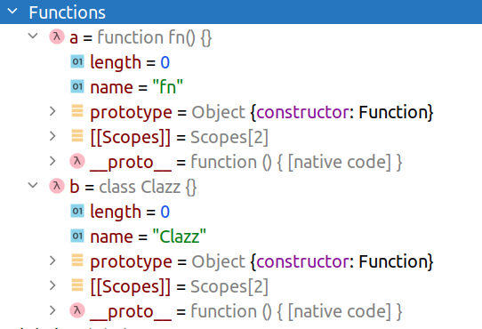
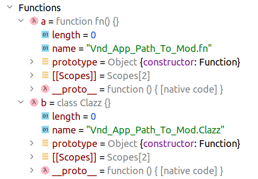
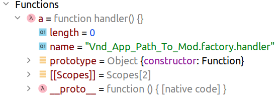
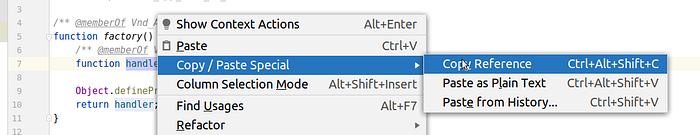

# Наименование элементов кода в JS

Я разработчик и смотрю на процесс создания кода с точки зрения разработчика. Как разработчика меня достаточно сильно напрягает невозможность установить источник кода для функции или экземпляра класса в JS по их имени. В Java и PHP (языки, на которых я довольно долго программировал) есть возможность использовать namespace’ы, которые помогают ориентироваться в коде:

import java.util.Scanner; // Java

use Symfony\Component\Cache\Adapter\FilesystemAdapter; // PHP
По имени элемента можно найти исходный код для него.

А если задаться целью выработать правила наименования элементов кода в JS, то какими они были бы?

Сразу опишу ограничения — всё, что ниже, является моей собственной фантазией и относится только к коду на ES6 с [использованием модулей](https://exploringjs.com/es6/ch_modules.html#sec_basics-of-es6-modules). Правила наименования относятся только к элементам уровня “функция”, “класс”, “модуль”. Основная задача правил наименования — определять по имени элемента источник исходного кода для него. Подход актуален для больших проектов с количеством файлов исходного кода от нескольких сотен и выше, разбитых на несколько пакетов.

## Модули

Основной единицей структурирования кода в ES6 является модуль — отдельный файл, в явном виде, через инструкцию `export`, описывающий, какие именно элементы будут доступны за пределами модуля:

export const sqrt = Math.sqrt;

export function square(x) {

 return x * x;

}

export function diag(x, y) {

 return sqrt(square(x) + square(y));

}
## Пакеты

Файлы с модулями объединяются в пакеты, которые подключаются к приложению менеджером пакетов (npm, yarn). Менеджер пакетов использует глобальный [реестр](https://docs.npmjs.com/cli/v6/using-npm/registry) для хранения всех пакетов. Идентификатором пакета в реестре является [имя пакета](https://docs.npmjs.com/cli/v6/configuring-npm/package-json#name): `@scope/package`.

## Файловая структура пакета

Как правило, в npm-пакете кроме файлов исходного кода есть ещё множество других файлов — тесты, документация, конфигурация. Файлы исходного кода (модули) обычно помещают в отдельный каталог, например — `./src/`.

Если файлов-модулей много, то внутри каталога `./src/` они группируются в подкаталоги:

./src/

 ./controller/

 ./model/

 ./view/
## Экспорт в модуле

В [ООП](https://ru.wikipedia.org/wiki/%D0%9E%D0%B1%D1%8A%D0%B5%D0%BA%D1%82%D0%BD%D0%BE-%D0%BE%D1%80%D0%B8%D0%B5%D0%BD%D1%82%D0%B8%D1%80%D0%BE%D0%B2%D0%B0%D0%BD%D0%BD%D0%BE%D0%B5_%D0%BF%D1%80%D0%BE%D0%B3%D1%80%D0%B0%D0%BC%D0%BC%D0%B8%D1%80%D0%BE%D0%B2%D0%B0%D0%BD%D0%B8%D0%B5) принято в одном файле размещать один класс. В ES6 экспорт по-умолчанию прописывается так:

export default ...
В этом случае импорт [выглядит так](https://exploringjs.com/es6/ch_modules.html#_default-exports-one-per-module):

export default function () {}

...

import myFunc from 'myFunc';
Если же в одном модуле есть множество элементов для экспорта, то код выглядит так:

// export in 'sub.mjs'

export function _fun_() {}

export class Clazz {}

export const PI=3.14;

export default function(){

 console.log('This is def.');

}// import in 'main.mjs'

import _def_ from './sub.mjs';

import {_fun_, Clazz, PI} from './sub.mjs';
## Функции-конструкторы

Зачастую, в коде присутствуют фабричные функции — они создают замыкание и возвращают новую функцию, которая может использовать созданное замыкание:

// sub.mjs

export function _factory_(init) {

 let sum = init;

 return function (delta) {

 sum += delta;

 };

}// main.mjs

import {_factory_} from './sub.mjs';

const fn = _factory_(4);

fn(2);
## Ожидание от правил наименования

Имя элемента кода должно давать разработчику возможность обнаружить файл, содержащий исходный код этого элемента, среди всех файлов приложения (а по возможности, вообще среди всех файлов всех приложений в мире).

Правила наименования должны позволять IDE обнаруживать нужный исходник и оказывать соответствующую поддержку (навигация между файлами, подсказки по использованию элементов на основе JSDoc).

## Алиасы

В ES6 можно применять алиасы при импорте кода из модулей:

_// subA.mjs_ export class Clazz {

 id = 'a';

}_// subB.mjs_ export class Clazz {

 id = 'b';

}_// main.js_ import {Clazz as AClass} from './subA.mjs';

import {Clazz as BClass} from './subB.mjs';const factory = (flag) => (flag < 5) ? new AClass() : new BClass();const a = factory(2); _// instance of 'AClass'_ const b = factory(8); _// instance of 'BClass'_
IDE корректно находит исходники для `AClass` и для `BClass`, несмотря на то, что в исходниках соответствующие классы называются одинаково — `Clazz`. Но под отладчиком этой разницы не видно:

Без доступа к коду нет возможности по данным отладчика определить, в каком файле находятся исходники для переменных `a` и `b`.

## JSDoc

В генераторе документации JSDoc есть таг ‘[namespase](https://jsdoc.app/tags-namespace.html)’, который позволяет задавать собственные namespace’ы в коде, и таг ‘[module](https://jsdoc.app/tags-module.html)’, который позволяет задавать абсолютное имя для ES6-модуля. Современные IDE (в частности IDEA) способны анализировать jsdoc-аннотации и находить исходный код с их помощью.

Главное отличие `namespace` от `module` в том, что `namespace` — это логическая адресация (не привязанная к файлам проекта), а `module` — физическая адресация (привязанная к файлам проекта).

### Физическая адресация

С использованием аннотации `module` код выглядит так:

_// file 'sub.mjs'

/**

 * @module app/path/to/sub

 */

/** ... */_ function nested() {}
_// file 'main.mjs'

/** @type {module:app/path/to/sub.nested} */_ let fn;

IDE может обнаружить исходный код для функции `nested` , даже если файл, её содержащий, будет называться не `sub.mjs` и будет расположен не в каталоге `/.../path/to/`. Что неудобно — нужно ставить префикс `module:` в `type` аннотациях, чтобы было понятно, что речь идёт о физической адресации (`@type {module:...}`).

### Логическая адресация

С использованием аннотации `namespace` код выглядит так:

_// file 'sub.mjs'

/**

 * @namespace NameOfTheModule

 */

/**

 * @memberOf NameOfTheModule

 */_ function nested() {}
_// file 'main.mjs'

/** @type {NameOfTheModule.nested} */_ let fn;

Что неудобно: нужно в явном виде добавлять аннотацию `memberOf` для каждого элемента внутри пространства, иначе IDE (IDEA, как минимум) не способно привязать элемент к пространству.

## Namespaces в PHP

В PHP пространства имён появились с версии 5.3. До этого разработчикам приходилось как-то самим разрешать коллизии, связанные с тем, что в большом приложении могут использоваться элементы кода из разных пакетов, но с одинаковым названием. Например, фреймворк Zend во второй версии использовал пространства имён PHP, а вот в первой они использовали правила наименования, которые не только гарантировали уникальность элементов кода среди всех пакетов, входящих во фреймворк, но и позволяли [находить и загружать](https://framework.zend.com/manual/1.12/en/zend.loader.autoloader.html) исходники по имени элемента. Так имя класса `Zend_Db_Table_Rowset` говорило о том, что исходники нужно искать [в файле](https://github.com/zendframework/zf1/blob/master/library/Zend/Db/Table/Rowset.php)`./Zend/Db/Table/Rowset.php`.

## Правила Zend1 для ES6

Правила Zend1 для наименований элементов кода позволяют находить файл с исходниками, но не отдельную функцию/класс внутри этого файла. Эти правила можно адаптировать для ES6-проектов, основываясь на имени npm-пакета и пути к файлу.

Допустим, что в пакете `@vendor/package` исходный код находится в каталоге `./src/`. В этом каталоге есть файл с классом, расположенный по пути `./Path/To/Clazz.mjs`. В рамках своего собственного проекта можно положить, что все элементы кода этого пакет относятся к пространству `Vnd_Pkg`, а путь к файлу ES6-модуля можно выразить как `Path_To_Clazz`. Тогда полное имя модуля внутри проекта будет как `Vnd_Pkg_Path_To_Clazz`:

_// ./Path/To/Clazz.mjs_ export default class {

 id = 'Vnd_Pkg_Path_To_Clazz';

}
_// ./main.mjs_ import Clazz from './Path/To/Clazz.mjs';

const a = new Clazz();

IDE успешно находит исходный файл из `./main.mjs`, но под отладчиком непонятно, где искать исходники для `a`:

## Имя для export default

Если же переписать `Clazz.mjs` таким образом:

export default class Vnd_Pkg_Path_To_Clazz {

 id = 'Vnd_Pkg_Path_To_Clazz';

}
то под отладчиком станет видно, что переменная `a` имеет отношение к модулю `Vnd_Pkg_Path_To_Clazz`:

Т.е., если ES6 модуль экспортирует по-умолчанию какой-то элемент (класс или функцию), то есть смысл называть этот элемент полным именем в соответствии с правилами Zend1. По сути дела мы адресуем этим именем некий ES6-модуль и договариваемся (в рамках своих проектов), что этим же именем мы адресуем и default-экспорт этого модуля.

## Именованный экспорт

Для элементов кода, экспортируемых в явном виде, очень хорошо работают jsdoc-аннотации, позволяющие IDE находить соответствующий исходник по имени в type-аннотации:

_// ./Path/To/Mod.mjs

/** @namespace Vnd\_App\_Path\_To\_Mod */
/** @memberOf Vnd\_App\_Path\_To\_Mod */_ function _fn_() {}
_/** @memberOf Vnd\_App\_Path\_To\_Mod */_ class Clazz {}

export {_fn_, Clazz};

_// Main.mjs_ import * as mod from './Path/To/Mod.mjs';
_/** @type {Vnd\_App\_Path\_To\_Mod.fn} */_ const a = mod._fn_;

_/** @type {Vnd\_App\_Path\_To\_Mod.Clazz} */_ const b = mod.Clazz;

Но под отладчиком не видно, к какому пространству имён относится соответствующий элемент ( `a` и `b`):

Ситуацию можно исправить, задав имена элементов в явном виде при их создании:

_// ./Path/To/Mod.mjs_...

Object.defineProperty(_fn_, 'name', {value: 'Vnd_App_Path_To_Mod.fn'});

Object.defineProperty(Clazz, 'name', {value: 'Vnd_App_Path_To_Mod.Clazz'});
export {_fn_, Clazz};

Тогда в `Main.mjs` под отладчиком элементы `a` и `b` будут выглядеть так:

Теперь и в отладчике по атрибуту `name` разработчик может видеть, где находятся исходники для соответствующего элемента кода.

## Вложенные элементы

В случае использования фабричных функций правила наименования для вложенных элементов могут выглядеть так:

_// ./Path/To/Mod.mjs

/** @namespace Vnd\_App\_Path\_To\_Mod */
/** @memberOf Vnd\_App\_Path\_To\_Mod */_ function _factory_() {

 _/** @memberOf Vnd\_App\_Path\_To\_Mod.factory */_ function handler() {}
Object.defineProperty(handler, 'name', {value: 'Vnd_App_Path_To_Mod.factory.handler'});

 return handler;

}

Object.defineProperty(_factory_, 'name', {value: 'Vnd_App_Path_To_Mod.factory'});

export {_factory_};

_// Main.mjs_ import * as mod from './Path/To/Mod.mjs';
_/** @type {Vnd\_App\_Path\_To\_Mod.factory.handler} */_ const a = mod._factory_();

Под отладчиком элемент `a` выглядит так:

## Резюме

Современный JavaScript (ES6 и выше) предоставляет возможность задавать имена элементам кода в приложении таким образом, чтобы можно было однозначно адресовать любой элемент кода его именем. С учётом практик других языках программирования (Java, .Net, PHP) можно выработать такую систему наименования, чтобы можно было однозначно адресовать элемент кода не только в приложении, но и глобально по всем пакетам [реестра](https://docs.npmjs.com/cli/v6/using-npm/registry).

Однозначная адресация элементов помогает не только при разработке/отладке приложений, но и при их документировании:

IDEA при клике правой кнопкой мыши по элементу кода и выбору `Copy Reference` записывает в буфер обмена полное имя элемента:

Vnd_App_Path_To_Mod.factory.handler
Из отрицательных моментов можно отметить необходимость документирования элементов (JSDoc annotations и `Object.defineProperty`) и проблемы несоответствия type-аннотаций реальным именам, которые могут возникать при рефакторинге (особенно вложенных функций).
