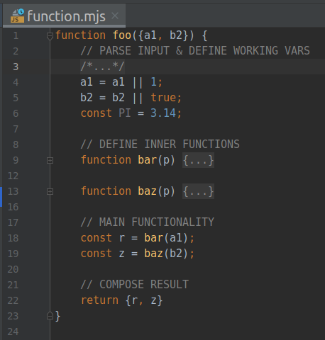

# Структура JS-кода: Функции

Я написал много разного кода на разных языках программирования. Сейчас я пишу на JS (ES2015+ a.k.a. ES6+) и в этой коротенькой заметке я описываю типовую структуру кода, которую я использую для своих JS-функций ([классы](https://alex-gusev.medium.com/%D1%81%D1%82%D1%80%D1%83%D0%BA%D1%82%D1%83%D1%80%D0%B0-js-%D0%BA%D0%BE%D0%B4%D0%B0-%D0%BA%D0%BB%D0%B0%D1%81%D1%81%D1%8B-221e37d3d1e7), [модули](https://alex-gusev.medium.com/%D1%81%D1%82%D1%80%D1%83%D0%BA%D1%82%D1%83%D1%80%D0%B0-js-%D0%BA%D0%BE%D0%B4%D0%B0-%D0%BC%D0%BE%D0%B4%D1%83%D0%BB%D0%B8-a6dd36033e69)). Во-первых, для явного упорядочивания в тексте неявных мыслительных образов, и для всего остального — во-вторых.

## Секции кода

В JS-функции можно выделить следующие части:

*   разбор и валидация входных данных;
*   определение внутренних вспомогательных функций, используемых данной;
*   выполнение заданных действий;
*   формирование результата;

Так как в JS функции могут содержать другие функции, то структура кода получается вложенная. Разделение кода на части и маркировка частей при помощи комментариев значительно упрощают разработчику визуальную навигацию по коду. Я использую такие маркеры:

function foo({a1, b2}) {

 // PARSE INPUT & DEFINE WORKING VARS

 a1 = a1 || 1;

 b2 = b2 || true;

 const PI = 3.14; // DEFINE INNER FUNCTIONS

 function bar(p) {

 return p / 2;

 } function baz(p) {

 return (p) ? "+" : "-";

 } // MAIN FUNCTIONALITY

 const r = bar(a1);

 const z = baz(b2); // COMPOSE RESULT

 return {r, z}

}
В отличие от старых интерпретаторов, выполняющих код строка за строкой, JS-движок сначала производит разбор фрагмента кода (из файла или HTML-блока `SCRIPT`), а затем выполняет его (см. “[Как работают движки?](https://learn.javascript.ru/intro)”).

В процессе разбора кода (фаза 1) JS-движок находит переменные и функции и фиксирует их в памяти. Поэтому определение внутренних функций может находиться в любом месте внешней функции (до или после `return`). Всё равно выполнение кода (фаза 2) начнётся только после разбора всего фрагмента кода. Такое поведение переменных и функций называется “поднятие” ([hoisting](https://developer.mozilla.org/ru/docs/Glossary/Hoisting)).

Я предпочитаю размещать внутренние функции на второй позиции (после разбора входных данных), чтобы при естественном прочтении кода (сверху вниз) можно было видеть все “кирпичики” (переменные и функции), которые будут использоваться в основной части:

Плюс, я предпочитаю иметь [одну точку выхода](https://habr.com/ru/post/442892/#ii-mnozhestvo-tochek-vyhoda) из функции (один `return`) и размещать эту точку в последней строке функции.

Секции кода без самого кода:

// PARSE INPUT & DEFINE WORKING VARS// DEFINE INNER FUNCTIONS// MAIN FUNCTIONALITY// COMPOSE RESULT
## Заключение

Не обязательно использовать именно эту структуру кода для функций и именно эти маркеры (комментарии), но наличие определённой структуры и определённых маркеров делают код более читабельным в сложных случаях. Разумеется, для простых случаев, когда вся функция видна, как на ладони, подобный подход избыточен и тогда я не ставлю маркеры, но в случае, когда в коде на несколько сотен строк есть несколько уровней вложенности да ещё и в разных местах, подобное структурирование и маркеры значительно облегчают разработчику навигацию по коду. Особенно при использовании такой функции IDE, как [сворачивание](https://ru.wikipedia.org/wiki/%D0%A1%D0%B2%D0%BE%D1%80%D0%B0%D1%87%D0%B8%D0%B2%D0%B0%D0%BD%D0%B8%D0%B5_(%D0%BF%D1%80%D0%BE%D0%B3%D1%80%D0%B0%D0%BC%D0%BC%D0%BD%D0%BE%D0%B5_%D0%BE%D0%B1%D0%B5%D1%81%D0%BF%D0%B5%D1%87%D0%B5%D0%BD%D0%B8%D0%B5)) (folding).
