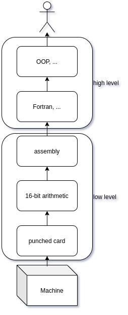

# TeqFW: Namespaces

Программирование — это не про то, как написать инструкции компьютерам, что они должны делать, а про то, как _представить_ инструкции компьютерам, что они должны делать, _в виде, понятном человеку_.

## История

Единственный язык, который компьютеры понимают без посредника — это [машинные коды](https://ru.wikipedia.org/wiki/%D0%9C%D0%B0%D1%88%D0%B8%D0%BD%D0%BD%D1%8B%D0%B9_%D0%BA%D0%BE%D0%B4). Причём у каждого типа компьютеров (процессоров) — своя система команд.

Вся история развития языков программирования — это история посредничества между Человеческим Разумом и Машинной Сущностью. Первым шагом можно считать появление перфокарт — Человек говорил с Машиной на её языке, где “пробой” означал “ноль”, а его отсутствие — “единицу” (или наоборот, в зависимости от выбранной системы кодирования). Следующий шаг — появление 16-битной арифметики. Машинные коды, состоящие из нулей и единиц, представили в более удобном для Человека виде — в виде 16-ричных цифр. Так, двоичное число “1111101000” в 16-ричном виде выглядит, как “3E8”, а в десятичном, как “1000”. Человек всё ещё разговаривал с Машиной на её языке, но делал это с бОльшим для себя комфортом. Потом появился [ассемблер](https://ru.wikipedia.org/wiki/%D0%AF%D0%B7%D1%8B%D0%BA_%D0%B0%D1%81%D1%81%D0%B5%D0%BC%D0%B1%D0%BB%D0%B5%D1%80%D0%B0) — Человек ещё больше облегчил для себя понимание языка Машины, но всё ещё должен был думать в категориях Машины (операции, операнды, реестры памяти, адресация, …). Каждый конкретный “_ассемблер_” соответствовал конкретной архитектуре Машины (её процессора). Именно поэтому такие ЯП назывались “_языками низкого уровня_” — при составлении инструкций Человек _обязан_ был думать, как Машина.

Появление “_языков высокого уровня_” (Fortran, Algol, Lisp, Cobol, …) впервые позволило Человеку начать создавать инструкции для Машин, не думая при этом, как Машина. Компиляторы переводили код, создаваемый Человеком, в инструкции, понимаемые Машиной. Причём один и тот же код мог переводиться для разных Машин с различной архитектурой — главное, чтобы для них был компилятор с соответствующего языка.

Ну, а потом Человек увлёкся и стал улучшать языки программирования вообще без оглядки на Машины — структурное программирование, объектно-ориентированное, логическое, функциональное, асинхронное, реального-времени, событийное, реактивное, … Человека перестало заботить, как именно Машины выполняют его инструкции, на первый план вышла забота о способности самого Человека осознавать инструкции, которые выполняет Машина по его указанию.

## Задача пространства имён

Так вот, [пространства имён](https://habr.com/ru/post/528218/) (namespaces) — это один из высокоуровневых способов осознания Человеком кода, им же и создаваемого. Пространства имён позволяют категоризировать код и “_раскладывать его по полочкам_”, как товар в супермаркете или книги в библиотеке. А также позволяют с лёгкостью находить нужный код, пользуясь его “_адресом_”. Причем не только автору кода, но и тому, кто этот код видит впервые. Пространства имён очень важны при разработке крупных проектов и жизненно необходимы при разработке крупных проектов слабосвязанными группами разработчиков — как раз тот сектор, для которого и создаётся `TeqFW`. Крупных — не по количеству пользователей, а по объёму кода, где количество разных файлов в сумме превышает 343 ([7 штук](https://ru.wikipedia.org/wiki/%D0%9C%D0%B0%D0%B3%D0%B8%D1%87%D0%B5%D1%81%D0%BA%D0%BE%D0%B5_%D1%87%D0%B8%D1%81%D0%BB%D0%BE_%D1%81%D0%B5%D0%BC%D1%8C_%D0%BF%D0%BB%D1%8E%D1%81-%D0%BC%D0%B8%D0%BD%D1%83%D1%81_%D0%B4%D0%B2%D0%B0) * [3 измерения](https://ru.wikipedia.org/wiki/%D0%A2%D1%80%D1%91%D1%85%D0%BC%D0%B5%D1%80%D0%BD%D0%BE%D0%B5_%D0%BF%D1%80%D0%BE%D1%81%D1%82%D1%80%D0%B0%D0%BD%D1%81%D1%82%D0%B2%D0%BE)).

## Правила наименования

Namespace в `TeqFW` — это уникальное название для конкретного ES-модуля (файла) в рамках совокупности всех ES-модулей, используемых во всех проектах с применением этой платформы.

Так как на данный момент (ES-2020) в JS нет пространств имён, то в рамках платформы применяется тот же метод, что применялся когда-то в PHP ([до появления](https://framework.zend.com/manual/2.4/en/migration/namespacing-old-classes.html) в нём namespace’ов). Имя namespaces’а для конкретного ES-модуля создаётся из двух частей:

*   namespace npm-пакета, содержащего данный ES-модуль;
*   путь к ES-модулю в рамках данного npm-пакета;

В общем случае типичное имя для namespace’а какого-либо модуля выглядит так:

Fl32_Ap_Shared_Service_Dto_Sale
Здесь `Fl32_Ap` — это название для всех модулей внутри npm-пакета `@flancer32/pwa_ap` , а `Shared_Service_Dto_Sale` — соответствует файлу `src/Shared/Service/Dto/Sale.mjs` внутри этого пакета. Подробнее о принципах формирования наименований для пространств имён [здесь](https://habr.com/ru/post/527610/) и [здесь](https://habr.com/ru/post/528218/).

Основное в правиле создания названий для namespace’ов — каждый ES-модуль должен иметь свой собственный namespace, уникальный в глобальном плане (среди всего остального кода, создаваемого людьми в этой версии Вселенной).

## JSDoc: @namespace

Каждый ES-модуль соответствует определённому namespace’у. Для этого используется JSDoc-аннотация [@namespace](https://jsdoc.app/tags-namespace.html), которая добавляется в комментариях в самом начале файла:

/**

 * Service to add new sale order.

 *

 * [@namespace](http://twitter.com/namespace) Fl32_Ap_Back_Service_Sale_Add

 */

import {constants as H2} from 'http2';

...
Этого достаточно, чтобы современные IDE смогли обнаружить данный конкретный ES-модуль среди всех модулей проекта. В случае отсутствия IDE можно найти соответствующий модуль через обычный `grep`:

$ grep -r "[@namespace](http://twitter.com/namespace) Fl32_Ap_Back_Service_Sale_Add"

src/Back/Service/Sale/Add.mjs: * [@namespace](http://twitter.com/namespace) Fl32_Ap_Back_...
Некоторые могут [называть](https://habr.com/ru/post/562008/#comment_23136676) это “_горой бойлерплейта ради не понятно чего_”, но **именно этот** “_бойлерплейт_” служит для уникальной адресации конкретного ES-модуля в пространстве всех модулей проекта. Если это не понятно, то с платформой `TeqFW` лучше не работать — не понравится.

## JSDoc: @memberof

Для меня, как для интегратора, очень важно, чтобы код, с которым я работаю, был удобен и в разработке, и в отладке. Это очень важный момент и namespace’ы при этом используются самым прямым образом — все компоненты кода (примитивы, функции, классы), которые могут быть использованы вне ES-модуля, в котором они определены, помечаются аннотацией `@memberof`:

/**

 * [@namespace](http://twitter.com/namespace) Vnd_Pkg_Back_Service_Product_List

 *//**

 * [@return](http://twitter.com/return) Vnd_Pkg_Back_Service_Product_List.service

 * [@memberOf](http://twitter.com/memberOf) Vnd_Pkg_Back_Service_Product_List

 */

export default function Factory() {

 /**

 * ...

 * [@memberOf](http://twitter.com/memberOf) Vnd_Pkg_Back_Service_Product_List

 */

 async function service() {

 // ...

 }
return service;

}

Это даёт IDE возможность находить соответствующие компоненты кода по их адресу из любого места проекта:

/** [@type](http://twitter.com/type) {Vnd_Pkg_Back_Service_Product_List.service} */

const service = Factory();
Этот “_бойлерплейт_” служит для связи места, где код определяется, с местом, где код используется.

## Резюме

Пространство имён для платформы `TeqFW` имеет фундаментальное значение. При помощи него каталогизируется весь код во всех проектах, использующих платформу. Пространства имён задают структуру каталогов с файлами ES-модулей и имена модулей. В исходном коде использование пространства имён достигается посредством соответствующих аннотаций JSDoc.
