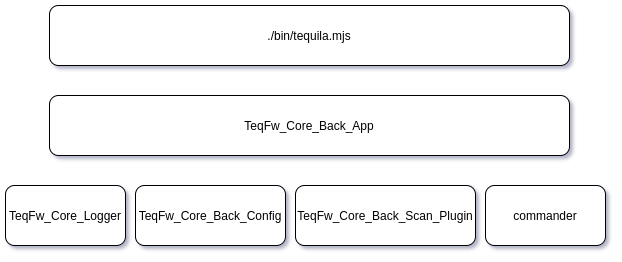

# TeqFW: Core

В этой публикация я опишу основные компоненты ядра платформы [TeqFW](https://wiredgeese.com/%D1%87%D1%82%D0%BE-%D1%82%D0%B0%D0%BA%D0%BE%D0%B5-teqfw-208d5938205). `Teq`-приложение — это прежде всего `nodejs`-приложение. Это во-первых. А во-вторых, `teq`-приложение — это модульное приложение, которое состоит из `teq`-плагинов, являющихся `npm`-модулями.

Таким образом, задачи у Ядра платформы следующие:

*   обеспечить возможность запуска `teq`-приложения и выполнения им команд в консольном режиме;
*   обеспечить поиск и подключение `teq`-плагинов;
*   заложить фундаментальные архитектурные принципы `teq`-приложений;

## Bootstrap

Точка входа в приложение — скрипт `./bin/tequila.mjs`. Он фиксирует текущее положение приложения в файловой системе, загружает [DI-контейнер](https://wiredgeese.com/%D0%B2%D0%BD%D0%B5%D0%B4%D1%80%D0%B5%D0%BD%D0%B8%D0%B5-%D0%B7%D0%B0%D0%B2%D0%B8%D1%81%D0%B8%D0%BC%D0%BE%D1%81%D1%82%D0%B5%D0%B9-%D0%B2-teqfw-b1beb319ca56), настраивает контейнер для работы с Ядром, достаёт из Контейнера объект `TeqFw_Core_Back_App$` , инициирует его и запускает. Этот скрипт не входит в Ядро и является частью пользовательского приложения, но его код [не меняется](https://github.com/teqfw/create-teqfw-app/blob/master/init/bin/tequila.mjs) от приложения к приложению:

#!/usr/bin/env node

'use strict';
import $path from 'path';

import Container from '[@teqfw/di](http://twitter.com/teqfw/di)';

const version = '0.11.0';/* Resolve paths to main folders */

const url = new URL(import.meta.url);

const script = url.pathname;

const bin = $path.dirname(script);

const root = $path.join(bin, '..');

try {

 /* Create and setup DI container */

 /** [@type](http://twitter.com/type) {TeqFw_Di_Container} */

 const container = new Container();

 const srcCore = $path

 .join(root, 'node_modules/@teqfw/core-app/src');

 const srcDi = $path.join(root, 'node_modules/@teqfw/di/src');

 container.addSourceMapping('TeqFw_Core', srcCore, true, 'mjs');

 container.addSourceMapping('TeqFw_Di', srcDi, true, 'mjs'); // Bootstrap configuration object for 'TeqFw_Core_Back_App'

 /** [@type](http://twitter.com/type) {typeof TeqFw_Core_Back_App.Bootstrap} */

 const Bootstrap = await container

 .get('TeqFw_Core_Back_App#Bootstrap');

 /** [@type](http://twitter.com/type) {TeqFw_Core_Back_App.Bootstrap} */

 const bootstrap = new Bootstrap({version, root});

 container.set('bootstrap', bootstrap); /** Request Container to construct App then run it */

 const app = await container.get('TeqFw_Core_Back_App$');

 await app.init();

 await app.run();

} catch (e) {

 console.error('Cannot create or run TeqFW application.');

 console.dir(e);

}
Разная функциональность приложений обеспечивается за счет разных `teq`-плагинов, подключаемых приложением, и реализованных в них исполняемых командах.

## TeqFw_Core_Back_App

### Инициализация

На этапе инициализации `core`-приложение выполняет следующее:

*   инициализирует логгер;
*   загружает локальную конфигурацию (параметры подключения к серверной БД и т.п.);
*   сканирует файловую систему приложения и формирует реестр `teq`-плагинов;
*   добавляет namespace’ы из найденных `teq`-плагинов в DI-контейнер;
*   сканирует `teq`-плагины и формирует список консольных команд, доступных для выполнения в данном приложении;

### Запуск

`Core`-приложение выполняет запрошенную консольную команду (как правило, запуск web-сервера). Если никакой команды не запрашивалось, то выводится список доступных команд (пример для [@flancer32/pwa_bwl](https://github.com/flancer32/pwa_bwl)) и выполнение `core`-приложения завершается:

Usage: tequila [options] [command]Options:

 -h, --help display help for commandCommands:

 app-db-reset Reset database structures and initialize test data.

 app-db-upgrade Backup data, drop-create tables then restore data.

 core-version Get version of the application.

 http2-start Start the HTTP/2 server.

 http2-stop Stop the HTTP/2 server.

 help [command] display help for command
### Завершение

`Core`-приложение предоставляет метод `stop()` для вызова из любой команды для своего завершения (например, закрытия соединений с БД).

_TODO: необходим механизм, позволяющий плагинам добавлять в этот метод свой функционал._

## Логгер

На данный момент логирование зачаточное и вывод логов реализован только на консоль и только для бэка. Но архитектурно логгер `TeqFw_Core_Logger` сделан таким образом, чтобы его можно применять и на фронте, и на бэке, а вывод логов перенаправлять при помощи подключаемых транспортов (на консоль, в файл, в базу, на сервер и т.п.).

## Конфигурация

На данный момент конфигурация приложения только локальная — `TeqFw_Core_Back_Config`. Конфиг-объект считывает JSON из файла `.cfg/local.json` и через DI предоставляет доступ к конфигурационным данным для остальных объектов приложения.

## Сканер плагинов

`Teq`-плагином считается любой `npm`-пакет, у которого в корне находится дескриптор `./teqfw.json`. В дескрипторе, как минимум, указывается маппинг namespace’а плагина (namespace выбирается разработчиком плагина) на локальную файловую систему плагина:

{

 "autoload": {

 "ns": "Vendor_Project_Plugin",

 "path": "./src"

 }

}
Сканер плагинов (`TeqFw_Core_Back_Scan_Plugin`) пробегает по всем подкаталогам в `./node_modules/` в поисках `teq`-дескрипторов (`./teqfw.json`) и фиксирует найденные `npm`-пакеты в качестве `teq`-плагинов в реестре `TeqFw_Core_Back_Scan_Plugin_Registry`. После чего `core`-приложение добавляет найденные namespace’ы и их маппинг на файловую систему в DI-контейнер.

Остальные части приложения получают доступ к плагинам и их дескрипторам через этот реестр (также через DI).

## Команды

По сути, `core`-приложение (объект `TeqFw_Core_Back_App$`) представляет собой обёртку над [commander’ом](https://www.npmjs.com/package/commander), которая анализирует `teq`-плагины приложения и добавляет к нему команды, прописанные в `teq`-дескрипторах (`./teqfw.json`):

{

 "commands": [

 "TeqFw_Core_Back_Cli_Version"

 ]

}
В узле `commands` прописываются идентификаторы es6-модулей, экспортирующих по-умолчанию фабрики для создания таких структур (`TeqFw_Core_Back_Api_Dto_Command`):

class TeqFw_Core_Back_Api_Dto_Command {

 /** [@type](http://twitter.com/type) {Function} */

 action;

 /** [@type](http://twitter.com/type) {string} */

 desc;

 /** [@type](http://twitter.com/type) {string} */

 name;

 /** [@type](http://twitter.com/type) {string} */

 realm;

}
Вот код типичной фабрики для создания команды:

export default function Factory(spec) {

 // EXTRACT DEPS

 /** [@type](http://twitter.com/type) {TeqFw_Core_Defaults} */

 const DEF = spec['TeqFw_Core_Defaults$'];

 /** [@type](http://twitter.com/type) {TeqFw_Core_Back_App.Bootstrap} */

 const cfg = spec['TeqFw_Core_Back_App#Bootstrap$'];

 /** [@type](http://twitter.com/type) {Function|TeqFw_Core_Back_Api_Dto_Command.Factory} */

 const fCommand = spec['TeqFw_Core_Back_Api_Dto_Command#Factory$']; // DEFINE INNER FUNCTIONS

 const action = async function () {

 console.log(`Application version: ${cfg.version}.`);

 }; // COMPOSE RESULT

 const res = fCommand.create();

 res.realm = DEF.BACK_REALM;

 res.name = 'version';

 res.desc = 'Get version of the application.';

 res.action = action;

 return res;

}
`Core`-приложение добавляет команды в [commander](https://www.npmjs.com/package/commander) при помощи DI-контейнера, который запускает соответствующую фабрику для создания действия (`action`) и мета-информации для commander’а:

const cmd = await container.get(`${factoryName}$`);

const fullName = (cmd.realm) 

 ? `${cmd.realm}-${cmd.name}` 

 : cmd.name;

commander.command(fullName)

 .description(cmd.desc)

 .action(cmd.action);
## Резюме

`core`-плагин в TeqFW содержит функционал для обнаружения `teq`-плагинов в общей массе `npm`-модулей, а также для нахождения консольных команд в `teq`-плагинах и выполнения запрошенной пользователем команды. Инициирует объекты логгера и локальной конфигурации приложения и помещает их в DI-контейнер.

