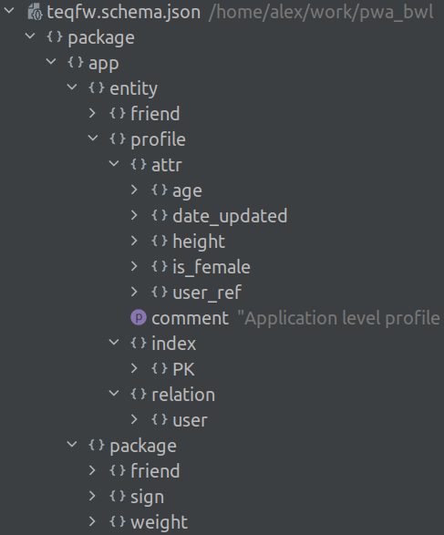

# JSON-описание реляционных структур данных

[Реляционная модель данных](https://ru.wikipedia.org/wiki/%D0%A0%D0%B5%D0%BB%D1%8F%D1%86%D0%B8%D0%BE%D0%BD%D0%BD%D0%B0%D1%8F_%D0%BC%D0%BE%D0%B4%D0%B5%D0%BB%D1%8C_%D0%B4%D0%B0%D0%BD%D0%BD%D1%8B%D1%85) занимает значимое место в разработке web-приложений. Стандартным способом описания реляционных структур данных является формат SQL. В отношении программного анализа содержимого и его трансформации SQL уступает таким форматам, как XML, JSON, YAML.

В таких платформах, как Magento, WordPress, Drupal, Joomla и т.п. присутствует независимая разработка расширений (плагинов), добавляющих в базу данных приложения свои собственные структуры данных, помимо структур самой платформы. В случае добавления большого количества сторонних плагинов желательно иметь инструмент анализа текущей структуры базы данных и структуры данных устанавливаемых плагинов для нахождения возможных несоответствий. В Magento 2 для таких целей используется [XML-описание](https://devdocs.magento.com/guides/v2.4/extension-dev-guide/declarative-schema/) структур данных.

Ниже я рассматриваю возможность описания структур данных в виде JSON-файла и преимущества, которые может дать подобное описание. Описание достаточно поверхностное и призвано продемонстрировать основную идею использования JSON-формата вместо SQL для описания структур данных.

## Область применения

Отмечу сразу, что JSON-описание не является полной заменой SQL, а фокусируется только на основах реляционной модели — таблицах и отношениях между ними. Представления, триггеры, процедуры и прочие дополнения в рассматриваемое описание не входят.

Пакеты для работы с базами данных (типа Hibernate, Doctrine, Sequelize) скрывают от разработчика часть возможностей СУБД, оставляя общие или часто употребимые специфические. JSON-описание ещё больше абстрагируется от деталей конкретных СУБД (и пакетов для работы с ними), фокусируясь на основных моментах — сущностях, атрибутах, отношениях.

Принципиально возможно расширить JSON-описание и добавить в него инструкции, специфические для отдельных СУБД, но в данной публикации рассматривается “_лес_”, а не “_деревья_”.

## Сущность

Отдельная сущность (таблица) описывается следующими характеристиками (атрибуты, индексы, отношения):

{

 "entity": {

 "name": {

 "attr": {},

 "index": {},

 "relation": {}

 }

 }

}
## Пакеты

В базе данных приложения может быть множество таблиц. Зачастую таблицы можно сгруппировать иерархически, по области применения хранимых данных (`/catalog/category/attr`, `/catalog/product/link`), как бы раскладывая “_таблицы_” по различным “_фолдерам_”, аналогично файловой системе. Современные базы данных не поддерживают подобную “_файловую_” группировку таблиц, сохраняя все “_файлы_” в одном “_фолдере_”, поэтому сложилась практика, когда для придания некоторого порядка для баз, содержащих сотни таблиц, имена таблиц включают в себя “_путь в иерархии_” и выглядят примерно так:

*   `catalog_category_attr`
*   `catalog_product_link`

Вполне естественно напрашивается мысль разбить всё множество сущностей на пакеты, вложенные друг в друга:

{

 "entity": {},

 "package": {

 "entity": {},

 "package": {}

 }

}
## Атрибуты

Сущности характеризуются своими атрибутами. Абстрагируясь от типов данных в различных СУБД, можно свести типы атрибутов сущностей к следующему списку:

// JSON types

boolean

integer

number

string// DB types

binary

datetime

option (enum)

text
### Идентификатор и референс

Есть два особых типа атрибута, которые не вошли в список выше:

id

ref
`id` — числовой идентификатор экземпляра сущности. В таблицах это поле, как правило, является инкрементным и его значения формируют первичный ключ для сущности.

`ref` — ссылка одной сущности на идентификатор другой сущности .

Определения идентификатора и ссылки должны совпадать (тип поля, длина, unsigned и т.п.), чтобы можно было построить внешние ключи.

### Общие и специфические свойства атрибутов

Помимо имени и типа (`name`, `type`) все атрибуты могут обладать такими общими характеристиками, как:

comment

default

nullable
В зависимости от типа атрибуты могут характеризоваться следующими опциями:

dateOnly // datetime

precision // number

scale // number

unsigned // integer

values // option/enum
Вот пример JSON-описания атрибутов:

{

 "attr": {

 "user_ref": {"type": "ref"},

 "date": {

 "type": "date",

 "options": {"dateOnly": true},

 "default": "current"

 },

 "type": {

 "comment": "Weight type: current or target.",

 "type": "option",

 "options": {"values": ["c", "t"]},

 "default": "c"

 },

 "value": {

 "comment": "Statistical value for the weight in kg: 75.4.",

 "type": "number",

 "options": {"precision": 4, "scale": 1}

 }

 }

}
## Индексы

Индексы накладывают ограничения на содержащиеся данные (первичные и уникальные), используются для связей между сущностями и для ускорения поиска. В общем случае можно выделить 4 типа индексов:

FULLTEXT

INDEX

PRIMARY

UNIQUE
Вот примеры описания индексов в JSON-формате:

{

 "index": {

 "pk": {"type": "primary", "attrs": ["user_ref", "date", "type"]}

 }

}{

 "index": {

 "pk": {"type": "primary", "attrs": ["login"]},

 "uq_user": {"type": "unique", "attrs": ["user_ref"]}

 }

}
## Отношения

Отношения выстраиваются между двумя сущностями — атрибуты одной сущности ставятся в соответствие атрибутам другой. Отношения являются основой реляционной модели данных.

{

 "relation": {

 "name": {

 "attrs": ["this_attr", ...],

 "ref": {"path": "/path/to/...", "attrs": ["that_attr", ...]}

 }

 }

}
От отношений между сущностями зависит порядок создания/удаления таблиц в БД.

## Пример JSON-описания

Описание структуры данных в тестовом проекте BWL ([teqfw.schema.json](https://github.com/flancer32/pwa_bwl/blob/main/teqfw.schema.json)) и его представление в IDE:

Подобная форма подачи схемы данных облегчает разработчику восприятие всей совокупности сущностей предметной области (за счёт пакетов и комментариев к ним).

## Резюме

JSON-описание структуры данных позволяет сфокусироваться на данных и отношениях между ними лучше, чем это позволяет делать SQL (особенно для баз, где количество таблиц превышает сотню).

Возможна распределённая разработка отдельных частей единой схемы данных в разных плагинах и их объединение в рамках приложения с учётом зависимостей между сущностями (создание/удаление таблиц).

Программная обработка JSON/XML/YAML форматов проще, чем обработка SQL, поэтому облегчается версионирование схем данных при эволюции приложения и сравнение различных схем данных.
