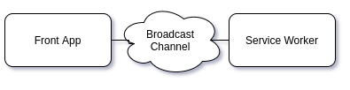

# Коммуникация web-приложения с Service Worker’ом

Service Worker в PWA — это скрипт, который работает в отдельном от основного приложения потоке и обрабатывает сетевые обращения web-приложения к серверу (и сервера к web-приложению). По своей сути сервис-воркер является прокси-прокладкой между приложением и сервером и эта прокладка работает на стороне браузера.

У сервис-воркера есть некоторые ограничения:

*   не имеет доступа к DOM;
*   полностью асинхронен (не блокирует собственный поток выполнения);
*   не может использовать синхронные API (например, [XMLHttpRequest](https://developer.mozilla.org/en-US/docs/Web/API/XMLHttpRequest) и [Web Storage](https://developer.mozilla.org/en-US/docs/Web/API/Web_Storage_API));

В связи с event-driven архитектурой сервис-воркеров возникают проблемы коммуникации приложения (выполняемого в основном потоке) с сервис-воркером (выполняемым в своём) — приложение не может просто вызвать какой-либо метод сервис-воркера, а поэтому вынуждено использовать именованный канал ([BroadcastChannel](https://developer.mozilla.org/en-US/docs/Web/API/BroadcastChannel)) для передачи-получения информации.

## Подключение к каналу

В коде сервис-воркера (`./sw.js`) весь функционал подключается через события:

/**

 * [@param](http://twitter.com/param) {MessageEvent} event

 */

function onMessage(event) {...}

self.addEventListener('message', onMessage);
Со стороны приложения подключение аналогичное:

/**

 * [@param](http://twitter.com/param) {MessageEvent} event

 */

function onMessage(event) {...}

navigator.serviceWorker.addEventListener('message', onMessage);
## Передача сообщений

Сообщения, как правило, инициирует приложение, поскольку именно с ним взаимодействует пользователь и именно он хочет получить какую-то информацию от сервис-воркера или изменить его текущий режим работы. Сообщением может быть любой объект, который в асинхронном режиме приложение отправляет текущему активному сервис-воркеру:

navigator.serviceWorker

 .ready

 .then((reg) => reg.active.postMessage({payload: ...}));
Сервис-воркер получает сообщение обрабатывает его, но он не имеет возможности вернуть ответ в силу асинхронной природы канала связи. Поэтому, если приложение ожидает получить какой-то результат, сервис-воркер может лишь отправить назад аналогичное сообщение:

function onMessage(event) {

 ...

 event.source.postMessage({result: ...});

}
## Синхронизация запросов и ответов

Поскольку общение между приложением и сервис-воркером асинхронное, то приложение не знает, какое из ответных сообщений сервис-воркера к какому запросу относится. Для сопоставления запросов и ответов приложение может регистрировать в специальном реестре каждый запрос со своим собственным уникальными идентификатором и передавать этот идентификатор в теле сообщения сервис-воркеру, а в качестве ответа возвращать промис:

const queue = {};

const generateMsgId = () => `${(new Date()).getTime()}`;function sendMsgToSw(payload) {

 const id = generateMsgId();

 return new Promise((resolve) => {

 queue[id] = resolve;

 const msg = {id, payload};

 self.navigator.serviceWorker

 .ready

 .then((reg) => reg.active.postMessage(msg));

 });

}
Сервис-воркер может возвращать этот идентификатор вместе с ответом обратно в приложение:

function onMessage(event) {

 const msg = event.data;

 const id = msg.id;

 const res = `answer from SW to msg #${id}.`;

 event.source.postMessage({id, payload: res});

}
После чего обработчик на стороне приложения по идентификатору сообщения находит в реестре соответствующий промис и разрешает его:

navigator.serviceWorker.addEventListener('message', (event) => {

 const msg = event.data;

 if (typeof queue[msg.id] === 'function') 

 queue[msg.id](msg.payload);

});
Коммуникация с сервис-воркером из приложения будет выглядеть так:

sendMsgToSw('message from app')

 .then((res) => console.log(JSON.stringify(res)));
## Резюме

Прямая связь между приложением и сервис-воркером невозможна в силу архитектуры сервис-воркеров. Поэтому для взаимодействия приходится использовать асинхронные сообщения, передаваемые через именованный канал:

Как следствие, в приложении возникает необходимость синхронизации сообщений с запросами, отправляемых сервис-воркеру, и сообщений с ответами, получаемыми обратно.

Соответствующий код:
