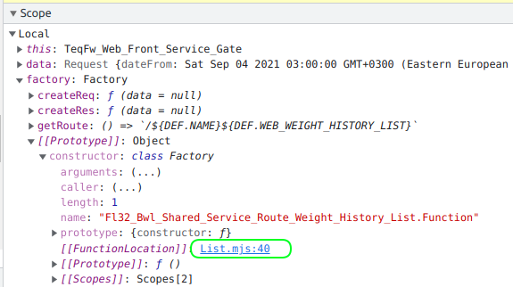

# TeqFW: action

Действие (action) — наиболее универсальный объект кода на платформе [TeqFW](https://wiredgeese.com/%D1%87%D1%82%D0%BE-%D1%82%D0%B0%D0%BA%D0%BE%D0%B5-teqfw-208d5938205). В общем случае действие представляет собой функцию у которой входной и выходной параметры являются объектами:

const {out1, out2} = action({in1, in2});
Действие применяется для кодирования функционала, который может использоваться вне рамок “_своего_” `npm`-пакета (пакета, в котором определён код действия). Именно поэтому действие имеет [один входной и один выходной](https://habr.com/ru/post/321862/) параметры — такой подход позволяет уменьшить зацепление между двумя фрагментами кода. Ослабляется зависимость вызывающего кода от количества и порядка следования входных параметров вызываемого кода.

В TeqFW используется динамическая загрузка исходников, основанная на [пространстве имён](https://wiredgeese.com/teqfw-namespaces-26eee644615a), в котором каждый `es6`-модуль `teq`-плагина имеет своё собственное, уникальное имя. Поэтому типовым подходом является размещение одного действия в одном `es6`-модуле.

## Фабрика

Зачастую, для работы действия нужно загрузить соответствующие зависимости — другие действия, конфигурацию приложения, логгер, соединение с БД и т. д. Поэтому результатом `default`-экспорта `es6`-модуля, содержащего действие, является фабрика, создающая действие, а не само действие. Для инъекции зависимостей в фабрику используется `spec`-объект, при помощи которого DI-движок внедряет зависимости в фабрику, а фабрика настраивает окружение для действия, создаёт и возвращает само действие:

export default function (spec) {

 // EXTRACT DEPS

 /** [@type](http://twitter.com/type) {Vnd_Prj_Back_Defaults} */

 const DEF = spec['Vnd_Prj_Back_Defaults$']; // DEFINE INNER FUNCTIONS

 async function act(input) {

 const output = {};

 // ...

 return output;

 } // MAIN FUNCTIONALITY

 return act;

}
В рамках платформы зависимость от действия, создаваемого фабрикой, экспортируемой `es6`-модулем, прописывается так:

/** [@type](http://twitter.com/type) {Vnd_Prj_Back_Act_Name|Function} */

const actSingle = spec['Vnd_Prj_Back_Act_Name$'];

/** [@type](http://twitter.com/type) {Vnd_Prj_Back_Act_Name|Function} */

const actInst = spec['Vnd_Prj_Back_Act_Name$$'];
В первом случае `actSingle` создаётся DI’ем как singleton (`$` — в конце идентификатора), во втором (`actInst`) — как новый экземпляр (`$$` — в конце).

## Глобальная идентификация

В JS с его особенностями под отладчиком иногда бывает непонятно, где искать код для той или иной функции. В браузере отладчик показывает, где находится исходник для соответствующего элемента кода:

но в IDEA, например, отладчик такой информации не даёт.

Поэтому, если предполагается, что информация о местонахождении кода исходника может пригодиться, то перед возвращением действия фабрика добавляет к её имени функции префикс с namespace’ом:

const NS = 'Vnd_Prj_Back_Act_Name';

export default function (spec) {

 // ...

 async function act(input) {} // MAIN FUNCTIONALITY

 Object.defineProperty(act, 'name', {value: `${NS}.act`});

 return act;

}
## Код результата

Если действие реализует достаточно сложную логику и результат может содержать код ошибки, то в коде модуля задаётся кодификатор возможных вариантов для кода результата и сам кодификатор “_навешивается_” на действие фабрикой:

/**

 * [@memberOf](http://twitter.com/memberOf) Vnd_Prj_Back_Act_Name

 */

const RESULT = {

 FAIL: 'fail',

 SUCCESS: 'success',

}

Object.freeze(RESULT);export default function (spec) {

 // ...

 async function act(input) {} // MAIN FUNCTIONALITY

 // ...

 act.RESULT = RESULT;

 return act;

}
Использование кодификатора выглядит так:

/** [@type](http://twitter.com/type) {Vnd_Prj_Back_Act_Name|Function} */

const act = spec['Vnd_Prj_Back_Act_Name$'];

/** [@type](http://twitter.com/type) {typeof Vnd_Prj_Back_Act_Name.RESULT} */

const RESULT = act.RESULT;

// ...

const {code} = act({in1, in2, in3});

if (code === RESULT.SUCCESS) {...}
JSDoc-аннотации с типами позволяют IDE ориентироваться в коде и помогать разработчику.

## Резюме

Действие — это один из базовых “_кирпичей_” в платформе [TeqFW](https://wiredgeese.com/%D1%87%D1%82%D0%BE-%D1%82%D0%B0%D0%BA%D0%BE%D0%B5-teqfw-208d5938205). Применяется для кодирования функционала, который может использоваться за пределами “_своего_” `npm`-модуля. Один `es6`-модуль содержит фабрику для настройки окружения и создания в нём одного действия. Необходимые кодификаторы (например, код результата) вешаются на само действие и таким образом становятся доступными для вызывающего кода.

Код типового действия:
