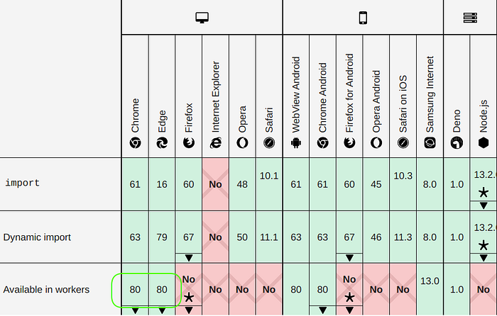
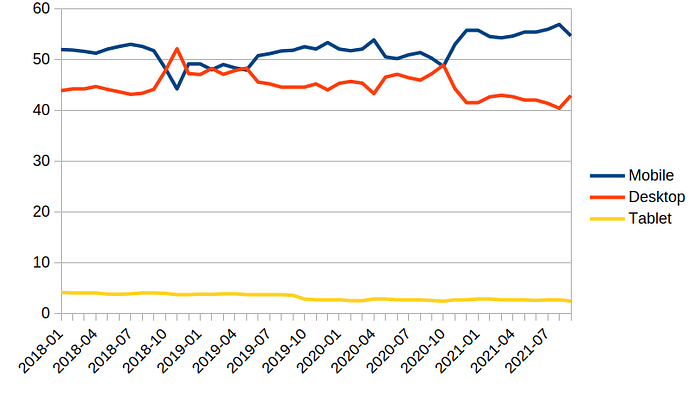
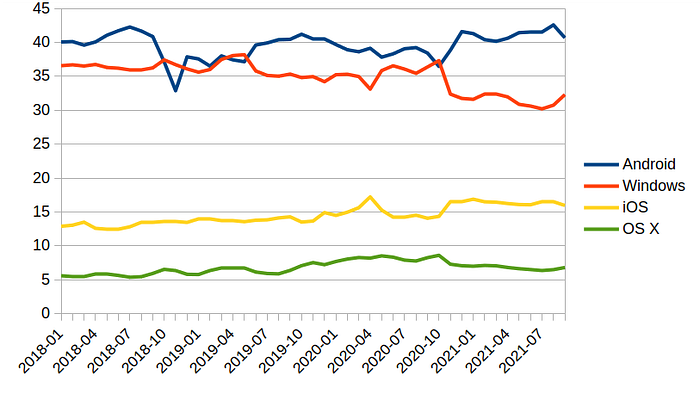
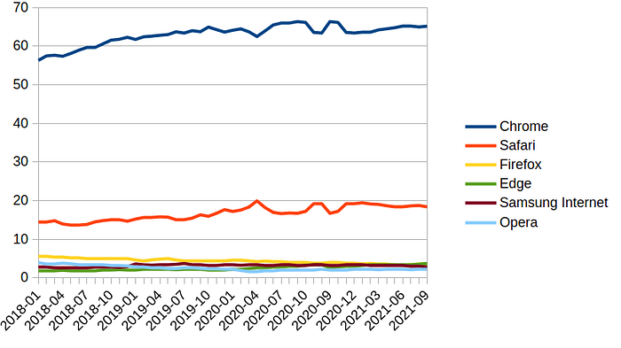
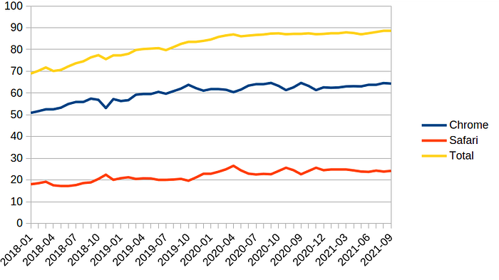

# PWA: перспективы среды обитания

Progressive Web App

Google

Chrome

Safari

Mobile Apps

Недавно столкнулся с проблемой — попытался использовать статический`import` в коде service worker’ов и выяснил, что на данный момент он работает только в браузерах на движке Blink (Chrome, Edge, …):

Предполагается, что в скором времени и [Firefox](https://github.com/mozilla/standards-positions/issues/499), и [Safari](https://webkit.org/blog/11577/release-notes-for-safari-technology-preview-122/) добавят у себя этот функционал, но на октябрь 2021 года ситуация вот такая — Импорты es6-модулей в коде service worker’ов работают в Chrome (Edge, Opera, …), но не работают в Firefox и Safari:

import setup from './sw/mod.mjs';

Progressive Web App — это достаточно свежая технология. Несмотря на то, что идеи, на которых базируется PWA, появились 15-20 лет назад (в 2000 году — Microsoft и [HTA](https://ru.wikipedia.org/wiki/HTML_Application), в 2007 году — Apple), более-менее широкая популярность к ним пришла в 2015 году — когда Google добавил поддержку Service Workers и Web App Manifest в браузер Chrome. В 2016 году Service Workers добавили в Firefox v. 44 (Extended Support Release начал поддерживать Service Workers только с 30 июня 2020, с версии 78), а признанной эта технология стала лишь весной 2018 года — когда поддержку Service Worker’ов добавили в Safari и в Edge.

Другими словами, PWA и в 2021-м году — это всё ещё очень динамично развивающаяся область, в которой есть как многообещающие направления, так и будущие тупики. Движителем технологии является Google. Именно он перерабатывает основную массу “_породы_”, отделяя “_зерна от плевел_”. Он задаёт тон. Но без поддержки остальных “_игроков_” (в первую очередь Apple) у него есть всего два пути:

*   “_захватить весь мир_” в случае успеха;
*   смириться с убытками в случае неудачи и спихнуть на энтузиастов ещё один продукт, типа [GWT](https://ru.wikipedia.org/wiki/Google_Web_Toolkit);

Так к какому же варианту на данный момент ближе Google и какова динамика развития событий? Я проанализировал некоторые данные по браузерам, операционным системам и устройствам, взятые с сайта [statcounter.com](https://gs.statcounter.com/).

## Устройства

Процент использования смартфонов / десктопов / планшетов с 2018 года по 2021:

Процент использования планшетов для доступа к web-приложениям колеблется в районе 3%, что говорит о низкой актуальности данного типа устройств. Мобильные устройства (смартфоны) слегка опережают десктопы (ноутбуки) по популярности — 55% и 42% соответственно. Т.е., оба типа устройств используются для доступа к web-ресурсам (в том числе и PWA) примерно с одинаковой частотой.

## Операционные системы

Процент использования операционных систем с 2018 года по 2021:

На четыре основных операционных системы приходится порядка 95% всего использования. Причём на мобильные версии (Android и iOS) приходится порядка 58%, а на десктопные (Windows, OS X) — порядка 38% от общего использования всех ОС. На оставшиеся ОС приходится порядка 4–5%.

С 2018 года есть небольшой процент роста использования мобильных ОС (в основном за счёт iOS). Десктопные ОС слегка “_просели_” за это время, причём в основном за счёт Windows (OS X даже набрала пару процентов).

## Браузеры

У браузеров есть два явных лидера — Chrome (65%) и Safari (18%). Вместе они занимают порядка 83% от всего “_рынка_”. При этом у обоих браузеров явно виден рост их долей за последние несколько лет.

## Браузеры на мобильных

PWA — это, прежде всего, [смартфоны](https://habr.com/ru/post/519880/). Вот так обстоят дела с браузерами на смартфонах:

Я взял только два основных браузера (Chrome и Safari), а также отобразил их общую долю на “_рынке_”. Видно, что с 2018-го года и Chrome, и Safari наращивают своё присутствие, причём Chrome делает это несколько активнее (с 53% до 64% с 2018 года против с 18% до 24% у Safari). Совокупная доля обоих браузеров выросла за это время с 70% до 87%. На долю всех остальных “_мобильных_” браузеров приходится 13%, из которых 5% — у Samsung Internet и по 2% у Opera и UC Browser.

## Резюме

*   Если применить “[принцип Парето](https://ru.wikipedia.org/wiki/%D0%97%D0%B0%D0%BA%D0%BE%D0%BD_%D0%9F%D0%B0%D1%80%D0%B5%D1%82%D0%BE)” к разработке PWA, то есть только два браузера — Chrome и Safari, на остальные можно не заморачиваться.
*   Ориентация разработки только лишь на Chrome позволяет охватить всего 64% пользователей смартфонов. Учёт особенностей Safari расширяет охват до 87%.
*   Процент использования смартфонов растёт, но вытеснения ими десктопов не намечается даже в отдалённой перспективе.
*   Тем не менее, удельный объём смартфонов в общем трафике (52%) делает целесообразным создание PWA отдельно для этой платформы с учётом её особенностей (размеры дисплея, устройства ввода, offline, …), вместо того, чтобы делать гибриды (адаптивный дизайн и т.п.).
*   Позиция Chrome устойчива как на десктопах, так и на смартфонах. Тенденции к снижению присутствия не наблюдается, даже наоборот. Так что роль Google в отношении PWA можно описать как “_тотальное доминирование_”, а перспективы ближе к “_захватить мир_”, чем наоборот.
