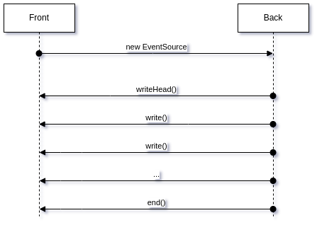
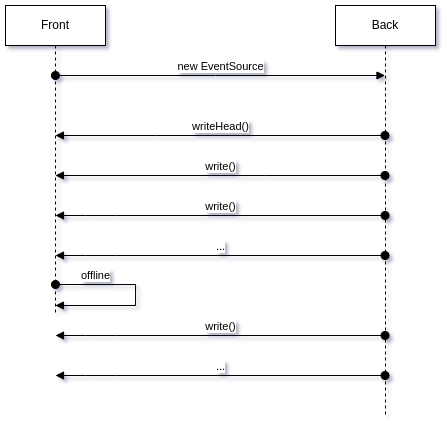
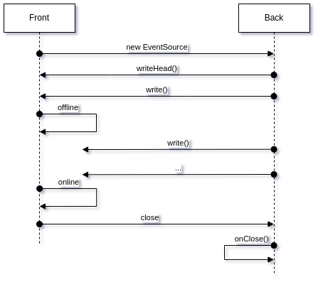
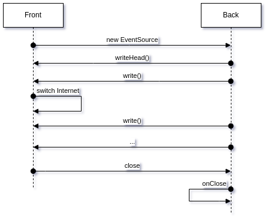

# События сервера для мобильных web-приложений

События сервера ([Server Sent Events](https://ru.wikipedia.org/wiki/Server-sent_events)) — это обычный HTTP-запрос клиента к серверу с растянутым во времени ответом. Клиент один раз отправляет запрос, открывая HTTP-соединение с сервером, после чего сервер начинает отправлять ему по этому соединению оповещения о событиях, происходящих на сервере.

Нюанс в том, что мобильные приложения, как правило, работают в условиях нестабильных соединений. Сеть может появляться/пропадать, переключаться с мобильного режима на WiFi и обратно. При этом клиент не может больше ничего отправит по уже открытому соединению, он работает только на приём. А это значит, что SSE-соединения должны постоянно мониториться со стороны сервера, причём у пары “клиент — сервер” должен быть некий механизм учёта открытых соединений, чтобы “[не плодить сущности без необходимости](https://ru.wikipedia.org/wiki/%D0%91%D1%80%D0%B8%D1%82%D0%B2%D0%B0_%D0%9E%D0%BA%D0%BA%D0%B0%D0%BC%D0%B0)” (не держать одновременно 2 открытых SSE-соединения для одного и того же клиента при переходе с WiFi на мобильный, например).

Клиент со своей стороны может отслеживать условия, при которых необходимо заново открывать SSE-соединение (при переходе в `offline`, а затем в `online`, например). Но он не всегда имеет возможность закрыть соединение с сервером со своей стороны. Для мобильных сетей типовой, скорее, является ситуация, когда SSE-соединение прерывается по ошибке, из-за обрыва связи, чем ситуация, когда SSE-закрывается клиентом или сервером (при завершении работы приложения, например).

## Основы SSE

Клиент отправляет на сервер HTTP-запрос через объект [EventSource](https://developer.mozilla.org/en-US/docs/Web/API/EventSource) и вешает прослушки (`listeners`) на нужные ему события (`error`, `message`, `open`):

const source = new EventSource('./path/to/sse/service');

source.addEventListener('error', (evt) => {});

source.addEventListener('message', (evt) => {});

source.addEventListener('open', (evt) => {});
Сервис на стороне сервера сначала отправляет заголовки ответа, сигнализирующие, что соединение является потоком событий:

res.writeHead(200, {

 'Content-Type': 'text/event-stream',

 'Cache-Control': 'no-cache',

});
а затем, по мере возникновения событий, отправляет через установленное соединение сообщения о событиях в текстовом формате:

res.write(`data: ${msg}\n\n`);
Клиент больше не может использовать установленное соединение для отправки собственных сообщений, только для получения сообщений от сервера. Сервер может закрыть соединение со своей стороны:

res.end();
Более подробно — на [learn.javascript.ru](https://learn.javascript.ru/server-sent-events).

## Идентификация клиента

В случае, если мобильный клиент переключается с WiFi на мобильный интернет или обратно, у него изменяется IP-адрес и ему нужно открывать новое SSE-соединение. Нет никакой возможности определить, что это один и тот же клиент открыл повторное соединение, если только клиент не генерирует при открытии соединения некоторый идентификатор, который отправляет в запросе при повторном соединении (в качестве GET-параметра, класс `EventSource` не даёт возможности манипулировать HTTP-заголовками).

В самом простом случае, “на поиграться”, можно генерировать достаточно большое случайное число:

async function generateId() {

 return Math.floor(Math.random() * 1000000);

}
Для реальных приложений лучше использовать пакеты [nanoid](https://www.npmjs.com/package/nanoid) или [uuid](https://www.npmjs.com/package/uuid).

Очевидно, что без подобного клиентского идентификатора у сервера нет возможности отследить, что это один и тот же мобильный (браузер, приложение) переходит от одной WiFi-точки к другой, а не разные мобильные подключаются с разных WiFi-точек.

## Установка соединения

Клиент генерирует свой идентификатор и отправляет его на сервер в GET-переменной:

const url = `[https://domain.com/sse/${id}](https://domain.com/sse/$%7Bid%7D)`;

const source = new EventSource(url);
Сервер сохраняет идентификатор клиента во внутреннем реестре и считает, что все соединения с таким идентификатором принадлежат одному клиенту (“_клиент_” в смысле “_браузер_” или “_web-приложение_”, а не в смысле “_пользователь_”).

Если в реестре сервера уже есть такой идентификатор, то сервер считает, что ранее подключенный клиент сменил тип интернет-подключения (`WiFi <-> mobile`), поменял точку доступа в интернет со сменой IP-адреса или вышел в `online` из `offline`-режима.

## Формат сообщений

Сообщения сервера — это просто текстовые строки, начинающиеся с определённый ключевых слов:

*   **retry**: рекомендованная задержка перед переподключением в миллисекундах;
*   **event**: имя пользовательского события;
*   **data**: тело сообщения;
*   **id**: идентификатор сообщения;

В общем виде отдельное сообщение сервера состоит из нескольких строк и выглядит так:

event: ...

data: ...

id: ...
Данные `retry` отправляются, если сервер считает, что клиент должен изменить интервал восстановления соединения в случае его потери (по-умолчанию — около 3–5 сек.).

## Подтверждение доставки сообщения

Сообщения сервера — это однонаправленная доставка данных от сервера к клиенту. Клиент не может подтвердить получение сообщения, используя это же соединение. Сервер может нумеровать отправляемые сообщения, и в случае потери соединения и его последующем восстановлении клиент отправляет на сервер номер последнего полученного сообщения в HTTP-заголовке:

Last-Event-ID: ...
Таким образом, без дополнительных ухищрений доставка сообщений с сервера на клиент проходит без подтверждения. Сервер просто выбрасывает сообщение в сеть и надеется, что клиент его получил и обработал.

Если бизнес-логика требует обязательного подтверждения доставки определённых сообщений, то её нужно “прикручивать сбоку” (ухищряться дополнительно).

## Обработка отдельного запроса

Обработку запроса можно разделить на три части:

*   отправка HTTP-заголовков ответа;
*   отправка сообщений о событиях;
*   завершение ответа;

Вот код для простой обработки запроса, отправляющий на клиента случайное число 2 раза в секунду на протяжении одной минуты:

/**

 * [@param](http://twitter.com/param) {http.IncomingMessage|http2.Http2ServerRequest}req

 * [@param](http://twitter.com/param) {http.ServerResponse|http2.Http2ServerResponse} res

 */

async function processRequest(req, res) {

 // DEFINE INNER FUNCTIONS

 function respond(payload, event, id) {

 res.write(`event: ${event}\n`);

 res.write(`data: ${payload}\n\n`);

 res.write(`id: ${id}\n`);

 } // MAIN FUNCTIONALITY

 // send HTTP headers to start SSE

 res.writeHead(200, {

 'Content-Type': 'text/event-stream',

 'Cache-Control': 'no-cache',

 });

 // sent event message to client every 0.5 sec

 let msgId = 1;

 const intervalId = setInterval(() => {

 const payload = Math.random();

 const event = 'rand';

 respond(payload, event, msgId++);

 }, 500);

 // close connection after 1 min.

 setTimeout(() => {

 clearInterval(intervalId);

 res.end();

 }, 60000);

}
## Типовые ситуации в мобильной сети

### Переход в offline

Если мобильное устройство переходит в `offline`-режим, то браузер определяет эту ситуацию и закрывает SSE-соединение со своей стороны. Если устройство использовало мобильный интернет, то информации о закрытии соединения попадает также и на сервер и тот прекращает отправлять сообщения.

Если же устройство использовало WiFi-подключение к интернету, то информация о закрытии соединения на сервер не попадает и он продолжает отправлять сообщения по наполовину закрывшемуся соединению:

Вполне допускаю, что такое поведение зависит от настройки WiFi-точки доступа, но вариант с пропаданием сообщений я наблюдал лично.

### Выход из `offline` с сохранением IP-адреса

Если клиент использовал WiFi, перешёл в `offline`, а затем вернулся в `online` без изменения своего IP-адреса, то браузер отправляет сигнал серверу, что он со своей стороны закрыл соединение, и сервер закрывает SSE-соединение со своей стороны. Все сообщения, которые отправлял сервер после выхода клиента в `offline`, пропадают в сети:

### Смена подключения с изменением IP-адреса

Если клиент находился _online_ (например, на мобильном интернете), а затем переключился на WiFi, то существующее соединение закрывается на клиенте, информация о событии уходит о на сервер, который закрывает соединение со своей стороны:

В этом случае все сообщения сервера доходят до клиента (ну, или почти все — возможно, сервер может отправить сообщение после того, как клиент закрыл соединение, но до того, как сервер узнал об этом).

## Резюме

Серверные события в чистом виде, без дополнительной доработки, слабо применимы в мобильной сети в силу частого “_обрыва_” соединения со стороны клиента. Сервер зачастую продолжает посылать сообщения, когда клиент уже закрыл соединение со своей стороны.

Помимо “идентификаторов клиента” для SSE-соединений в “дополнительные доработки” просится также подтверждение получения сообщений клиентской стороной. Либо бизнес-логика приложения должна учитывать, что сообщения с сервера могут пропасть по пути к клиенту.
