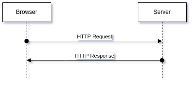
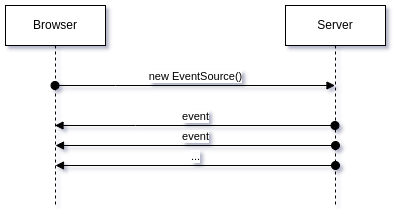
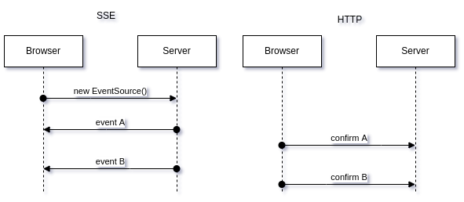
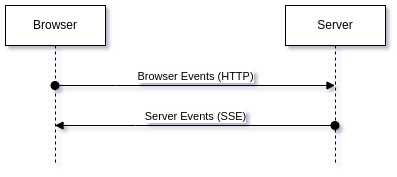

# EDA для PWA

Когда разбираешься с особенностями работы событий сервера ([Server Sent Events](https://en.wikipedia.org/wiki/Server-sent_events)) рано или поздно сталкиваешься с [Event Driven Architecture](https://en.wikipedia.org/wiki/Event-driven_architecture). Вообще-то, EDA — это “_родная_” для web-приложений архитектура. Настолько “[родная](https://wiredgeese.com/%D1%81%D0%BE%D0%B1%D1%8B%D1%82%D0%B8%D1%8F-%D0%B8-web-%D0%BF%D1%80%D0%B8%D0%BB%D0%BE%D0%B6%D0%B5%D0%BD%D0%B8%D1%8F-8e5b13a71724)”, что мы зачастую даже не замечаем её, добавляя JS-функционал в HTML-код:

<button onclick="myFunction()">Click me</button>
Взаимодействие браузера (и нашего приложения) с пользователем основано на событиях. В общем, событийно-ориентированная архитектура для web’а — это то, что интуитивно понятно любому web-разработчику, даже если он никогда про неё не слышал (что вряд ли).

С другой стороны, любому web-разработчику так же интуитивно понятно взаимодействие браузера с сервером — браузер отправляет запрос на сервер и получает в ответ результат выполнения запрошенного действия:

HTTP basics

В этом суть HTTP-протокола, альфа и омега взаимодействия клиента с сервером: отправил запрос — получил результат.

Что же предложил [Ян Хиксон](https://ru.wikipedia.org/wiki/%D0%A5%D0%B8%D0%BA%D1%81%D0%BE%D0%BD,_%D0%AF%D0%BD) в далёком 2004-м? Он [предложил](http://ln.hixie.ch/?count=1&start=1083167110) растянуть ответ сервера во времени (создать поток) и обрабатывать на клиенте результат не единым целым, а по частям (по событиям), по мере получения информации. Развитие этой идеи привело к новому Web API — [Server Sent Events](https://developer.mozilla.org/en-US/docs/Web/API/Server-sent_events).

Теперь информация с сервера на клиент может литься отдельным потоком, отображая процессы, происходящие на сервере:

Server Sent Events

Если рассматривать связку “_Browser — Server_” с позиций EDA, то сервер представляет собой “_Генератор событий_” (`Producer`), браузер — “_Подписчик на события_” (`Subscriber`), а HTTP-соединение (и поддерживающий его с обеих сторон код) — механизм обработки событий (`EventQueue`).

Подобное построение требует асинхронности при обработке данных и устойчивости к потере отдельных событий во время их передачи. Поэтому в архитектуру просится встречный поток запросов от браузера к серверу, который бы подтверждал получение браузером соответствующих событий:

Events confirmation with HTTP

Подтверждения о получении событий можно отправлять обычным POST’ом на отдельный сервис — один сервис для всех событий (нужно только указать ID события). Т.е., получается, что на один канал событий сервера нам нужен один web-сервис с потверждением доставки сообщений о событиях.

Но проблема в том, что EDA требует от приложения устойчивости к потере событий и простым обратным подтверждением проблему потери события не решить. Подтверждение ведь тоже может потеряться. Приложение должно быть спроектировано таким образом, что потеря отдельного сообщения не должна приводить к сбою в работе. Допустим, если ожидаемой реакции на действие не произошло в допустимый интервал времени, то приложение просто ещё раз отправляет сообщение о событии — а там уже от Подписчиков зависит, кто успел в предыдущий раз среагировать на это событие, а до кого оно не дошло.

Но что интересного в предыдущей схеме? То, что все подтверждения идут на один сервис, по одному каналу. А если использовать этот канал, как развернутый SSE, и таким же асинхронным образом отправлять сообщения с браузера на сервер?

То есть, вместо того, чтобы делать множество web-сервисов, выполняющих различные действия на сервере и возвращающих результаты этих действий в синхронных запросах, сделать два канала: один прямой канал (сервис, который получает сообщения от браузера), а второй — обратный (события сервера, отправляемые браузеру):

На мой взгляд, такое построение очень хорошо подходит для мобильных PWA, которые должны учитывать возможность работы в `offline`-режиме, а поэтому содержат набор рабочих данных на клиентской стороне (`localStorage`, `indexedDb`) и обмениваются данными с сервером по мере возможности.

Эта архитектура делает ненужым web-сервисы в приложении и сводят весь Web API к двум сервисам:

*   открыть канал для получения событий сервера;
*   сообщить серверу о событии в браузере;

По сути, данная архитектура делает бессмысленным использование в приложениях, её реализующих, таких технологий, как REST, GraphQL, gRPC и им подобных (ориентированные на синхронное получение данных по схеме “запрос — ответ”).

На мой взгляд, EDA очень подходит для мобильных PWA приложений, но ориентация архитектуры на события требует полной перестройки характера сетевого взаимодействия клиента и сервера. Я не утверждаю, что EDA вытеснит REST, GraphQL, gRPC, я просто отмечаю, что для мобильных PWA с их постоянными переходами “offline — online” потоки событий, IMHO, подходят лучше, чем классический “запрос — ответ”. Для обычных web-приложений, работающих в среде с устойчивым интернетом, классические технологии являются более проверенными и прогнозируемыми.
