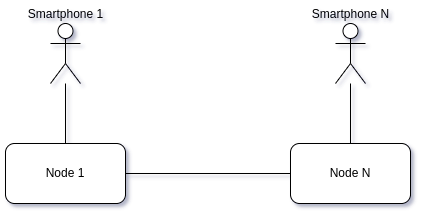

# Распределённые мобильные web-приложения

Слова для данной публикации появились после прочтения статьи “[Web3 и NFT: хайп обоснован или нет? Ещё неясно.](https://vc.ru/future/348494-web3-i-nft-hayp-obosnovan-ili-net-eshche-neyasno)”, где Дмитрий Калупин суммировал и подытожил идеи, высказанные Мокси Марлинспайком. Меня зацепила идея Мокси, что `web1` был децентрализованным, `web2` стал централизованным, а `web3` должен стать опять децентрализованным:

> the general thesis seems to be that web1 was decentralized, web2 centralized everything into platforms, and that web3 will decentralize everything again

Я наблюдаю, как технологии создания web-приложений двигают разработку именно в эту сторону — в сторону децентрализации. Самый яркий пример — [IndexedDB](https://developer.mozilla.org/ru/docs/Web/API/IndexedDB_API). Если каждый браузер обладает собственной встроенной базой данных, то зачем сохранять все данные базе на сервере? Данные пользователя — это данные пользователя, не надо их тащить на сервера.

Когда-то, давным-давно, был популярен такой протокол для чтения почты, как [POP3](https://ru.wikipedia.org/wiki/POP3). Он забирал почту с сервера (удалял физически) и сохранял на машине пользователя. Это как раз и были времена `web1` по классификации Мокси. Потом появились почтовые серверы с доступом через web-интерфейс (через браузер) и такие сервисы, как GMail (времена `web2`). Насколько я понял идею Мокси про децентрализацию, `web3` — это о том, что данные пользователя должны принадлежать самому пользователю, а не платформам, предоставляющим сервис.

Технически, у каждого из нас в кармане лежит вычислительное устройство по мощности сравнимое с тем, что стояло лет 10–15 назад у нас на столах. Я говорю о смартфонах — 4–8 Гб оперативной памяти и 256 Гб и более постоянной. А если рассматривать все смартфоны в качестве единой вычислительной сети, где каждый узел обслуживает интересы своего владельца? Не это ли имел в виду Мокси, когда говорил про децентрализацию всего и снова?

Понятно, что подобная вычислительная сеть не может быть удобной для всех и всего (например, для банковского обслуживания или e-коммерции она точно не подойдёт), но определённый класс задач она сможет решать вполне эффективно (например, социальное взаимодействие, в том числе и при помощи электронной почты). При этом каждый смартфон тем больше задействует собственных ресурсов, чем более социально активен его владелец. Кстати, было бы интересно сравнить совокупный объём памяти (оперативной и постоянной) и процессорных ресурсов всех смартфонов и всех серверов — что перевесит?

Особенностью современного web’а является его ярко выраженная дуальность: с одной стороны находятся “_сервера_”, с другой — “_браузеры_”. Сервера способны обрабатывать входящие запросы, браузеры — нет. Вся инфраструктура интернета выстроена таким образом, что снаружи на смартфон пользователя зацепиться практически невозможно (если только через [Push API](https://developer.mozilla.org/ru/docs/Web/API/Push_API)).

Поэтому стандартной является конфигурация, когда web-приложение загружается с сервера и взаимодействует в основном с этим сервером, а уже сервер перенаправляет запросы приложения далее (другим пользователям этого же сервера или на другой сервер) и способен принимать данные для web-приложения.

Таким образом, чтобы `Smartphone 1` мог передать информацию `Smartphone 2` (с учётом, что тот может быть `offline`), нужны промежуточные узлы (`Node 1`, `Node N`), способные сохранять данные, предназначенные для “_его_” пользователей, до того момента, когда пользователь будет иметь возможность забрать их. Всё это очень напоминает получение электронной почты по протоколу POP3, с той разницей, что современные технологии позволяют организовать доставку отдельных сообщений от смартфона к смартфону в течение долей секунды (при условии, что оба смартфона находятся в `online`). Сервера при такой архитектуре теряют своё значение в качестве центров обработки данных, а становятся пересылочными пунктами (очередями сообщений).

Современные технологии разработки web-приложений позволяют:

*   реализовать сложную бизнес-логику на клиентской стороне;
*   хранить и обрабатывать достаточно большие объёмы данных на клиентской стороне;
*   не зависеть от подключения к интернету (service workers);
*   использовать push-notification и SSE для загрузки данных на клиента;

Это даёт возможность создавать web-приложения:

*   _классические (клиент-серверные)_: когда данные хранятся на серверах, а пользователь через фронт лишь получает к ним доступ. Типичный пример — доступ к банковскому счёту или электронная коммерция.
*   _распределённые_: когда данные сохраняются в местах их использования , у конкретных пользователей (мессенджеры, социальные сети).
*   _оффлайновые_: когда приложение взаимодействует с сетью только для своей установки (блокнот для ведения записей или калькулятор).

Таким образом, раз сейчас можно создавать полностью оффлайновые web-приложения (как бы бредово это не звучало — _оффлайновое web-приложение_), то уж тем более можно создавать web-приложения, где персональная информация сохраняется локально, в устройстве пользователя, а сеть используется для коммуникации с серверами, а через них и с другими подобными приложениями. Понятно, что архитектура подобных распределённых приложений будет значительно отличаться от архитектуры классических клиент-серверных, как и область применения. Распределённые мобильные web-приложения могут использоваться там, где со стороны пользователя существует запрос на обеспечение конфиденциальности персональной информации и отсутствует необходимость в централизованном сборе информации (например, частная переписка). Тем не менее, распределённые мобильные web-приложения не могут существовать вообще без серверов в силу того, что мобильные устройства не могут напрямую взаимодействовать друг с другом через интернет (но могут через NFC и bluetooth). Вполне допускаю, что web3 — он как раз об этом.
