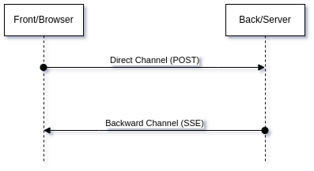
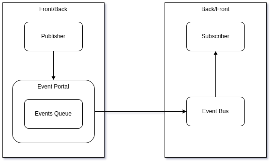
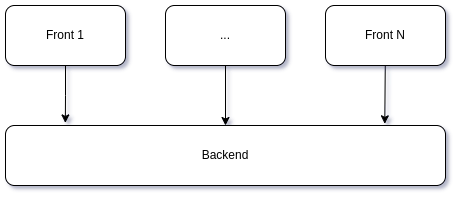

# TeqFW: трансграничные события

[Платформа TeqFW](https://wiredgeese.com/%D1%87%D1%82%D0%BE-%D1%82%D0%B0%D0%BA%D0%BE%D0%B5-teqfw-208d5938205) предназначена в первую очередь для разработки мобильных PWA, которые существуют в условиях нестабильного интернет-соединения. Классическая схема “_запрос-ответ_” для обмена данными между браузером (фронтом) и сервером (бэком) в этом случае плохо применима. Поэтому в TeqFW взаимодействие фронта и бэка выполнено на базе [событийной архитектуры](https://wiredgeese.com/eda-%D0%B4%D0%BB%D1%8F-pwa-d77d10cc3276). В данном посте описываются особенности платформы Tequila Framework, связанные с взаимодействием клиентской и серверных частей по сети Интернет.

## Основы

В teq-приложении каждый клиент (браузер) имеет один канал связи для передачи на сервер сообщений о событиях, происходящих на клиенте, и один канал связи для получения сообщений о событиях, происходящих на сервере. В интернете браузеры не могут выступать в роли серверов (принимать входящие соединения), поэтому оба канала (прямой и обратный) открываются по инициативе браузера.

Канал “клиент — сервер” — это обычный POST-запрос, канал “сервер — клиент” — это [EventSource](https://developer.mozilla.org/en-US/docs/Web/API/EventSource) ([Server Sent Events](https://ru.wikipedia.org/wiki/Server-sent_events)). Сообщения по обоим каналам однонаправленные — от издателя (_publisher_) к подписчику (_subscriber_). Для POST-запросов (прямой канал) ответы сервера не содержат данных бизнес-логики приложения, а просто служат подтверждением получения сообщения с фронта. Для SSE (обратный канал) на уровне самой технологии не предусмотрено в этом же канале ответов фронта на события, отправляемые с сервера.

В контексте данной статьи события, которые возникают на одной стороне (фронте или бэке), а должны быть обработаны на другой (бэке или фронте), называются “_трансграничными_”.

## Очередь сообщений

Так как PWA приложения должны работать и при отсутствии связи (offline mode), то для обоих каналов должны существовать буфера, которые бы накапливали сообщения о трансграничных событиях, которые в данный момент не могут быть переданы по сети другой стороне:

Каждая сторона имеет собственную Шину Событий (_Event Bus_), через которую все Подписчики оповещаются о событиях, как локальных для данной стороны, так и о трансграничных. На другую сторону сообщения о событиях передаются через Портал Событий (_Event Portal_), который по сети переправляет сообщения на Шину Событий другой стороны. Если в данный момент соединение с другой стороной отсутствует, то событие сохраняется в Очереди Событий (_Events Queue_) до момента восстановления соединения.

Данная схема работает симметрично для обоих каналов (прямого — “фронт-бэк” и обратного — “бэк-фронт”). Портал Событий со стороны Издателя оценивает возможность отправить трансграничное сообщение на другую сторону и, если отправка невозможна, сохраняет сообщение в Очереди. При первой же возможности (переход в online-режим) все сообщения из Очереди отправляются на другую сторону.

## Мониторинг состояния сети

Как уже было сказано выше, за установление соединений по прямому и обратному каналам отвечает фронт. Если браузер фиксирует отсутствие соединения с интернетом ([navigator.onLine](https://developer.mozilla.org/en-US/docs/Web/API/Navigator/onLine)), то все поступающие сообщения помещаются в очередь (и сохраняются в IndexedDB). Если соединение с интернетом есть, то фронт пытается установить с бэком SSE-соединение (поднять обратный канал). Если обратный канал поднят, то можно отправлять сообщения на сервер и получать сообщения от него.

Если интернет-соединение есть, но с сервером не удаётся установить связь по обратному каналу (SSE), то фронт считает, что сервер недоступен и складирует все сообщения в очередь на своей стороне. При этом фронт периодически пытается поднять обратный канал (сначала каждый 5 секунд, затем, через 2 минуты, частота запросов уменьшается до одного в минуту). Как только прямое и обратное соединение между фронтом и бэком установлено, сообщения из фронт- и бэк-очередей перекидываются на другую сторону.

События, сохраняемые в очередях, могут потерять свою актуальность за время отсутствия соединения, а также события могут потеряться в сети (актуально для SSE). Поэтому бизнес-логика приложения с событийно-ориентированной архитектурой значительно отличается от традиционной архитектуры, основанной на синхронных запросах и ответах, и должна предусматривать возможность синхронизации состояний фронта и бэка в случае потери событий (например, асинхронное подтверждение доставки критического с точки зрения бизнеса сообщения и повторная его отправка, если подтверждение не получено в отведённое время).

Разница между двумя этими подходами сопоставима с разницей между TCP-пакетами (с гарантированной доставкой) и UDP-пакетами (без гарантированной доставки). Гарантированная доставка, безусловно, проще в использовании, но лишь в случае стабильного интернет-соединения. Если же соединение “мерцает” (то есть, то нет), то “_UDP-подход_” становится более эффективным, чем “_TCP-подход_”.

## Frontend UUID

Как правило, с точки зрения фронта у него есть только один бэк. Фронт открывает соединения с бэком по прямому и обратному каналам и отправляет/принимает через них сообщения. А вот с точки зрения бэка фронтов много и бэк должен каким-то образом отличать один фронт от другого:

PWA-приложение — это приложение, которое работает в браузере. Если в смартфоне есть несколько браузеров, в каждые из которых будет загружено PWA-приложение с одного и того же сервера, то с точки зрения доступа к ресурсам (cookies, кэш, IndexedDB) это будут разные приложения. Даже если в одном и том же браузере (Chrome) используются различные профили, это будут различные PWA-приложения.

Чтобы бэк мог на своей стороне различать, какому фронту нужно отправлять сообщение о событии, фронты должны каким-то образом идентифицировать себя. При первой загрузке в браузер PWA-приложение “_инсталлируется_” — устанавливается service worker, загружаются в кэш нужные файлы с сервера и т.п. При “_инсталляции_” teq-приложение генерирует [UUID](https://ru.wikipedia.org/wiki/UUID) для фронта, который сохраняется в хранилище браузера (в IndexedDB). Этот UUID и используется бэком для идентификации конкретного фронта. Все трансграничные сообщения, отправляемые фронтом на бэк, содержат этот UUID в качестве мета-атрибута. UUID не является аналогом `sessionId` или `accessToken`, это просто некоторый идентификатор конкретного фронта.

UUID фронта используется бэком, чтобы закрыть существующий SSE-канал к этому же фронту в случае дублирования соединения(возможно “зависание” SSE-канала, когда сервер отправляет сообщения в канал, а клиент уже повторно установил новый — например, при переключении между мобильным и WiFi подключениями).

## Структура сообщения

Трансграничное сообщение в TeqFW — это JSON-объект, состоящий из двух частей:

{

 "data": {},

 "meta": {

 "name": "Event_Name",

 "uuid": " 6619619c-c46a-409a-b852-9e919328f717",

 "published": "2022-01-31T13:11:51.628Z",

 "frontUUID": "34445e07-5395-4c22-bcc4-3403e3a19e14"

 }

}
Часть `data` содержит бизнес-данные, относящиеся к событию. Часть `meta` содержит служебные данные, необходимые для обработки сообщения:

*   `name`: имя сообщения;
*   `uuid`: UUID конкретного сообщения;
*   `published`: дата публикации сообщения в источнике (UTC);
*   `frontUUID`: UUID фронта с которого пришло сообщение о событии или на который отправляется.

## Резюме

Web-приложения, ориентированные на смартфоны, должны существовать в условиях нестабильного интернет-соединения с сервером. В данных условиях очень хорошо применима событийно-ориентированная архитектура и “_UDP-подход_” (доставка без гарантии) вместо “_TCP-подхода_”. Сообщения о событиях, передаваемые между фронтами и бэком, должны помимо бизнес-данных содержать также и дополнительные метаданные, которые помогают приложению обрабатывать сообщения.
