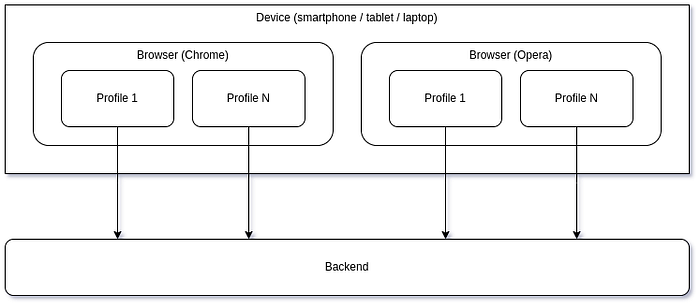
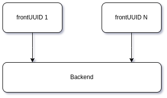
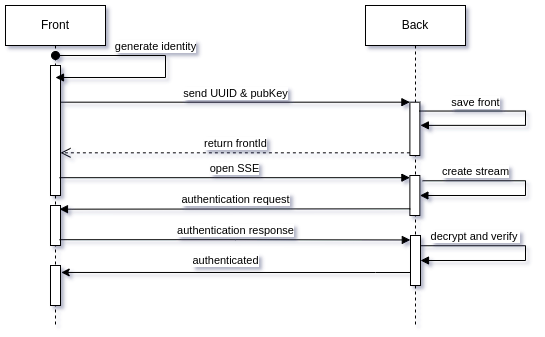

# TeqFW: идентификация web-приложений

Мобильные PWA-приложения отличаются от обычных PWA-приложений не только тем, что у них периодически отваливается подключение к интернету, но также и тем, что у них может периодически меняться IP-адрес (при смене одной wifi-точки на другую, например). В этой статье я описываю, каким образом в приложениях на платформе [Tequila Framework](https://wiredgeese.com/%D1%87%D1%82%D0%BE-%D1%82%D0%B0%D0%BA%D0%BE%D0%B5-teqfw-208d5938205) происходит идентификация клиентской части (фронта).

## frontUUID

Если обычные приложения “живут” в операционных системах (windows, linux, ios, android) и доступ к ресурсами им предоставляют операционные системы, то PWA “живут” в браузерах и доступ к ресурсам (local storage, IndexedDb, cookies, кэш) им предоставляют браузеры. Если на одном физическом устройстве (смартфоне, ноутбуке, …), установлено несколько браузеров, в каждом из которых с одного и того же сервера установлено и запущено одно и то же PWA-приложение, то с точки зрения доступа к ресурсам это будет разные экземпляры PWA. Даже если один и тот же браузер (например, Chrome) будет запущен с разными пользовательскими профилями, то и в этом случае приложения, работающие в разных профилях, не будут видеть данные друг друга (будут являться различными экземплярами приложения со своими ресурсами). А вот если в браузере открыть две вкладки и в каждой из них запустить одно и то же PWA-приложение, то они будут использовать общий набор ресурсов.

Каким же образом бэкенд может различать приложения, работающие на одном и том же физическом устройстве? Ведь с точки зрения бэкэнда у них будет один и тот же IP-адрес и даже имя браузера (если используются различные профили).

Самый очевидный ответ — сгенерировать некоторый код и сохранить его в доступных ресурсах (local storage или IndexedDB). Все экземпляры приложения, которые используют одни и те же ресурсы, будут иметь один и тот же код. В качестве (достаточно) уникальных идентификаторов в распределённых приложениях используется [UUID](https://ru.wikipedia.org/wiki/UUID). Таким образом, если фронт приложения, работающий в браузере, не находит в условленном месте (например, в local storage) UUID-идентификатора, то он создает его и сохраняет в этом условленном месте (первый запуск приложения). Если же такой идентификатор существует, то он и используется для общения с бэком.

В рамках платформы TeqFW подобный идентификатор называется `frontUUID`.

## Идентификация фронта

Теперь картинка со множеством браузеров и профайлов упрощается до такой:

С точки зрения сервера все входящие запросы, у которых один и тот же `frontUUID`, относятся к одному и тому же экземпляру фронта, вне зависимости, с какого IP-адреса они получены. Для получения [сообщений о событиях бэка](https://wiredgeese.com/%D1%81%D0%BE%D0%B1%D1%8B%D1%82%D0%B8%D1%8F-%D1%81%D0%B5%D1%80%D0%B2%D0%B5%D1%80%D0%B0-%D0%B4%D0%BB%D1%8F-%D0%BC%D0%BE%D0%B1%D0%B8%D0%BB%D1%8C%D0%BD%D1%8B%D1%85-web-%D0%BF%D1%80%D0%B8%D0%BB%D0%BE%D0%B6%D0%B5%D0%BD%D0%B8%D0%B9-eb540c7b3f3f) фронт открывает SSE-канал, указывая свой собственный `frontUUID` в GET-запросе (SSE нельзя открыть другим запросом, только GET). Например, так:

https://server.com/sse/7dc933ff-5acd-434d-8703-7cef276d69e2
Бэк “на ходу” (runtime) привязывает открываемые SSE-каналы (runtime-объекты) к соответствующим `frontUUID` во внутреннем реестре, а затем использует эту привязку, чтобы отправлять сообщения нужному фронту, зная его `frontUUID`.

При этом, если пришёл запрос на открытие SSE-канала с `frontUUID` для которого уже есть открытый канал (переключение интернета “_mobile-to-wifi_”), то бэк закрывает старый канал и открывает новый. Бэк резонно полагает, что для связи одного фронта с бэком достаточно одного SSE-канала.

## Подмена frontUUID

Как следствие, если на двух различных физических устройствах (смартфон и ноутбук, например) запущено два экземпляра web-приложения с одним и тем же `frontUUID`, то для бэка это будет один и тот же экземпляр. Алгоритм генерации UUID’ов предполагает, что вероятность подобной коллизии настолько мала, что ею можно пренебречь. Но если какой-либо злоумышленник получит действительный UUID какого-либо фронта, то он сможет выдать себя за жертву и получить в своё приложение данные, которые предназначались не ему.

Если жертва и злоумышленник одновременно пытаются работать с сервером, то сервер будет думать, что это один и тот же фронт перемещается между точками подключения к интернету и будет принудительно закрывать более старое соединение. Так как на фронте работает отдельная функция, которая пытается поднять SSE-соединение, если оно оборвалось, то жертва будет периодически отваливаться, подключаться, отваливаться и т.д. Период подключений зависит от конкретного приложения (как правило, несколько секунд).

А вот если жертва находится offline, то злоумышленник вполне успешно может выдавать себя за неё. Можно ли каким-то образом избежать подобной ситуации?

## Асимметричное шифрование

Основной проблемой является то, что `frontUUID` передаётся по сети. PWA для работы требуют наличия шифрования (HTTPS), тем не менее есть возможность извлечь нужный `frontUUID` из, допустим, логов web-сервера. С точки зрения безопасности писать UUID’ы в логи — идея плохая, но с точки зрения “разбора полётов” при инцидентах — очень даже хорошая.

А можно ли сделать так, чтобы сам идентификатор по сети не передавался, но в то же самое время надёжно идентифицировал отправителя? Классическое решение в подобной ситуации — ассиметричное шифрование. По сети передаётся только открытая часть ключа (используемая для дешифрации сообщений), а закрытая часть (для шифрации) не выходит за рамки клиентского устройства (смартфона). Получается, что идентифицировать себя может лишь тот, у кого есть закрытая часть ключа, а проверить идентификатор — любой, у кого есть открытая.

Таким образом, при инсталляции фронт-приложения создаётся не только `frontUUID`, но и генерируется ключ для ассиметричного шифрования. Публичная часть ключа и `frontUUID` передаются на сервер и регистрируются. Теперь, при открытии SSE-канала фронт не просто передаёт `frontUUID`, идентифицируя себя, но также шифрует некоторую информацию, расшифровка которого публичной частью асимметричного ключа, хранящегося на бэке, подтверждает, что “_этот фронт тот самый фронт, который и был зарегистрирован изначально_”.

Что будет, если злоумышленник каким-то образом получит доступ к закрытому ключу? Тогда он сможет выдать себя за жертву и никакой сервер не заметит подмены (хотя одновременная работа жертвы и злоумышленника будет по-прежнему невозможна — они будут отваливаться поочерёдно).

## Identity

Получается, что одной идентификации фронта через UUID недостаточно, для более-менее безопасной работы нужна также аутентификация фронта бэком, для чего уже нужен асимметричный ключ . Фронт-приложение идентифицируется совокупностью UUID’а и асимметричного ключа:

{

 "publicKey": "MvEyGsVIOxCrPrLcijxvHnWPtY+jS7sMgp+q5akMams=",

 "secretKey": "A6xO8bbkqCNwJCzNYj5zJVbsGUi1MtUEzlCwisTp24Q=",

 "uuid": "7dc933ff-5acd-434d-8703-7cef276d69e2"

}
Эта информация хранится в IndexedDB браузера и является общей для всех экземпляров одного и того же приложения, запущенного в разных вкладках (но не [в профилях](https://www.theverge.com/2021/3/2/22309154/google-chrome-reading-list-new-profile-bookmarks-colors-features)!).

`publicKey` и `uuid` являются публичной информацией и могут передаваться по сети, а вот `secretKey` является критически важной для безопасности приложения информацией и в идеале не должен выходить за пределы физического устройства (смартфона).

## Аутентификация фронта

На данной диаграмме показано взаимодействие фронта и бэка при установке нового web-приложения и открытия SSE-канала для получения сообщений с сервера.

*   **generate identity**: фронт определяет, что это его первый запуск и генерирует `frontUUID` и ключи шифрования, которые сохраняет в IndexedDB.
*   **send UUID & pubKey**: фронт отправляет POST-запросом данные на бэк для их регистрации.
*   **save front**: бэк сохраняет UUID и публичный ключ фронта в своей базе данных и генерирует внутренний идентификатор фронта (auto increment).
*   **return frontId**: в ответе на POST-запрос идентификатор возвращается на фронт.
*   **open SSE**: фронт отправляет GET-запрос на создание SSE-соединения с бэком.
*   **create stream**: бэк открывает соединение и регистрирует новый поток для отправки сообщений на данный фронт, привязывая его к `frontUUID`.
*   **authentication request**: первый запрос по открытому каналу — запрос на подтверждение аутентичности фронта. В качестве данных для шифрования передаётся `backUUID`, но можно передавать любую строку.
*   **authentication response**: фронт шифрует полученный `backUUID` и отправляет обратно вместе со своим `frontId`.
*   **decrypt and verify**: бэк по `frontId` находит публичный ключ фронта, с его помощью проверяет аутентичность фронта, после чего активирует в реестре соответствующий канал (разрешает передавать по нему сообщения на фронт).
*   **authenticated**: бэк отправляет на фронт подтверждение успешной аутентификации.

В этом процессе синхронной является только регистрация публичных данных фронта — POST-запрос с получением в ответе идентификатора фронта. Вся остальная коммуникация между фронтом и бэком асинхронная (с фронта на бэк — POST без ожидания ответа, с бэка на фронте — SSE).

Если фронт уже был зарегистрирован ранее, то коммуникация начинается с шага `open SSE`.

## Резюме

Характер взаимодействия мобильных приложений с сервером (постоянная смена IP-адреса) принуждает к использованию аутентификации на уровне отдельного фронта (характеризующегося доступом к ресурсам браузера). Аутентификация реализована на базе асимметричного шифрования и автоматизирована, так как она должна происходить при каждом подключении фронта к серверу, что для мобильных устройств является рядовой ситуацией.

Идентичность фронта определяется `frontUUID` и асимметричным ключом. Публичная часть ключа и `frontUUID` являются открытой информацией и могут без проблем передаваться по сети. Закрытая часть ключа не должна выходить за пределы устройства, т.к. в этом случае у сервера не будет возможности определить, обращается ли к нему оригинальное устройство или дублёр.

Т.к. генерация атрибутов идентичности фронта и аутентификация фронта автоматизированы, то для пользователя приложения эти процессы происходят незаметно. С его точки зрения он вообще не регистрируется в приложении, но устанавливает приложение на отдельном устройстве.
