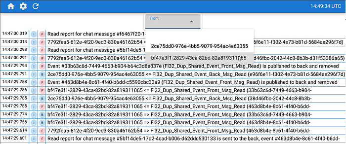

# Мониторинг логов при разработке web-приложений

Каждое более-менее серьёзное приложение генерирует множество логов. Существуют различные сервисы для агрегирования, хранения и анализа логов ([ELK](https://www.elastic.co/what-is/elk-stack), [Sentry](https://sentry.io/welcome/), [Google Cloud Logging](https://cloud.google.com/logging), [Amazon CloudWatch Logs](https://docs.aws.amazon.com/AmazonCloudWatch/latest/logs/WhatIsCloudWatchLogs.html), …), но они предназначены для приложений, работающих в production-режиме, и их не слишком-то удобно использовать именно в разработке приложений. В данной публикации я, как web-разработчик, описываю свои ожидания от агрегатора логов, предназначенного именно для разработчиков web-приложений.

## Распределённость web-приложения

Web-приложения, как правило, состоят из серверной и клиентской частей (бэк и фронт). Более того, серверная часть сама может быть неоднородной (микросервисы) или многократно дублированной (load balancing). Клиентские части по своему определению многочисленны (десктопы, смартфоны, планшеты).

Агрегатор должен позволять не только собирать логи из различных источников, являющихся частями одного web-приложения, но также и идентифицировать источники. У разработчика должна быть возможность выделить логи отдельного источника (например, только логи определённого экземпляра фронта).

## Трассировка бизнес-процессов

Некоторые бизнес-процессы выполняются различными частями web-приложения. Например, в чате один фронт отправляет сообщение, бэк принимает его и пересылает получателю, фронт получателя сохраняет сообщение. В данном бизнес-процессе задействован функционал как фронта, так и бэка, плюс фронт отправителя и фронт получателя задействовал различный функционал.

Агрегатор должен позволять выделять логи, относящиеся к одному бизнес-процессу, даже если он выполнялся в различных частях web-приложения и на различных устройствах.

## Привязка к коду

Сообщение в логе должно иметь ссылку на код, который сгенерировал это сообщение. Как минимум на файл с исходным кодом. Зачастую для поиска места в коде, которое сгенерировало соответствующую запись в логе, используется обычный Ctrl + Shift + F (IDEA).

## Скорость обновления

Для разработчика важно понимать, что именно происходит в приложении и каким образом его правки изменили работу приложения. Чем меньше время между внесением правок и получением обратной связи через логи, тем быстрее разработка. Агрегатор логов должен выдавать отобранные записи по мере их поступления, а задержка не должна превышать нескольких секунд.

## Короткое время хранения

При разработке логи устаревают очень быстро. Можно сказать, они практически одноразовые: внесли изменения, запустили тестовый прогон, проанализировали логи — и новая итерация. По большому счёту нет смысла хранить логи больше, чем за один час (или какое-то количество последних записей, если с момента последнего запуска приложения прошло больше часа).

## Уровни логирования

В программировании принято разделять логи по уровням ([log4j](https://javapapers.com/log4j/log4j-levels/)):

*   DEBUG
*   INFO
*   WARN
*   ERROR
*   FATAL

Эти уровни созданы с учётом администрирования приложений. При нормальной работе приложений администратору достаточно получать информацию об ошибках (WARN, ERROR, FATAL), а вот если в приложении есть какие-то проблемы, то включают уровни INFO и DEBUG.

При разработке уровни логирования разделяются на две большие группы:

*   INFO
*   ERROR

Разработчика, как правило, интересуют все сообщения (на максимальном уровне), но ошибки должны привлекать большее внимание (отдельный маркер).

## Резюме

Агрегатор логов для web-разработчика отличается по специфике решаемых задач от агрегатора логов, предназначенного для мониторинга и анализа состояния приложения. Основные задачи такого агрегатора:

*   фильтрация поступающих логов в режиме реального времени согласно установкам разработчика;
*   привязка лог-записи к её источнику — экземпляру приложения (или его части) и исходному файлу;

В качестве экспериментальной реализации подобного агрегатора для одного из своих проектов я создал PWA-приложение “[flancer64/pwa_log_agg](https://github.com/flancer64/pwa_log_agg)”. Это сервер, который принимает через POST-запрос логи и ретранслирует их всем желающим через web-интерфейс с использованием Server Sent Events (SSE). Фильтрация логов происходит на клиентской стороне.

Агрегатор лишь демонстрирует идеи изложенные в данной статье (PoC) и не является самодостаточным приложением. Тем не менее, в случае возникновения интереса к подобному проекту, его можно выделить в отдельное приложение и доработать до нужного уровня.
