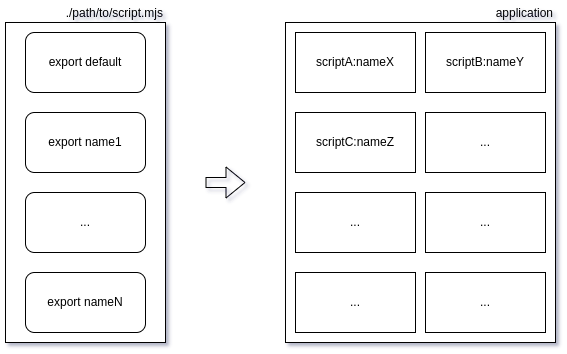

# ES6 `export` as code ‘brick’

What is a software ‘brick’ in modern ES2015+ applications — variable, function, class, module? My answer is `export`. Currently we place our JavaScript code into `es6`-modules (files) and bind modules with each other using `import` statement:

import { export1 , export2 } from "module-name";
So, every `export` is a minimal code object which can be used by developer in a complex programs (applications).

## Script files

Generally all code is placed into separate files — ‘script files’ in JavaScript. I’ll consider modern ES2015+ (ES6) approach in this post, so these script files are called as `es6`-modules. Unlike Java `es6`-module can contain more than one class (function, object, …) in one file. JS engine executes every `es6`-module on import and composes and saves results in a module’s scope. All other `es6`-modules can access these results in case of they are [exported](https://developer.mozilla.org/en-US/docs/Web/JavaScript/Reference/Statements/export) by the module:

// module 'cube.mjs'

export default function cube(x) {

 return x * x * x;

}
But first we need to know path to script file in our application. Only then we can address any inside export from any outside code:

// module 'main.mjs'

import cube from './cube.mjs';

const y = cube(2); // 8
Path to script file can be absolute:

import cube from '/home/alex/cube.mjs'; // for server side

import cube from 'https://domain.com/cube.mjs'; // for browser
or relative:

import cube from './cube.mjs'; // both for server & browser
This case is allowed for server side only (`nodejs`):

import cube from '@vendor/package/path/to/cube.mjs';
in case of file `./cube.mjs`` exists in `./path/to` folder of `@vendor/package` package. It’s curious that we cannot use relative paths without `./` in the beginning:

import cube from 'cube.mjs'; // failure
There is an error for this case (from Chrome browser):

Relative references must start with either "/", "./", or "../".
## The first '`import'` execution

All code inside one `es6`-module works in a separate scope (module’s scope) and runs just once — on the first import of this `es6`-module. We have some set of exports as result of the run on the first import and we use this set to bind code of this module with other modules.

### Module scope

This `es6`-module exports `hello` function that prints hello message and saves addressee (`to`) as other addresser (`from`):

// ./sub.mjs

console.log(`es6-module is imported.`);let from = 'module';export function hello(to) {

 console.log(`Hello to ${to} from ${from}.`);

 from = to;

}
It doesn’t matter how many times we will import this `es6`-module, output string “_es6-module is imported._” will be printed just once.

`./sub.mjs` has its own scope (module’s scope) and can save any data there (it is not the _best practice_ but it is possible):

import {hello} from './sub.mjs';

hello('main');

hello('again');
Output:

es6-module is imported.

Hello to main from module.

Hello to again from main.
### Asynchronous import

`es6`-module can even perform some operations and compose exports asynchronously:

console.log(`es6-module is imported.`);const init = new Promise((resolve) => {

 setTimeout(() => {

 function hello(to) {

 console.log(`Hello to ${to} from ${from}.`);

 from = to;

 }

 resolve(hello);

 }, 3000);

});let from = 'module';

/** [@type](http://twitter.com/type) {function(to:string)} */

const hello = (await init);

console.log(`'hello' function is created.`);export {hello}
Code execution will be paused on the first `import` and will wait until result exports will be composed:

import {_hello_} from './async.mjs';

_hello_('main');

_hello_('again');
Output:

es6-module is imported.

'hello' function is created. // after 3 sec. delay

Hello to main from module.

Hello to again from main.
### ‘Zero’ export

It does not matter what was produced by original module. Other modules don’t “see” any code if it is not exported. We can imagine a case when `es6`-module can perform any useful piece of work but has no export:

function cleanUpFiles() {}setInterval(() => {

 cleanUpFiles();

}, 60 * 1000);
Obviously, this case is possible but I consider that `es6`-module rather has zero export than has no export at all. Import statement in this case:

import './cleaner.mjs';
On a note, no matter how many times we import this script, `cleanUpFiles` function will be started just once — on the first import.

## Resume

Thus every reusable component (‘_brick_’) we can use to build an application (‘_wall_’) is an `export` in some `es6`-module:

‘Wall’ from the ‘bricks’

I imagine all available code fragments (classes, functions, objects) as exports of some `es6`-modules and I can address every code fragment using notation `Path_To_File.exportName`. I can do it in documentation for my apps and, more importantly, I can do it in code of my apps. Typical class constructor in my own code:

class Demo {

 constructor(spec) {

 _// DEPS_

 _/** @type {TeqFw\_Core\_Shared\_Util\_Cast.castInt|function} */_ const castInt = spec['TeqFw_Core_Shared_Util_Cast.castInt'];

 _/** @type {TeqFw\_Core\_Shared\_Util\_Cast.castStr|function} */_ const castStr = spec['TeqFw_Core_Shared_Util_Cast.castStr'];
_// ..._}

}

Pure JS code above is a demo of usage of my own Dependency Injection container [@teqfw/di](https://github.com/teqfw/di), that can compose more complex code (‘_walls_’) from single `export`’s (‘_bricks_’).

I believe that JS needs namespaces (like it is done in other ‘serious’ languages) to organize exports. I hope, I will write about it in the following posts.

If you enjoyed this article, please give it a clap and follow me for more content!

Stay connected:

*   [GitHub](https://github.com/flancer64)
*   [LinkedIn](https://www.linkedin.com/in/aleksandrs-gusevs-011ba928/)
*   [Upwork](https://www.upwork.com/freelancers/~0181de0a64c6981497)

Thank you for your support!
