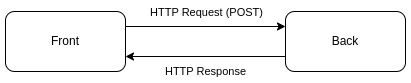
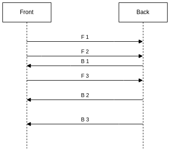
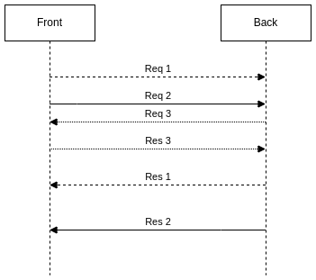

# Events in Web-Apps (4): Call Requests

The fourth post about using of [Server Sent Events](https://en.wikipedia.org/wiki/Server-sent_events) to build modern web applications based on [Event-Driven Architecture](https://en.wikipedia.org/wiki/Event-driven_architecture) rather than on classic [REST](https://en.wikipedia.org/wiki/Representational_state_transfer) (with [simple demo](https://event.dev.demo.teqfw.com/)).

There are 4 posts in the series:

*   [Concept](https://wiredgeese.com/a2e77a6ed140)
*   [Authentication](https://wiredgeese.com/a6b895172aa2)
*   [Delayed Messages](https://wiredgeese.com/6985e5d9ae2)
*   Call Requests (this post)

## REST Request

A normal REST request is synchronous and consists of two parts:

*   **request**: any data (JSON, XML, …) sent by HTTP POST request from the front to the back;
*   **response**: any data (JSON, XML, …) sent in HTTP response body from the back to the front;

REST request

“_Synchronous_” means that the front waits for a response from the back for a certain time (request timeout), after which the request is considered as “_failed_”.

## Events Flows

Event messages are asynchronous and independent of each other. There are two event flows:

*   **front-to-back**: F1, F2, F3, …;
*   **back-to-front**: B1, B2, B3, …;

Asynchronous events

We don’t know where is request and where is response. All are event messages.

## One-Way Events

Some events do not require a response from the other side. For example, the back sends the exchange rates for the current minute to the front. It doesn’t care if these rates reach the front and what the front does with them. As a rule, one-way events are informational messages that do not affect the logic of data processing within the application. They have a short lifetime and can be lost without harm.

## Two-Way Events

Let’s assume that the side sending the request (front or back) expects the second side (back or front) to process it and to return the processing result back. Exactly as it happens in a normal REST. I will call them as “_call requests_” in this post (similar to [RPC](https://en.wikipedia.org/wiki/Remote_procedure_call)).

Let’s say we have two call requests from the front waiting for a response from the back (`Req1/Res1`, `Req2/Res2`), and one call request from the back waiting for a response from the front (`Req3/Res3`):

Call requests

Unlike REST, here the request initiator can be both front (`Req1`, `Req2`) and back (`Req3`).

### Timeout

It is clear that there should be a timeout, like in HTTP request, for the sending side to understand that the request cannot be completed. After this timeout has elapsed, the sending side may take action to process request as a failed. This timeout should match the lifetime of the event message (see “[Delayed Messages](https://wiredgeese.com/6985e5d9ae2#f7a6)”).

### Request Binding

If one side sends several requests of the same type to the other side within a short time (for example, a requests to create a new object), then there is a problem with matching the received responses. Without additional effort, it is difficult to understand which response corresponds to which request.

To uniquely associate a response with a request, the response should contain the UUID of the request.

## Long Life Responses

The asynchronous approach affects the logic of interaction between parts of the application. For example, in e-commerce, checkout can involve multiple steps: order registration, inventory update, invoice creation, invoice mailing, etc.

When executing a checkout in synchronous mode, the front can wait quite a long time while the back completes all the processing steps. If during this time the front loses connection with the back, then it will never know whether the order was processed or not.

In the case of an asynchronous approach, the back response can be stored in the delayed messages queue for quite a long time (hours, days, or longer). The front can even be restarted during this time. If the associating of requests and responses on the front occurs at runtime (through a closure, for example) and not through stores (IDB, etc. ), then these associations will be lost after the application is reloaded on the front.

Binding in long term requests should be done either through the IDB (local store) or based on some other response data (such as an order number).

## Resume

The asynchronous approach requires additional effort to perform normal request/response operations. It is necessary to additionally associate the request event with the response event and ensure correct processing of responses in case of long disconnections or restarting of some part of the application (usually the front).
