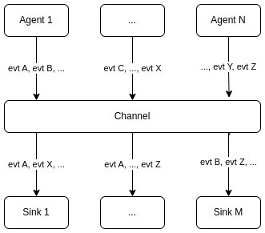
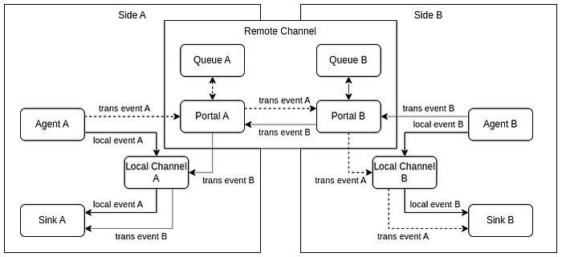

# Events in Web-Apps (3): Delayed Messages

The third post about using of [Server Sent Events](https://en.wikipedia.org/wiki/Server-sent_events) to build modern web applications based on [Event-Driven Architecture](https://en.wikipedia.org/wiki/Event-driven_architecture) rather than on classic [REST](https://en.wikipedia.org/wiki/Representational_state_transfer) (with [simple demo](https://event.dev.demo.teqfw.com/)).

There are 4 posts in the series:

*   [Concept](https://wiredgeese.com/a2e77a6ed140)
*   [Authentication](https://wiredgeese.com/a6b895172aa2)
*   Delayed Messages (this post)
*   [Call Requests](https://wiredgeese.com/49b016b6fbfa)

## Local Channel

When the agent producing the event and the sink handling the event are in the same runtime engine, the flow of events can be processed naturally as events occur (unless these are highly loaded systems — but this is not my topic at all):

Local events channel

The agents generate any messages and send them to the local Channel, through which the messages reach the sinks. The sinks can process any messages. The Channel is responsible for delivering the messages from the agents to the sinks.

## Remote Channel

If the agent and the sink are located in different parts of the web app (front and back), and communication between them can be interrupted (online/offline), then additional efforts are needed to organize messaging. Events that need to be reported between different parts of a web application are referred to as _transborder events_ in this publication.

To send messages about transborder events, a representative of the other side in the current runtime engine is used — a Remote Channel:

Local and transborder events

The Remote Channel consists of two Portals (one on each side) that interact with each other — send “_their_” events to the “_other_” side and receive “_those_” events “_here_”. The Portal publishes received events to the Local Channel. For sinks, transborder events are practically no different from local events.

## Message Queue

Each portal has its own Message Queue that have not currently been sent to the “_other side_” right now (delayed messages). After the connection is restored, delayed events from this Queue are sent to the “_other side_”.

## Lifetime

There are two types of interruptions in web-connections:

*   **short term**: “_WiFi <=> Mobile_” internet switching, for example;
*   **long term**: “_Airplane mode_” in smartphones, for example;

Some messages expire when there is no connection, and some have to be delivered even after very long interruptions. The first ones include, for example, a requests for a list of some objects from the back (a list of users, orders, products, etc.) to compose UI grids. The second ones include, for example, sale order registrations.

Therefore, each message should have a lifetime in the metadata during which the message remains relevant. If the connection is restored before this time expires, the message is sent to the other side, otherwise — is just removed from the queue (is not transmitted to the other side).

## Resume

Event-driven web applications should have a queue for transborder messages that cannot be sent to the other side due to a lack of connection (delayed messages queue). Each such message should have its own “lifetime”, after which the message is simply removed from the queue. The business logic of the web application should take this into account.
