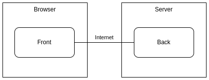
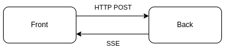
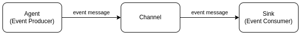
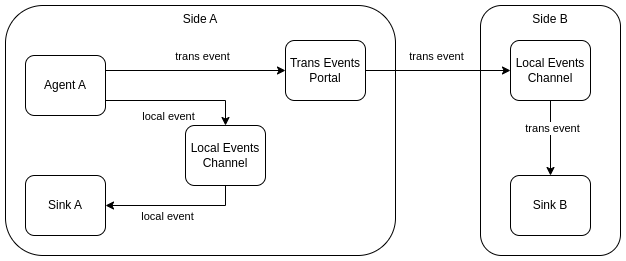
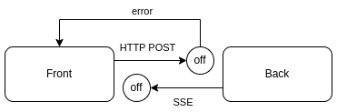
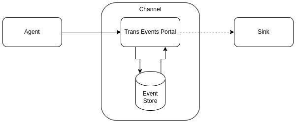

# Events in Web-Apps (1): Concept

My own experience about using of [Server Sent Events](https://en.wikipedia.org/wiki/Server-sent_events) to build modern web applications based on [Event-Driven Architecture](https://en.wikipedia.org/wiki/Event-driven_architecture) rather than on classic [REST](https://en.wikipedia.org/wiki/Representational_state_transfer) (with [simple demo](https://event.dev.demo.teqfw.com/)).

There are 4 posts in the series:

*   Concept (this post)
*   [Authentication](https://wiredgeese.com/a6b895172aa2)
*   [Delayed Messages](https://wiredgeese.com/6985e5d9ae2)
*   [Call Requests](https://wiredgeese.com/49b016b6fbfa)

These thoughts apply only to web applications — two-tier applications in which the client side (front) runs in a browser and the other side (back) — on a server:

Web application

## HTTP POST & SSE

In web applications, the front is always the first to open a connection to the back. The front requests data from the back via HTTP GET or sends data to the back via HTTP POST. The back cannot connect to the front on its own initiative.

However, it is possible that the front initiates an SSE connection to the back, and then the back sends data to the front at its own discretion.

Thus, two streams of event messages can be distinguished:

*   **direct**: messages via HTTP POST from front to back.
*   **reverse**: messages via SSE from back to front.

Direct and reverse streams

## Events Basic

An event can be defined as “_a significant change in state_”. “_Significant_” means that “_the change_” is related to some data (quantitative or qualitative). This data can be transmitted as “_an event message_” from the point where event is produced (“_agent_”) to the place(s) where the reaction to this event is to take place (“_sink_”). Event messages can be transmitted over one or more “_channels_”:

## Local and Transborder Events

Events in a web application can be separated into two groups:

*   **local**: event messages are transmitted within one part of the web application (front or back);
*   **transborder**: event messages are transmitted via the Internet to the other side (from front to back or vice versa);

Transborder events

Each side (front or back) has two channels:

*   **Local Events Channel**: passes event messages within the same runtime environment;
*   **Trans Events Channel**: passes messages over the Internet to the Local Event Channel of the “other side”;

## Offline

Modern (progressive) web applications — is primarily the ability to work offline. POST requests behave well in offline — if there is no connection, the requests do not execute and the sender is notified about this. An SSE connection does not have this capability. It is possible that messages from the back are sent to the front, but do not reach it, and the back knows nothing about it:

Offline mode

Thus, the fact that the back successfully sent message does not mean that the front has received this message. Front (app in smartphone browser, for example) can switch from WiFi to mobile internet and direct requests (HTTP POST) will reach the back in both cases but SSE connection needs to be established every time. If front is switched (from WiFi to mobile or vice versa), some messages over the SSE channel can be sent by the back, but not be received by the front (will be lost).

This is not critical for some data, for others, on the contrary, it is critical. The business logic of the application must provide confirmation of receipt of critical data from the “other side”. If there is no confirmation, the application must resend the event message.

## Events Store

Offline duration can be short-term (mobile internet to WiFi switch) or long-term (airplane mode). Some messages can expire while web app is offline, but others messages should be transmitted anyway.

So, each individual message should have an “expiration date” in its metadata and each transborder channel should have a storage to store event messages while the channel is offline. If the message has not been transmitted to the other side during the expiration time, then it is deleted from the storage. If the connection to the other side is restored, the delayed messages are passed to the receiver.

Events Store

## Resume

Communication between front and back in web applications can be built using EDA. Front event messages are transmitted to the back via HTTP POST. Back event messages are transmitted to the front via SSE. The nature of the environment in which web applications run imposes additional requirements on applications with a similar architecture: front initiative when opening a reverse channel, the possibility of losing transborder event messages, the need for intermediate saving of transborder messages when working offline.
