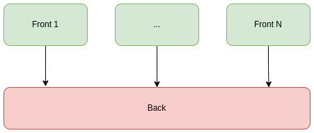
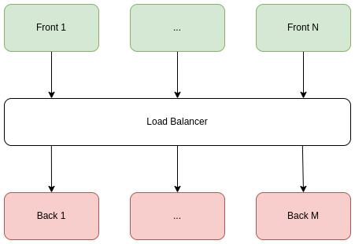
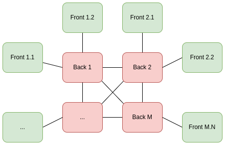
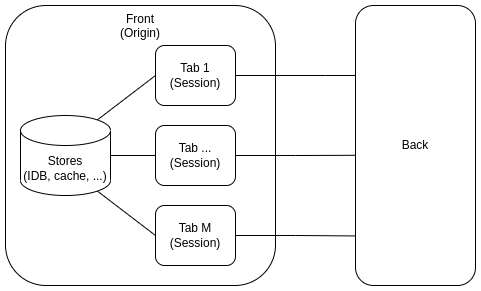
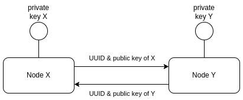
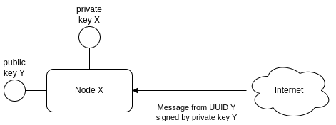
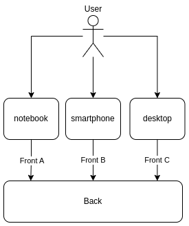

# Events in Web-Apps (2): Authentication

The second post about using of [Server Sent Events](https://en.wikipedia.org/wiki/Server-sent_events) to build modern web applications based on [Event-Driven Architecture](https://en.wikipedia.org/wiki/Event-driven_architecture) rather than on classic [REST](https://en.wikipedia.org/wiki/Representational_state_transfer) (with [simple demo](https://event.dev.demo.teqfw.com/)).

There are 4 posts in the series:

*   [Concept](https://wiredgeese.com/a2e77a6ed140)
*   Authentication (this post)
*   [Delayed Messages](https://wiredgeese.com/6985e5d9ae2)
*   [Call Requests](https://wiredgeese.com/49b016b6fbfa)

## Web Apps Topology

The simplest case of a web application is when a single back (server side app) is accessed by many fronts (in-browser app):

Single back

In a more complex case, there could be several identical back instances on the server side, each serving its own set of fronts:

Load balancing

Considering the evolution of the Web towards a distributed one (Web 3.0), a typical Web App v 3.0 can be thought of as many backs connected to each other, and many fronts that use “their” backs:

Web 3.0 app (distributed)

## Identification

It is clear that in the most complex case (a distributed web application), the assignment of identifiers for the front and back cannot be centralized. In the IT industry, in such cases, it is common to use UUID ([universally unique identifier](https://en.wikipedia.org/wiki/Universally_unique_identifier)):

bf821f2b-a776-4aae-ab01-1cc3d6728a88
### Origins and Sessions

Some browser resources (IDB, cookies, cache store, etc.) are available to all scripts loaded from a specific [origin](https://developer.mozilla.org/en-US/docs/Glossary/Origin). But other resources (session store and session cookies) are only available in a specific browser tab. The origin related resources should have its own identity from the back’s point of view and every tab should also have its own.

Origins and stores

### Back Identification

Web app loads all stuff (scripts, styles, images, etc.) from one origin, so in the simple case (single back) we don’t need IDs for the back. We need IDs for the back instances in case of load balancing and only if the back instances are not identical in event processing (for example, they store the history of relations with a particular front in their cache).

In other words, from the front’s point of view, the back is usually alone, but in the case of a distributed topology, there can be many backs in one distributed web app. So back identification is needed anyway in Web 3.0 apps.

### Front and Session Identification

When back sends data to front’s local storage it should use front’s UUID. No matter how many tabs are opened in the browser — they all use the same storage. But when back sends data to concrete tab it should use session’s UUID (for example, one tab contains grid of customers and other tab — grid of orders but items for both tabs are loaded from the back).

### Identification Resume

The Web Apps v 3.0 should use decentralized ID generation for backs, fronts, and sessions. The corresponding component independently generates a UUID for itself when it appears.

## Asymmetric cryptography

How do we authenticate components (backs and fronts) if each component independently assigns an UUID to itself? In my opinion, asymmetric cryptography (public key cryptography) can solve this problem.

When a front or back generates its UUID, it also generates a key pair (public and private) for itself. The public key is sent to the “other side” along with the UUID the first time the connection is established:

First connection between nodes

Any communication between two sides should involve asymmetric encryption of some of the message data (or even the entire message). In this case, we can be sure that the message decrypted using the public key attached to some UUID really came from this UUID:

All other messages from Node Y

Of course, if any node declassifies its private key, then anyone can impersonate it.

## Users

It is important that front authentication does not imply user authentication. Each front should have an asymmetric key to communicate with the back in the face of a constant change of the IP-address of the device (smartphone) on which this front runs. There may not be any users in the web application at all (all users are anonymous), but the backend should be able to distinguish fronts so that messages for one front do not get to another.

If the web application provides user authentication, then this is a completely separate authentication layer on top of the fronts authentication layer. Because one user can login from different devices (fronts):

User and fronts

## Resume

Each application node (front or back) should generate its own UUID and key pair for asymmetric cryptography. Messages between nodes should be encrypted and signed. This ensures the identification and authentication of nodes in the application (fronts and backs). It is possible that each event message sent from one node to another can be encrypted and transmitted through any number of intermediary nodes.
