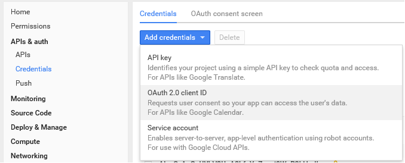

# Obtaining OAuth2 Access Token for Google Cloud API using Browser-Side JavaScript

In this article, I will describe my experience of obtaining an OAuth2 access token using the new `gsi/client` library. My goal was to get an access token in a web application using client-side JavaScript. While there were many articles on the internet that described how to get an access token in Node.js or with the deprecated `gapi.auth2` library, none of them were suitable for the new library.

I will not go into the details of setting up the Google Cloud project, as that is well-documented in [this article](https://medium.com/automationmaster/getting-google-oauth-access-token-using-google-apis-18b2ba11a11a) by Osanda Deshan Nimalarathna. Instead, I will focus on the client-side code needed to obtain the access token.

First, we need to include the library script in our HTML file:

<html>

<head>

 

</head>

</html>
This library adds a new `google` object to the global scope (`self` or `window`), which we can use to request an access token.

const CLIENT_ID = 'XXX.apps.googleusercontent.com';

const SCOPES = 'https://www.googleapis.com/auth/...';

const google = self.google;
function onTokenResponse({access_token, token_type, expires_in, scope} = {}) {

 

}

const client = google.accounts.oauth2.initTokenClient({

 client_id: CLIENT_ID,

 scope: SCOPES,

 callback: onTokenResponse,

});

client.requestAccessToken();

This is the code I searched for a long time on the internet, and I hope it will save others some time.
