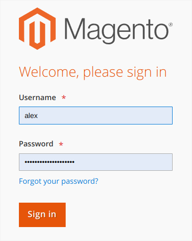
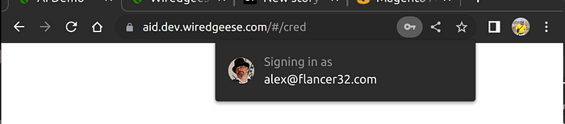
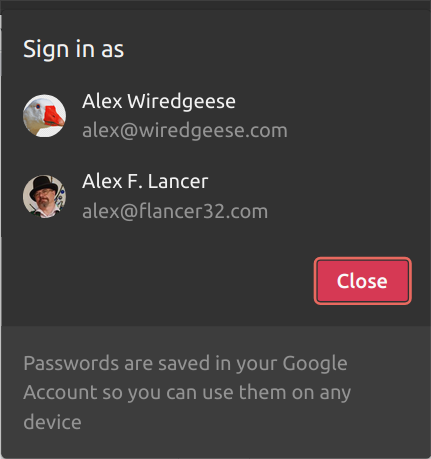
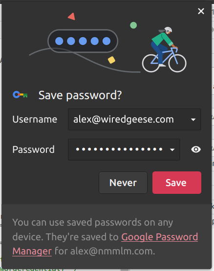
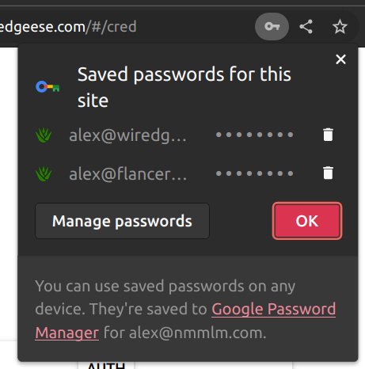

# Using PasswordCredentials in Chrome Browser

The other day I came across a useful feature of the Chrome browser when using the [Credential Management API](https://developer.mozilla.org/en-US/docs/Web/API/Credential_Management_API). It turns out that if there is only one saved password for a given site, the browser will automatically fill in the login and password fields without the user having to manually enter them.

In traditional web forms, the browser fills in the appropriate form fields with data from the password manager:

Typical login form with stored credentials.

With [PasswordCredential](https://developer.mozilla.org/en-US/docs/Web/API/PasswordCredential) you can immediately take the login and password from the browser’s password manager. An icon appears to the right of the browser’s address bar, and when clicked, a pop-up window displays the username used for authentication:

Notification for password credential usage.

If multiple passwords are saved for this site, the browser will prompt you to select the appropriate user:

Select user for authentication.

Unfortunately, this feature is not yet [widely supported](https://developer.mozilla.org/en-US/docs/Web/API/PasswordCredential#browser_compatibility) across all browsers. Currently, Chrome, Edge, and Opera have support for this feature, but Firefox and Safari do not yet support it. Nevertheless, in my opinion, this is a promising technology that can be used just now.

OK, how can we use it? First, get the password credentials for the current origin:

const found = await navigator.credentials.get({password: true});
If there are credentials for the current Origin, then we will get the following data structure:

if (found) {

 const id = found.id;

 const password = found.password;

 const name = found.name;

 const iconURL = found.iconURL;

}
You will see notification `Signing in as ...` in popup in this case.

If credentials are not found, then you should display login form and get username and password from user. Save this data after successful authentication:

const credential = new PasswordCredential({

 id: 'alex@wiredgeese.com',

 password: '...',

 name: 'Alex Wiredgeese',

 iconURL: 'https://www.gravatar.com/avatar/19e5d3174548cc948e1a8b73e5ee7ecd',

});

await navigator.credentials.store(credential);
This prompt will appear:

Save new credentials to Password Manager.

You can edit saved credentials at any time:

Passwords review.

Overall, the Credential Management API is a promising technology that can simplify the login process and make it more convenient for users. I hope that it will be widely supported across all browsers in the near future, and we look forward to seeing how developers will implement it in their projects.
