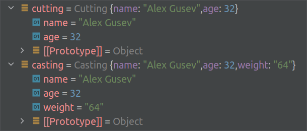

# DTO in JavaScript

Information systems are designed to process data, and DTO ([Data Transfer Object](https://en.wikipedia.org/wiki/Data_transfer_object)) is an important concept in modern development. In the “_classical_” sense, DTOs are simple objects (without logic) that describe data structures that are transferred “_over the network_” between remote processes. If data is transferred between application layers within the same process, then such DTOs are called [local DTOs](https://martinfowler.com/bliki/LocalDTO.html).

The key objectives of a DTO are:

*   **data structuring**: making it easier for the application developers to work with;
*   **data transformation**: transform the data from the format used for transfer (e.g. JSON, XML, YAML) into the internal format used by the application (e.g. JavaScript Object);

Here, I will outline the principles I follow when building DTOs in my JavaScript applications.

## Simple DTO

In a simple case, the DTO is a flat structure where each attribute is a [primitive](https://developer.mozilla.org/en-US/docs/Glossary/Primitive) data type, such as a string or integer:

class Simple {

 

 aBool;

 

 aNumber;

 

 aString;

}
It’s about data structuring (the first objective). The second objective is data transformation. We need to be able to parse some input `data` and convert it into our structure while casting data types:

class Simple {

 ...

 constructor(data) {

 this.aBool = Boolean(data?.aBool);

 this.aNumber = Number.parseFloat(data?.aNumber);

 this.aString = String(data?.aString);

 }

}
## Complex DTO

A complex DTO consists of other DTOs (complex and simple) and primitives:

class Complex {

 

 aDto;

 

 aString;
constructor(data) {

 this.aDto = new Simple(data?.aDto);

 this.aString = String(data?.aString);

 }

}

‘_JSON-to-DTO_’ transformation in this case looks like this:

const dto = new Complex({

 aDto: {

 aBool: true,

 aNumber: 16,

 aString: 'simple',

 },

 aString: 'complex'

});
## Waterfall Type Casting

For waterfall casting of a types in complex objects, we need to connect the code sources with import-export:

export default class Simple1 {}import Simple from './simple.mjs';
export default class Complex {}

In this case, we can create complex DTOs with a very high level of complexity and independently modify individual components of complex DTOs. At each level, the component itself parses its input data fragment, casts data types, and connects constructors for nested levels.

## Cutting vs. Casting

Let’s say we have a JSON data:

{

 "name": "Alex Gusev",

 "age": "32",

 "weight": "64"

}
… and DTO for this data:

class Person {

 

 name;

 

 age;

}
In general, we may receive data that differs from what we are prepared to process. In such cases, there are two ways to convert the data to a DTO:

constructor(data) {

 this.name = String(data?.name);

 this.age = Number.parseInt(data?.age);

}

constructor(data) {

 Object.assign(this, data);

 this.name = String(data?.name);

 this.age = Number.parseInt(data?.age);

}
Here is the result for both cases:

cutting vs. casting

If our code is the final DTO handler, it is better to eliminate any unnecessary data. If it is an intermediate handler, it is better to handle the casting of data types that we directly interact with and leave any unfamiliar data unchanged.

## Resume

*   DTO is a simple object that describes the data structure being transferred between remote processes or application layers.
*   The main goals of a DTO are data organization and type casting.
*   DTOs can have nested structures, making them capable of forming complex structures.
*   In input data conversion to a DTO, data can either be cut off or have its types casted for known properties.
