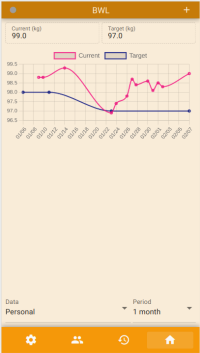
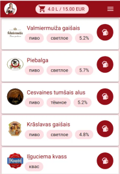
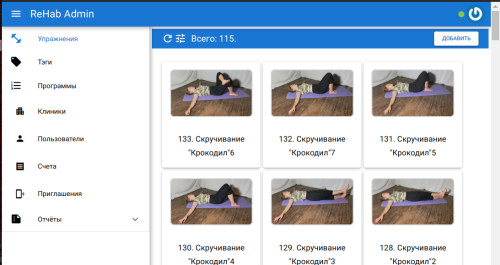
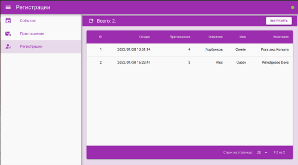

# What is TeqFW? (deprecated)

This is a deprecated post left here for historical reasons. The new one is available [here](https://flancer32.com/what-is-teqfw-f84ab4c66abf).

`TeqFW` is an abbreviation for the `Tequila Framework`, a web application development framework written in regular JavaScript. My name is Alex Gusev, the author of Tequila Framework, and I have over 20 years of experience in the field of web development. During this time, I have developed my own vision of what constitutes a “_beautiful_” web application. With `TeqFW`, I aim to bring this vision to life by creating web applications that adhere to the latest industry trends while staying true to my “_idea of beauty_”. However, as the IT industry continues to evolve, so too will `TeqFW`, making sure that it remains up-to-date with the latest advancements in web development and with my “_idea of beauty_” for the moment.

The beauty of Tequila

To achieve this idea, I have focused on the following key principles in the development of `TeqFW`.

## Mobility

In today’s world, the primary personal communication device is a smartphone. The device format imposes certain restrictions on how the user interacts with the application — such as the size of the device, input/output methods (touch, video, audio), and available functions (geolocation, vibration, etc.).

When it comes to web applications, the focus should be on [designing](https://en.wikipedia.org/wiki/Progressive_web_app) for compact mobile devices (such as smartphones and tablets) first and foremost, before considering desktop and laptop computers.

Note: [IoT](https://en.wikipedia.org/wiki/Internet_of_things) is not a focus area for the author.

## Browser-friendly

Applications for mobile devices can be created [as native applications or as web applications](https://appmaster.io/blog/progressive-web-apps-pwa-vs-native-apps-which-type-is-better-in-2022). In principle, any program that interacts with external servers over the Internet can, with certain assumptions, be considered a web application. Such web applications can be created using various SDKs such as [Flutter](https://flutter.dev/), [Android NDK](https://developer.android.com/ndk), [iOS SDK](https://en.wikipedia.org/wiki/IOS_SDK), or [Windows Mobile SDK](https://www.microsoft.com/en-us/download/details.aspx?id=6135).

However, the browser has been the primary environment for web applications and remains a crucial component in the way a web application communicates with the outside world. The [browser API](https://developer.mozilla.org/en-US/docs/Web/API) serves as a “gateway” for the web application to interact with the rest of the world.

Think of the browser as the “operating system” for a web application.

## “Big Three”

HTML, CSS, and JavaScript are the foundation for applications that run in the browser. While there are many programming languages that offer advantages over JavaScript, the browser can only understand JavaScript without transpilation.

With the advent of the [Web 2.0](https://en.wikipedia.org/wiki/Web_2.0) concept in 2004, HTML, CSS, and JavaScript technologies received a significant boost in development, incorporating many improvements from third-party technologies such as TypeScript and LESS. This development process is expected to continue in the future. The use of JavaScript on the server-side with [Node.js](https://nodejs.org/en/) allows for the same code to be used on both the front-end and back-end, giving it additional advantages in web development compared to traditional server-side languages like PHP, C#, Java, and Python.

There is a wealth of experience in using HTML, CSS, and JavaScript to solve various problems, both from developers and consumers, and IT has proven to be a reliable solution in web applications. Currently, [WebAssembly](https://en.wikipedia.org/wiki/WebAssembly) has not yet reached the same level of importance as these three technologies in the field of web applications.

## Focused on Small and Medium Businesses

Web applications have a global reach, just like the internet they operate on. Some web applications serve thousands of users, while others cater to hundreds of millions. This results in vastly different demands on the applications and their architecture.

The `TeqFW` platform is designed to cater to small and medium businesses, with databases that are no larger than 500 GB and network requests that do not exceed hundreds per second.

## Versatility

In contemporary web development, there are a range of specialized roles, such as layout designers, programmers, analysts, database administrators, DevOps, etc. The `TeqFW` platform, however, is geared towards projects that are developed by one or a few individuals who possess a combination of these skills. To fully utilize the platform, one must possess a thorough understanding of both front-end and back-end development and have knowledge of data structures in RDBMS. Additionally, they should be able to configure the development environment, including the web server, database server, npm, nodejs, etc.

## Modularity

The use of a common programming language (EcmaScript 2015+) for both front-end and back-end development allows for building applications with the use of the `npm` package manager. The `TeqFW` platform prioritizes high modularity and enables the integration of various modules (plugins) into the final application.

## The Evolution of Plugins

The `TeqFW` platform facilitates the development and combination of plugins, with similar functionality, for various groups of applications, such as e-shops, ad services, social networks, etc. Developers can create custom plugins or utilize third-party plugins via `npm` and `GitHub`.

The principles of evolution through variability and natural selection are embodied in the `TeqFW` platform. The platform unifies the interfaces between plugins and itself, promoting variability, and the selection of viable plugins occurs naturally, just like in nature.

## Developer-Centered Approach

As a developer, I understand the importance of a development experience that is both productive and enjoyable. While the business and end-users may have different perspectives, the `TeqFW` platform is designed with the primary goal of providing a satisfying development experience for the developer. The platform is created with developers like myself in mind and is focused on providing the tools and features that they need to be productive and fulfilled in their work.

## Projects

The `TeqFW` platform has developed several project codes as part of its development. At the moment, none of the projects are in active use, but they offer insights into the platform’s capabilities.

[BWL](https://github.com/flancer32/pwa_bwl): weight loss monitoring social network (2021/02 — …)

BWL

[Alus Pils](https://github.com/flancer32/pwa_ap): pre-order for draft beer sale (2021/04 — …)

Alus Pils

ReHab: a prototype application for sports injury rehabilitation programs (2022/04 — …).

ReHab Mobile

ReHab Admin

Conference Registrations: a prototype for customer registration at conferences (2022/12 — …).

Conference Registrations

## Conclusion

The `TeqFW` ([Tequila Framework](https://github.com/teqfw?tab=repositories)) platform is a youthful web application development framework that is written using regular JavaScript and developed by a single individual. This platform is specifically designed for small and medium-sized businesses and is centered on delivering a productive and satisfying development experience for developers. It is mobile-friendly, browser-compatible, and leverages HTML, CSS, and JavaScript as its foundational elements.

If you enjoyed this article, please give it a clap and follow me for more content!

Stay connected:

*   [GitHub](https://github.com/flancer64)
*   [LinkedIn](https://www.linkedin.com/in/aleksandrs-gusevs-011ba928/)
*   [Upwork](https://www.upwork.com/freelancers/~0181de0a64c6981497)

Thank you for your support!
