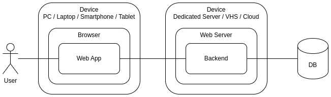
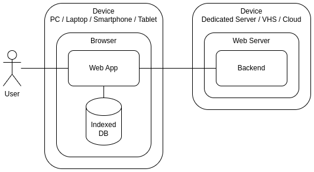
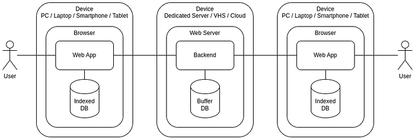
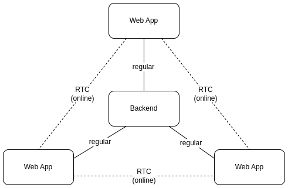
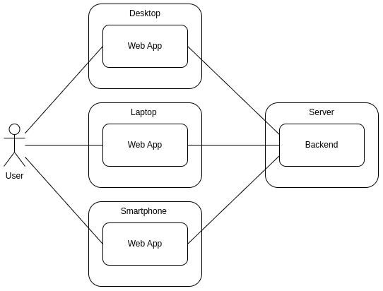
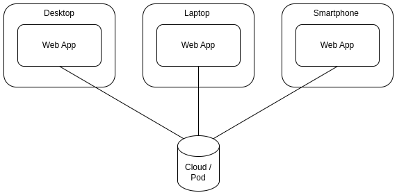

# Personal Web Apps

Before the advent of the web, all applications were personal and stored their data on the user’s computer. With the rise of the web, user data moved to corporate servers and privacy was suddenly reduced. But what if all personal data in web applications were exclusively stored on users’ devices, such as smartphones? In this article, I ponder what such personal web applications could be like.

## What distinguishes web applications from native ones?

The two main differences, in my opinion:

*   web applications run in the browser
*   a server is needed to distribute web applications

At the moment, the browser is a kind of operating system for web applications. Operating systems have their [own API](https://en.wikipedia.org/wiki/DOS_API), and the browser also has its own — [Web API](https://developer.mozilla.org/en-US/docs/Web/API).

Operating systems appeared as “_intermediaries_” between programs and various hardware from different manufacturers. Browsers have also gone a long way in standardizing the rules of programs within the browser and with available peripherals (screen, keyboard, mouse, printer, etc.). Unlike regular OS, the capabilities of low-level interaction of the program with peripherals inside the browser are very limited. But for the interaction of the program with a person, a device and other programs, these functions are enough.

Applications used to be distributed on floppy disks and CDs, but with the advent of broadband Internet, this method of installing programs on personal computers has become irrelevant. Now most programs are distributed through the web. But for a web application to end up in a browser, a web server is still needed. Browser restrictions do not allow you to run a full-fledged web application just by downloading code from a disk or flash drive.

Thus, the scheme of the usual web application can be represented as follows:

The regular web app

The application code is located on the user’s device (for example, a smartphone) and on the server. The user’s main data is also stored on the server along with the data of other users.

## Personal data storage

Approximately starting from 2015, browsers have been able to save and process large volumes of data on the client side — [IndexedDB](https://en.wikipedia.org/wiki/Indexed_Database_API). The total size of the data depends on the volume of disk space of the local device and on the browser in which the web application is running, and can be measured in tens and hundreds of gigabytes.

Thus, now you can create applications that save all the user’s personal information on his own device (computer or smartphone):

The personal web app

Some client data is still on the server (for example, authentication), but most of the personal data can now be stored centrally, using the hardware capabilities of the user himself. Just imagine how much performance requirements for central servers would decrease if the processing of users’ personal data were transferred to their own devices!

## The role of the server

In the new architecture of personal web applications, the server still has the responsibility to distribute the application code — because the browser still cannot load code from a flash drive or disk. If each user stores his own personal data, then the server must also transmit this data from one user to another if necessary.

If users are always online, then there are no problems with the transfer. But if the recipient of the message is offline, then the sender’s data will have to lie on the server for a while. Until the recipient goes online and retrieves this data from the server.

All this is very similar to how regular email ([POP3](https://en.wikipedia.org/wiki/Post_Office_Protocol) protocol) worked before Gmail appeared (a web interface to your mail on the server).

## WebRTC

If two users are online at the same time, the server can be excluded from the data transfer chain. With the help of [WebRTC](https://webrtc.org/?hl=en) technology, data can be transmitted directly between users. The server is only needed to establish initial contact between users.

If personal data is transferred directly between users, then all network traffic that previously passed through the server is spread between individual pairs of users. This can significantly reduce network load on the server.

If asymmetric encryption of each “user — user” connection is used in such a decentralized environment, then the server can also remove the user authentication function. Users exchange public keys when establishing contact, and then use these keys to encrypt and verify messages.

These keys can also be used for forwarding messages when the recipient is offline and messages are temporarily buffered on the server. Without encryption keys, the server cannot access user data.

## Clouds/Pods

If user data is stored on the user’s device, not on the server, then there is a situation where the user has several instances of some application on different devices (for example, on a laptop and smartphone):

The user has multiple devices with the same app

It is clear that when each device has its own personal database for storing user’s personal data, some replication mechanism is needed. That is, the user must have his own personal server through which he could replicate his data between different devices.

Replicate the data with Cloud/Pod

Similar services are already offered by cloud data storage (Dropbox, Google Drive, OneDrive, etc.) and similar technologies (for example, [Solid](https://solidproject.org/about)). In the simplest case, when the user has only one device with a personal application, external storage serves as a backup data storage in case of device loss.

## Conclusion

The demand for confidentiality of personal data and the development of web applications create conditions for the emergence of personal web applications in which user data is stored not on the central servers of corporations, but on the user’s devices themselves and are replicated between devices through external storage, which are also managed by the user.

I consider this direction of development of web technologies promising and try to conduct the development of my web applications precisely in this key. If you need to develop such web applications, I would be interested in joining such a project to the best of my abilities to pump up my own skills in this direction.

If you enjoyed this article, please give it a clap and follow me for more content!

Stay connected:

*   [GitHub](https://github.com/flancer64)
*   [LinkedIn](https://www.linkedin.com/in/aleksandrs-gusevs-011ba928/)
*   [Upwork](https://www.upwork.com/freelancers/~0181de0a64c6981497)

Thank you for your support!
