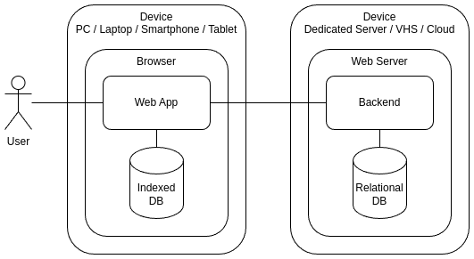

# What is TeqFW?

TeqFW stands for the Tequila Framework, a web application development framework written in pure JavaScript. It is not a large-scale framework like AngularJS, Laravel, Django, etc., but rather an individual’s endeavor to create a tool tailored to their specific needs. In the current landscape of web development, a clear dichotomy has emerged: backend and frontend development, each with its own coding nuances. Often, backend and frontend components are coded in different programming languages, resulting in separate applications interconnected via APIs and data structures. Consequently, web developers now categorize themselves into frontend developers, backend developers, and full-stack developers.

TeqFW is an experiment, a test to see if a single developer can successfully create web applications for small and medium-sized businesses. My name is Alex Gusev, and I have been involved in web application development for about 25 years. Here are the principles I have based this experiment on.

## One Language to Rule Them All

Certainly, in web development, HTML and CSS are indispensable. However, when it comes to actual programming, there is only one language for web programming, and that language is JavaScript. It’s neither Java, nor PHP, nor Ruby, nor Python, nor Go, nor TypeScript — only JavaScript (and a bit of WebAssembly).

Personally, I find it challenging to actively use multiple programming languages and switch between them. There was a time when I was quite actively programming in LotusScript, Java, PHP, and JS simultaneously. From my own experience, I know that specializing in one direction gradually leads to the degradation of skills in others, less used ones.

With the advent of NodeJS, it became possible to write both server-side and client-side code in JS. Therefore, for me, it became quite logical to abandon all other programming languages ​​in favor of JS. As Bruce Lee said, “_I fear not the man who has practiced 10,000 kicks once, but I fear the man who has practiced one kick 10,000 times_”. Focusing on one language allows for a better understanding of its philosophy, and as a result, enables more efficient use of it. Both on the frontend and on the backend.

## JSDoc instead of TypeScript

I had the opportunity to program using [GWT](https://www.gwtproject.org/) for a couple of years — this is when you write code in Java, and it transpiles into JS. It’s very convenient if you know Java and don’t know JS. But the downside is that the code in the browser looks completely different from the code in the IDE. Essentially, with this scheme, you can transpile code into JS from any language — python, PHP, C++, Go, … You can even transpile from TypeScript. You can even transpile from JS to JS (minification and obfuscation).

All this leads to the fact that the code executed in the browser is not the same as the code in the developer’s IDE. This makes debugging and bug hunting difficult. And if you not only write code but also maintain it, from time to time you have to look at the code in the browser and try to understand why it doesn’t work as expected. Of course, you can drag all sorts of map files and plugins into the browser that help you see the same code in the browser that was in the IDE, or you can simply use the same code during development that ends up in the browser. I chose the latter option.

At the moment, the main advantage of TS over JS is considered to be types. They greatly assist in code navigation and refactoring. My experience has shown that using [JSDoc](https://jsdoc.app/) together with JS helps to structure data quite well and describe the interfaces of code elements. At the same time, the developed code may not differ from the executed one at all, there are no restrictions on all the capabilities of JS (yes, you can shoot yourself in the foot, but weapons are toys for adults), and there is no time lost on transpiling the code.

## Dependency Injection

When programming in Java and PHP, I often used object containers with dependency injection. Binding objects at runtime allows for adding depth to development. You can compare binding objects at compile time with 2D space, while binding objects at runtime — with 3D space. Dependency injection not only reduces the level of coupling between application components and increases code testability but also allows overriding base functionality without changing the base code (for example, by injecting a component from a plugin instead of the base component, which wraps the base component and adds/changes its behavior). This behavior provides significant advantages when building applications from modules developed by unfamiliar groups of developers.

Therefore, the first thing I did when I started my experiment was to create such a [dependency container](https://github.com/teqfw/di) for JS that would work in both the browser and Node.js. To achieve this, I had to introduce the concept of [namespaces](https://medium.com/@wiredgoose/namespace-scope-or-address-9037fada36f2) into my experiment. Namespaces in TeqFW are similar to the namespace used in the [Zend1](https://zf2.readthedocs.io/en/release-2.2.1/migration/namespacing-old-classes.html) framework before the corresponding operator appeared in PHP 5.3.

Using namespaces in the object container together with the import function and es6 modules allowed me to create JS code that worked equally well in the frontend and backend without prior transpilation. Thus, in my applications, three areas of JS code can be distinguished:

*   **Back**: code that will only be used on the server — may include static imports of nodejs functions and code from npm packages.
*   **Front**: code that will only be used in the browser — cannot include static imports of nodejs functions and code from npm packages, but can include static imports of web resources (for example, from [JSDelivr](https://www.jsdelivr.com/) or [UNPKG](https://www.unpkg.com/)).
*   **Shared**: code that will be used both on the server and in the browser — should preferably use only dependency injection through the object container.

## DRY (Don’t Repeat Yourself)

In programming, there’s a huge practice built around being able to use someone else’s code or reuse your own. In the JavaScript ecosystem, this is facilitated by npm packages. Therefore, in my experiment, I organize my code into separate packages and build the final application using a regular `package.json`.

There are two packages that are included in every Teq application:

*   [@teqfw/di](https://github.com/teqfw/di) — object container with dependency injection
*   [@teqfw/core](https://github.com/teqfw/core) — basic code allowing the execution of a Teq application as a nodejs application on the server.

Depending on the requirements of the final application, other packages can be included:

*   [@teqfw/db](https://github.com/teqfw/db) — interaction with relational databases on the server side.
*   [@teqfw/web](https://github.com/teqfw/web) — web server for serving static files.
*   [@teqfw/i18n](https://github.com/teqfw/i18n) — internationalization.
*   …

Often, web applications consist of a client-side and an admin panel. In this case, the application code can be organized into three packages:

*   @app/base — the base package contains code used in both the client-side and admin panel (including defining common data structures).
*   @app/client — complements the base package with client-specific functionality.
*   @app/admin — complements the base package with administrative functionality.

If a developer has common code that they use in a subset of their applications, it can also be extracted into a separate package:

*   @vendor/auth — code for user authentication.

This is all standard practice for server-side development (Node.js), but not entirely common for the frontend. For the frontend, developers usually prefer to bundle their code using tools like [Webpack](https://webpack.js.org/), [Browserify](https://browserify.org/), etc.

## Typical Application Architecture

It’s clear that high-traffic applications have different architectures compared to static websites. The TeqFW platform is designed specifically for small web applications with low traffic, which can be developed by one or two full-stack developers. Ideally, users connect to the application through mobile phones. The client-side assumes extensive use of modern technologies ([PWA](https://web.dev/explore/progressive-web-apps), [service workers](https://developer.mozilla.org/en-US/docs/Web/API/Service_Worker_API), [cacheStorage](https://developer.mozilla.org/en-US/docs/Web/API/CacheStorage), [IndexedDB](https://developer.mozilla.org/en-US/docs/Glossary/IndexedDB), [WebPush](https://developer.mozilla.org/en-US/docs/Web/API/Push_API), etc.), allowing the computational load to be shifted from the server to the client.

The typical teq-application:

*   Stores shared data on the server in a relational database.
*   Stores/caches user’s personal data in their browser’s IndexedDB.
*   Data processing code is spread across two environments — frontend and backend.

However, it is not a set of microservices but a modular monolith. Rather, two modular monoliths assembled from the same packages. Both the frontend and backend are standalone applications consisting of individual fragments distributed as npm packages.

I want to emphasize that a Teq application is a web application, not a set of static pages. It largely disregards SEO requirements. The platform is designed for building applications that operate in a mobile phone browser, not for creating server-side pages indexed by search engines.

## RDBMS and DEM

On the frontend, IndexedDB allows storing heterogeneous data in a single store, while on the backend, a layer called [Knex.js](https://knexjs.org/) is used for data manipulation. It’s not a classic [ORM](https://www.doctrine-project.org/projects/orm.html) but rather a [DBAL](https://www.doctrine-project.org/projects/doctrine-dbal/en/4.0/reference/introduction.html) — it allows working uniformly with different databases (PostgreSQL, MySQL/MariaDB, SQLite, etc.).

To work with data in relational databases, you first need to describe the table structures. Since a Teq application is assembled from npm packages, each npm package contains its own fragment of the shared database in the form of a JSON file (`etc/teqfw.schema.json`). This file describes the desired table names, data types in the tables, indexes, and relationships with other tables. Each Teq application has its own rules for creating tables in the database needed by the packages included in the application. These rules are also described in a JSON file (`etc/teqfw.schema.map.json`). All these JSON files, combined together, allow building a unified structure (Domain Entities Map) and using it to create tables in the database and manipulate data. The transformation of DEM into a data structure is done in the [@teqfw/db](https://github.com/teqfw/db) package.

This approach allows each npm package to have its own subset of tables in the relational database and to link its tables with tables from other packages, taking into account the recommendations of the current Teq application. In one Teq application, the tables of the `mod_address` package, for example, may be linked to the tables of the `app_base_user` package, while in another Teq application, these same tables may be linked to the tables of the `@vendor/customer` package.

## Code Modifiability

For me, as a developer, the primary goal of developing a web application at the moment is its [modifiability](https://flancer32.com/so-what-is-the-ultimate-goal-of-programming-0fd5def59fdc). The TeqFW platform is based on some principles that help facilitate code analysis and modification (for example, DI, decomposition of input-output arguments, [recursive structuring](https://flancer32.com/recursive-structure-of-js-code-3e9cfb5fb19c) of JS code, [AZ-structuring](https://flancer32.com/az-structuring-for-source-code-files-8ae5844696ea) for source code files, etc.).

For me, the speed of application execution or the volume of information transmitted over the network is not a priority. I am not concerned at all that the final application code is in the browser in an open form, in the form of separate es6 files, rather than in bundles familiar to everyone. What matters most to me is the ability to quickly recall or understand what a particular piece of code does and how to modify it to add new functionality without breaking the existing one. However, since this is an experimental platform, I can afford not to be too concerned about backward compatibility. It is sufficient for my applications to work on fixed versions of platform packages.

## Conclusion

Tequilla Framework is an experiment aimed at testing less popular approaches in web application development. The ultimate goal of this experiment is to develop technologies and create tools for modular development of modern web applications by individual developers, with the ability to reuse their own modules or modules of other developers.

At the moment, the following modules can be highlighted, which are in a more or less ready-to-use state:

*   [@teqfw/di](https://github.com/teqfw/di) — object container with dependency injection.
*   [@teqfw/core](https://github.com/teqfw/core) — Teq plugin scanner (npm packages with integration capabilities into Teq application) and a wrapper for commander for running Teq applications in console mode.
*   [@teqfw/db](https://github.com/teqfw/db) — Teq plugin for working with relational databases on the server side, forming the DB structure based on DEM, wrapper for knexjs.
*   [@teqfw/email](https://github.com/teqfw/email) — [nodemailer](https://www.nodemailer.com/) wrapper.
*   [@teqfw/web](https://github.com/teqfw/web) — nodejs-based web server for serving static files, with the ability to connect HTTP request handlers. Can be run in HTTP/HTTP2/HTTPS modes. Wrapper for [ws](https://github.com/websockets/ws).
*   [@teqfw/web-api](https://github.com/teqfw/web-api) — connects a synchronous request handler (POST, GET) to the web server.
*   [@teqfw/web-event](https://github.com/teqfw/web-event) — connects an asynchronous request handler (SSE) to the web server.
*   [@teqfw/web-push](https://github.com/teqfw/web-push) — for using WebPush API in Teq applications.
*   [@teqfw/web-source-installer](https://github.com/teqfw/web-source-installer) — installation of frontend source files of Teq applications in the browser cache using a service worker.
*   [@teqfw/vue](https://github.com/teqfw/vue) — wrapper for [Vue 3](https://vuejs.org/) and [Vue Router 4](https://router.vuejs.org/).
*   [@teqfw/ui-quasar](https://github.com/teqfw/ui-quasar) — wrapper for [Quasar UI 2](https://quasar.dev/).
*   [@teqfw/i18n](https://github.com/teqfw/i18n) — wrapper for [i18next](https://www.i18next.com/).

These modules are used in various combinations in my own projects (both personal and commercial) and are actively being developed. The [@teqfw/di](https://github.com/teqfw/di) module can be considered relatively stable.

If anyone wants to participate in this experiment, I will be glad to answer your questions and help as much as I can.

If you enjoyed this article, please give it a clap and follow me for more content!

Stay connected:

*   [GitHub](https://github.com/flancer64)
*   [LinkedIn](https://www.linkedin.com/in/aleksandrs-gusevs-011ba928/)
*   [Upwork](https://www.upwork.com/freelancers/~0181de0a64c6981497)

Thank you for your support!
