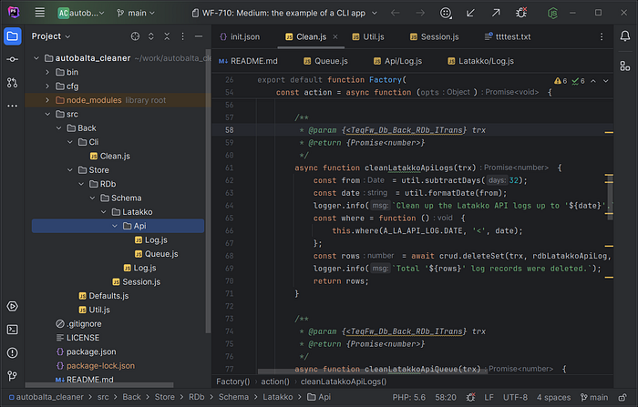

# Example of a console application based on TeqFW

Here, I describe a very simple yet functional [console application](https://github.com/flancer64/autobalta_cleaner) made using the [Tequila Framework](https://flancer32.com/what-is-teqfw-f84ab4c66abf) platform. The application is used in the [autobalta.com](https://autobalta.com/) store to clean up outdated information from the database that remains after data exchange with external systems, as well as outdated user session data.

IDE with the project

The primary and sole task of the application is to delete data older than a specified date from the following tables:

*   oc_latakko_api_log
*   oc_latakko_api_queue
*   oc_latakko_log
*   oc_session

The application runs daily using a cron job.

## package.json

### ES6 Module

TeqFW is a platform existing within the npm/nodejs ecosystem. Therefore, the entry point of the application is the `package.json` file. Key points to note:

"type": "module"
In teq-applications, TypeScript and transpilation are not used. All source files are ES6 modules.

### Dependencies

"dependencies": {

 "@teqfw/core": "0.24.0",

 "@teqfw/db": "0.21.0",

 "@teqfw/di": "0.22.0",

 "mysql": "^2.18.1"

}
Since the platform is under active development, I have fixed the specific versions of the platform packages used. The purpose of the npm packages:

*   **@teqfw/di**: The most basic package of the platform, containing an object container that allows loading ES6 modules, creating necessary objects (singletons and transient), and injecting them as dependencies into other objects.
*   **@teqfw/core**: A layer on top of the dependency container that sets the rules for forming and resolving dependency identifiers. It also wraps the [commander](https://github.com/tj/commander.js) library.
*   **@teqfw/db**: A layer on top of the [knex.js](https://knexjs.org/) library, allowing (almost) uniform access to different databases.
*   [**mysql**](https://github.com/mysqljs/mysql): A Node.js driver for MySQL/MariaDB.

### Commands

"scripts": {

 "start": "node ./bin/tequila.mjs app-clean"

}
The application contains only one command, which is run through npm:

$ npm start
## ./bin/tequila.mjs

This file is the entry point for all teq-applications in the Node.js environment, and its code is the same for all backend applications:

#!/usr/bin/env node

'use strict';

import {dirname, join} from 'node:path';

import {fileURLToPath} from 'node:url';

import teq from '@teqfw/core';
const url = new URL(import.meta.url);

const script = fileURLToPath(url);

const bin = dirname(script);

const path = join(bin, '..');

teq({path}).catch((e) => console.error(e));

The main task of the `./bin/tequila.mjs` file is to determine the root directory where the application is located, so that the platform core script (`TeqFw_Core_Back_Launcher` from @teqfw/core) can scan the file system (`./node_modules/`), find all teq-plugins (npm modules supporting the @teqfw/di object container), configure the object container, and create and run the main application (`TeqFw_Core_Back_App`), which is a wrapper around the regular `commander` (npm package).

Other plugins, including our application, can specify which commands each plugin adds to commander. In our case, only one command is added — `app-clean`.

## ./teqfw.json

A teq-plugin is a regular npm package with a `./teqfw.json` file at its root, describing the rules for connecting the plugin to the platform. Each teq-plugin can set its own rules for interaction with other teq-plugins. Our application is a teq-plugin and interacts with two other teq-plugins:

*   **@teqfw/di**: Specifies which namespace is used by our application and where the source files are located.
*   **@teqfw/core**: Specifies which commands our application adds to commander.

Here is the descriptor text:

{

 "@teqfw/di": {

 "autoload": {

 "ns": "Ab_Clean",

 "path": "./src"

 }

 },

 "@teqfw/core": {

 "commands": [

 "Ab_Clean_Back_Cli_Clean"

 ]

 }

}
## Configuration Structures

Interaction rules description structures with plugins:

*   **@teqfw/di**: TeqFw_Core_Back_Plugin_Dto_Desc_Di
*   **@teqfw/core**: TeqFw_Core_Back_Plugin_Dto_Desc

### ./cfg/local.json

Each plugin may require configuration parameters for its operation. The teq-application uses one configuration file, common to all teq-plugins. The platform core (`TeqFw_Core_Back_Config`) is responsible for loading and parsing the configuration file. In our application, only one teq-plugin requires configuration — @teqfw/db:

{

 "@teqfw/db": {

 "client": "mysql",

 "connection": {

 "database": "...",

 "host": "127.0.0.1",

 "password": "...",

 "user": "..."

 }

 }

}
The local configuration description structure follows the configuration parameters for the [knexjs](https://knexjs.org/) library:

*   **@teqfw/db**: TeqFw_Db_Back_Dto_Config_Local

## Command '`app-clean`'

When the application starts, the platform core scans all plugin descriptors `./teqfw.json` and initializes the teq-application. In our case, our plugin [@flancer64/autobalta_cleaner](https://github.com/flancer64/autobalta_cleaner) adds one command, which is defined in the script `Ab_Clean_Back_Cli_Clean`:

 "@teqfw/core": {

 "commands": [

 "Ab_Clean_Back_Cli_Clean"

 ]

 }
The result of the `Ab_Clean_Back_Cli_Clean` function is an object whose structure matches that specified in the script `TeqFw_Core_Back_Api_Dto_Command`. The platform core sequentially connects all commands described in the descriptors of all used teq-plugins to the `commander`. In our case, it looks something like this:

const res = fCommand.create();

res.realm = DEF.CLI_PREFIX;

res.name = 'clean';

res.desc = 'clean up the expired data';

res.action = action;

return res;
The command name is prefixed (realm) common to all commands of one plugin. In our case, `DEF.CLI_PREFIX = ‘app’.` When running the application with the parameter:

$ ./bin/tequila.mjs app-clean
the `action` function will be called. The realm is needed to separate commands of one plugin from commands of another. As a rule, the name of the teq-plugin serves as the realm. If the teq-plugin is not intended for use by other teq-plugins, the prefix `app` is a good option.

## Database Interaction

Database interaction is provided by the teq-plugin @teqfw/db. Its main role in the platform is to allow assembling a single relational database structure from separate fragments belonging to different plugins, and to allow the teq-application to work with it as a whole. However, in this case, we already have a database external to our application (OpenCart), so it is enough for us to describe in our code the tables and columns we use in our application.

*   `Ab_Clean_Back_Store_RDb_Schema_Latakko_Api_Log`
*   `Ab_Clean_Back_Store_RDb_Schema_Latakko_Api_Queue`
*   `Ab_Clean_Back_Store_RDb_Schema_Latakko_Log`
*   `Ab_Clean_Back_Store_RDb_Schema_Session`

Each of these files describes the structure of a separate table:

*   oc_latakko_api_log
*   oc_latakko_api_queue
*   oc_latakko_log
*   oc_session

and implements the interface `TeqFw_Db_Back_RDb_Meta_IEntity`.

## Working with the Database

Two main scripts are used to work with the database:

*   `TeqFw_Db_Back_RDb_IConnect`: Allows opening connections to the database and initiating transactions.
*   `TeqFw_Db_Back_Api_RDb_CrudEngine`: Allows performing CRUD operations on individual entities (tables) in the database schema.

Typical code for interacting with the database in a teq-application:

const trx = await conn.startTransaction();

try {

 …

 await trx.commit();

} catch (e) {

 await trx.rollback();

}

await conn.disconnect();
A specific operation (in our case, deletion) is performed like this:

async function cleanSessions(trx) {

 const from = util.subtractDays(45);

 const date = util.formatDate(from);

 logger.info(`Clean up the sessions started before '${date}'.`);

 const where = function () {

 this.where(A_SESS.EXPIRE, '<', date);

 };

 const rows = await crud.deleteSet(trx, rdbSession, where);

 logger.info(`Total '${rows}' sessions were deleted.`);

 return rows;

}
Note the functional style of performing CRUD operations. All necessary information is passed to the corresponding method of the `crud` object:

*   **trx**: The transaction within which actions are performed.
*   **rdbSession**: The description of the entity over which actions are performed (metadata).
*   **where**: Additional information depending on the action performed.

## Summary

Tequila Framework is a platform for creating JavaScript applications using technologies typical for enterprise-level languages (like Java, C#, PHP Zend 1). In particular, teq-plugins use dynamic object linking through dependency injection during runtime instead of static linking through import at the code writing level (as seen in the example of the `TeqFw_Db_Back_Api_RDb_CrudEngine` interface and its implementation `TeqFw_Db_Back_RDb_CrudEngine`). This allows building more complex applications from individual components, overriding component behavior depending on application execution conditions, and increasing the reusability of individual components.

The transition from file module linking (physical addressing) to namespaces (logical addressing) enhances documentation convenience and allows developers to better focus on their application’s architecture, ultimately speeding up project modifications. I hope that after reading this post, you can somewhat imagine the application architecture based solely on logical module names (I intentionally did not link to Github to the corresponding files so you can reverse map the logical name to the file name).

Overall, I am pleased with the result. I am confident that pure JavaScript can be used to create web projects of a scale comparable to platforms like Magento, WordPress, Drupal, Laravel. Considering that browsers do not understand other languages except JavaScript (and a little Web Assembly), this approach has a good chance to surpass the mentioned platforms.

If you are interested in the Tequila Framework platform and have a commercial proposal, I will be happy to develop an application for you at 30 euros/hour. If you have an educational or humanitarian project, I will help you for free.

*   [Example of a Web App Based on TeqFW](https://flancer32.com/example-of-a-web-app-based-on-teqfw-add155627b58)

If you enjoyed this article, please give it a clap and follow me for more content!

Stay connected:

*   [GitHub](https://github.com/flancer64)
*   [LinkedIn](https://www.linkedin.com/in/aleksandrs-gusevs-011ba928/)
*   [Upwork](https://www.upwork.com/freelancers/~0181de0a64c6981497)

Thank you for your support!
