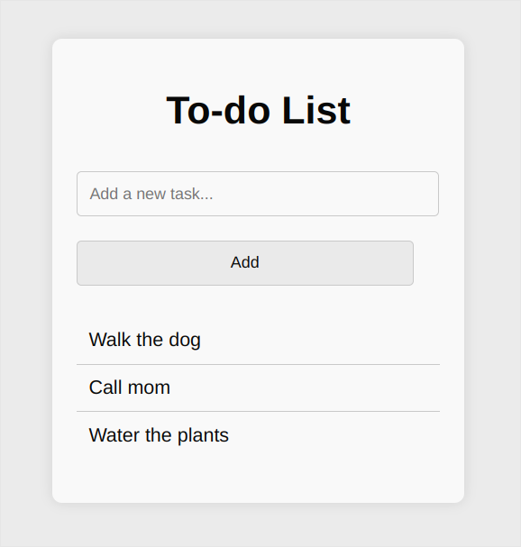
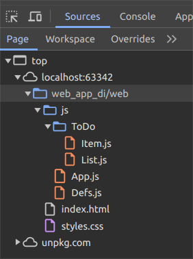
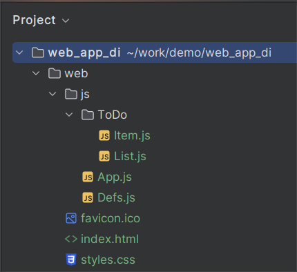

# Example of a Web App Based on TeqFW

In [this example](https://github.com/flancer64/demo_web_app_di), I will demonstrate how to use the object container and dependency injection in a browser application. The example uses my own library, [@teqfw/di](https://github.com/teqfw/di).

Unlike the previous example with a [console application](https://flancer32.com/example-of-a-console-application-based-on-teqfw-e038e31766dd), here we will not have a server-side part at all. Our entire application consists of static files that are loaded into the browser and executed there. I will base my example on the familiar ToDo List application.

The ToDo List app

An application written in pure JS using ES6 modules has a significant advantage, at least for me, over applications written in TS - in the browser, I see the same files as in the IDE:

The sources in a browser

The sources in an IDE

Below, I will describe the most important points.

## Connecting the Object Container

The @teqfw/di library can be connected as ES6 modules by loading the sources, for example, from unpkg.com:

<!DOCTYPE html>

<html lang="en">

<head>

 

</head>

<body></body>

</html>
## Creating and Configuring the Container

A feature of my Object Container is that you cannot pre-store objects in it. The container itself computes the path to the source files based on the dependency identifier using a Resolver.

After creating a new instance of the Container, you need to configure the Resolver so that it loads ES6 modules from the `./js` directory for the `Demo` namespace:

const container = new Container();

const url = new URL(location.href);

const root = url.href.replace('index.html', '');

const pathApp = root + '/js';

const resolver = container.getResolver();

resolver.addNamespaceRoot('Demo', pathApp);
Thus, the dependency names will be transformed into the following addresses:

*   Demo_App => https://…/js/App.js
*   Demo_Defs => https://…/js/Defs.js
*   Demo_ToDo_Item => https://…/js/ToDo/Item.js
*   Demo_ToDo_List => https://…/js/ToDo/List.js

## Initializing the Application

To obtain a singleton instance of the application from the container, you need to specify its identifier `Demo_App$`. The `$` symbol at the end of the identifier indicates that a singleton object is needed:

const app = await container.get('Demo_App$');

app.run();
The @teqfw/di container can work with various identifier schemes and rules for transforming them into paths to source files:

*   [TeqFw_Di_Api_Container_Parser](https://github.com/teqfw/di/blob/main/src/Api/Container/Parser.js)
*   [TeqFw_Di_Api_Container_Resolver](https://github.com/teqfw/di/blob/main/src/Api/Container/Resolver.js)

“Out of the box,” the following dependency identifier structures are supported

*   `Demo_App` => the default export as-is;
*   `Demo_App$` => the singleton made from the default export (the container returns the same object each time);
*   `Demo_App$I` => the instance made from the default export (the container creates a new object each time);
*   `Demo_App.` => the Module object;
*   `Demo_App.export` => the named export as-is;
*   `Demo_App.export$` => the singleton made from the named export;
*   `Demo_App.export$I` => the instance made from the named export;

## Describing Dependencies

In the application code, static import is used only to load the object container itself. The linking of other application modules is done through dependency identifiers.

### The Singleton

Dependencies of an object are set in its constructor:

export default class Demo_App {

 constructor({Demo_Defs$: defs, Demo_ToDo_List$: list}) {}

}
The object container will load the source files for `Demo_Defs` and `Demo_ToDo_List`, create the corresponding singleton objects, and pass them to the constructor to create the `Demo_App` object.

### The Class (as-is)

export default class Demo_ToDo_List {

 constructor({Demo_ToDo_Item: TItem}) { }

}
In this case, the object container will load the corresponding ES6 module and return its default export as-is. The `Demo_ToDo_Item` class constructor does not have parameters, so in `Demo_ToDo_List` you can write:

const item = new TItem();
## Summary

The [@teqfw/di](https://github.com/teqfw/di) library is intended for using enterprise-level technologies (object container, namespaces) when creating browser applications (SPA, PWA). To run the demo application, you need to upload the `./web/` folder to any web server or open the folder in a browser with local file access enabled via the `file://` URL.

The main advantage of using the object container is the late binding of objects in the program during its execution, rather than at the time of writing. This practice is clearly redundant for static web applications and small-sized applications. Its benefits are revealed when developing large applications or applications consisting of a large number of modules (packages). An additional bonus is the ability to use the same code both on the front end (in the browser) and on the back end (nodejs).

If you are interested in the Tequila Framework platform and have a commercial proposal, I will be happy to develop an application for you at 30 euros/hour. If you have an educational or humanitarian project, I will help you for free.
