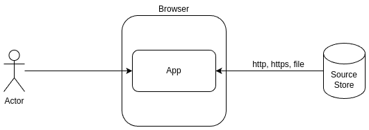
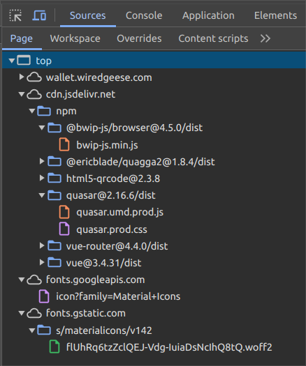
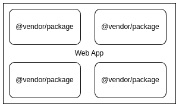
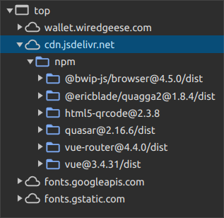
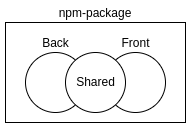

# A Personal Perspective on File Structuring in SPA Development

In this post, I will attempt to formalize and systematize my own understanding of what the structure of SPA applications should be like. This is a very subjective presentation, reflecting my own experience. It pertains to a specific class of web applications (SPA, PWA) and does not claim to be universal.

Web Applications Not Considered Here:

*   Headless applications (without a UI)
*   Microservices and microfrontends
*   High-load applications
*   Static pages using external libraries
*   SSR sites

In the context of this article, an SPA application is a classic client-server application where the client exists in the browser (usually within a single page) and interacts with the server via HTTP requests. The application is developed as a set of npm packages in a “_modular monolith_” style. The server-side is implemented on the Node.js engine.

## Unavoidable Constraints

An SPA is primarily a browser application. All browser applications “live” in the browser and communicate with the outside world through a set of protocols (`http(s)://`, `ftp://`, `ws(s)://`, `data://`, `file://`, …). To get the application into the browser, it must be loaded from an external source via one of three protocols (http, https, file) in the form of a basic HTML file, which contains either the entire application’s code or describes the resources the browser should additionally load.

Loading a web application in the browser

Therefore, no matter how we twist it, a browser application must have at least one HTML file, which is the entry point. Personally, I adhere to the tradition where this file is named `./index.html`.

## CDN

There are many CDNs that distribute various static resources:

*   cdnjs.cloudflare.com
*   cdn.jsdelivr.net
*   fonts.googleapis.com
*   …

If our application at the entry point loads the necessary resources through a CDN, we are forced to adhere to the rules dictated by the corresponding CDN. Historically, to improve performance, individual resources were combined into files (bundles, sprites), and the end developer (integrator) dealt with them.

Loading bundles through CDN

In other words, if the application uses third-party resources loaded through a CDN, the developer (integrator) cannot influence the placement of files or their naming. This is generally a normal situation for external resources. However, if the project’s files are distributed through a CDN, the developer is free to place them as they see fit.

## NPM Packages

Before the advent of Node.js, the issue of packages in JS development was not acute. Any bundle available on the internet could be loaded into the browser. Centralized registries for accounting existing JS libraries were virtually absent. NPM changed the rules of the game, and now it is considered good practice to publish open libraries as npm packages in the [registry](https://www.npmjs.com/). Thus, the highest level of code grouping in a web application is the npm package.

The application consists of npm packages

This grouping can be seen in the CDN jsDelivr:

Grouping by npm packages

The code of the web application itself is also an npm package (contains `./package.json` specifying the relevant dependency packages):

./project/

 ./index.html 

 ./LICENCE 

 ./package.json 

 ./README.md 

 ./RELEASE.md 
## Static Assets

All information related to the web application can be divided into three large groups:

*   Data
*   Code
*   Static resources (static assets)

In principle, most source code is also static resources, and even data sometimes (for example, the initial configuration of the application), but the term “_static assets_” has been assigned to style files, media files, fonts, templates, etc. Static resources in a project are placed in directories named `./public/`, `./static/`, `./assets/`. In my projects, I place static resources in the `./web/` directory:

./project/

 ./src/ 

 ./web/ 

 ./index.html 

 ./LICENCE 

 ./package.json 

 ./README.md 

 ./RELEASE.md 
## Build

Building the distribution (or distributions — esm, umd, min, prod, dev) is a common practice when developing public libraries or using TypeScript. For the build, directory names such as `./build/` or `./dist/` are usually used. Considering the configuration files for the builders, our structure looks like this:

./project/

 ./dist/ 

 ./src/ 

 ./web/ 

 ./LICENCE 

 ./package.json 

 ./README.md 

 ./RELEASE.md 

 ./rollup.config.js 

 ./tsconfig.json 
## Additional Environment

When developing in the “_modular monolith_” style, there is usually a main npm package — the web application itself, and a set of npm packages that are plugins to it (and often to other applications as well). There is a difference between an npm package containing application code and an npm package that is a plugin. An application package implies running the application as a web server (to load code into the browser and handle backend requests) or as a console command (for example, to perform service functions). A plugin package is not used independently and is included in other applications as a dependency.

Therefore, there are directories such as `./doc/` and `./test/`, which can relate to both applications and plugins, and there are those that are more likely to relate only to applications — `./bin/`, `./cfg/`, `./var/`.

At this stage, the directory structure can be represented as follows:

./project/

 ./bin/ 

 ./cfg/ 

 ./dist/ 

 ./doc/ 

 ./etc/ 

 ./log/ 

 ./src/ 

 ./test/ 

 ./var/ 

 ./web/ 

 ...
## Front & Back

Since JavaScript can be used to create code that works both in the browser (front) and on the server (back), and since npm packages are chosen as the “_module_” in the “_monolith_”, it makes sense to separate the source JS code for the browser and for Node.js at the directory level. At the very least, because it operates in different environments that provide the code with different functionalities ([Web API](https://developer.mozilla.org/en-US/docs/Web/API) in the browser and [Node modules](https://nodejs.org/docs/latest-v12.x/api/) on the server). As JS code that can work both in the browser and on the server is possible, three corresponding areas appear in the `./src/` directory:

./src/

 ./Back/

 ./Front/

 ./Shared/
The separation of the “_monolith_” into “_modules_” should occur in such a way that the code in a separate npm package (plugin, module) is highly cohesive, and the packages themselves are loosely coupled.

The distributed nature of the web application, where many clients (browsers) use a single data source (DB on the server), determines the “_strong connection_” between a field in the form in the browser and a column in the DB for storing this field’s data. Therefore, it is rational to combine the form’s code and the code for saving this form’s data in one npm package, despite the first code working in one environment (Web API) and the second in another (Node.js). After all, both are just JS.

Of course, these considerations are not applicable if the front is written in JS, and the back in another good programming language (Java, PHP, C#, Go, Python, …). But if the entire application is written in JS, the source code from the `./src/` directory can be divided into three groups based on its usage:

Areas of JS code usage

## Directory ./web/

The directory for placing static files can be in each plugin (npm package). Since the application itself is an npm package, all dependencies end up in the `./node_modules/` directory during the build, and the static resources of each plugin become available relative to the application root at `./node_modules/@vendor/plugin/web/`. Then it is a matter of technique to create a handler for the web server (express, fastify, koa, …) that can serve the static files of the corresponding plugin from its web subdirectory.

If the npm package is published in the [npmjs registry](https://www.npmjs.com/), it can be done without a handler — all package files, including the web directory contents, become available via CDN (e.g., jsDelivr — https://cdn.jsdelivr.net/npm/@vendor/plugin@latest/web/...).

The grouping of resources in the `./web/` directory is usually by type of resource:

./web/

 ./css/

 ./font/

 ./img/

 ./js/

 ./media/

 ./favicon.ico

 ./index.html

 ./manifest.json

 ./styles.css

 ./sw.json
Naturally, static resources are mainly used on the front, but serving static files, due to the nature of web applications (see “_Unavoidable Constraints_”), is done from the server (or CDN).

## Directory ./test/

There are many different types of tests (unit tests, functional, integration, etc.), and once an application reaches a certain size (or rather, once the development team reaches a certain size), all of them become necessary. Typically, I develop my applications with 1–2 people, so my main type of “_tests_” is a developer environment for developing a specific class. Since I use IoC (Constructor Dependency Injection) in my applications, instead of deploying the entire application to check the next batch of changes, I create a test script that constructs an instance of the desired class and calls its methods in a test environment (some dependencies may be mocked or real, such as a connection to a developer version of the database).

In general, I see the point in having three test subdirectories:

./test/

 ./dev/ 

 ./e2e/ 

 ./unit/ 
## Directory ./src/Shared/

This directory contains JS sources that can be used both in the browser and in nodejs. At this level, file subdivision into subdirectories is based on the type of code contained in the file. In my projects, I use approximately these subdirectories (types of JS code):

./src/Shared/

 ./Api/ 

 ./Di/ 

 ./Dto/ 

 ./Enum/ 

 ./Util/ 

 ./Web/ 

 ./Api/ 

 ./Event/ 

 ./Rtc/ 

 ./Socket/ 
## Directory ./src/Front/

This directory contains files used only on the front end and tied to the Web API provided by the browser. In some ways, it mirrors the structure of the `./Shared/` directory, but it also adds its own types specific to the front:

./src/Front/

 ./Api/ 

 ./Convert/ 

 ./Di/ 

 ./Dto/ 

 ./Enum/ 

 ./Ext/ 

 ./Mod/ 

 ./Store/ 

 ./IDb/ 

 ./Local/ 

 ./Mem/ 

 ./Session/ 

 ./Ui/ 

 ./Layout/ 

 ./Lib/ 

 ./Route/ 

 ./Widget/ 

 ./Util/ 

 ./Web/ 

 ./Event/ 

 ./Rtc/ 

 ./Socket/ 
## Directory ./src/Back/

This directory contains JS code that runs on the server in the nodejs environment and supports the operation of various front-end instances of the application in users’ browsers. The directory structure echoes the structures in the `./Front/`&`./Shared/` directories but also has its own features:

./src/Back/

 ./Act/ 

 ./Api/ 

 ./Cli/ 

 ./Convert/ 

 ./Di/ 

 ./Dto/ 

 ./Enum/ 

 ./Mod/ 

 ./Plugin/ 

 ./Store/ 

 ./Mem/ 

 ./RDb/ 

 ./Util/ 

 ./Web/ 

 ./Api/ 

 ./Event/ 

 ./Handler/ 

 ./Socket/ 
## Conclusion

*   A codebase written in a single programming language has certain advantages over one written in two or more languages. At the very least, it reduces the number and qualifications of developers required.
*   A monolithic architecture has certain advantages over separate development. For example, it makes it easier to find usage of code elements during refactoring (‘_Find Usages’ in IDE_).
*   A modular approach has advantages over a fully monolithic architecture. It, at the very least, provides the ability to reuse modules in different applications.
*   A modular approach at the npm package level allows the application code to be divided by its functional purpose (e.g., authentication, user contacts, order processing, inventory management, etc.), describing their integration with each other in the main npm package of the web application. With a successful division, package reusability can be increased in different applications.
*   The directory structure in an npm package should organize not only the source code but also related artifacts (documentation, tests, build instructions, integration, deployment, etc.).
*   Rules for structuring static resources in packages can be based on the traditions of developing static websites (img, css, font, etc.). Especially considering that in SPAs, HTML fragments of the user interface are often integrated into the JS code of components.
*   Source JS code is initially divided into three parts based on its area of application (`Front`, `Back`, `Shared`).
*   Further division of source JS code is done relative to the type of code element (considering the area of application and not considering the business function being implemented: DTO, utility, action).
*   Division of code by implemented business functions occurs already within each type (`./Dto/User.js`, `./Dto/Sale.js`, `./Dto/Address.js`).

Thus, code decomposition and structuring proceed in a spiral:

*   by business functions at the package level
*   by code types within an individual package
*   again by business functions within an individual code type
*   again by code types within the implementation of an individual business function ([AZ-order](https://flancer32.com/az-structuring-for-source-code-files-8ae5844696ea)).

I have outlined my approach to structuring program code when developing SPA/PWA to formalize and organize my current practices. I would be interested to hear your evaluations of this approach.

If you enjoyed this article, please give it a clap and follow me for more content!

Stay connected:

*   [GitHub](https://github.com/flancer64)
*   [LinkedIn](https://www.linkedin.com/in/aleksandrs-gusevs-011ba928/)
*   [Upwork](https://www.upwork.com/freelancers/~0181de0a64c6981497)

Thank you for your support!
