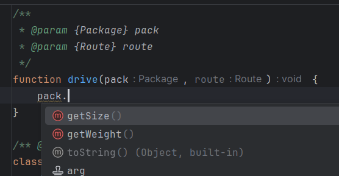

# Simulating Interfaces in JavaScript with JSDoc Annotations

JavaScript, unlike some statically typed languages like TypeScript, does not have built-in support for interfaces. However, as JavaScript applications grow in complexity, the need for enforcing a consistent structure and behavior across different parts of the codebase becomes increasingly important. Interfaces provide a way to define a contract that classes or objects must adhere to, ensuring that certain methods are implemented and promoting code reliability and maintainability. In this article, we will explore how to simulate interfaces in JavaScript using JSDoc annotations [@interface](https://jsdoc.app/tags-interface) and [@implements](https://jsdoc.app/tags-implements), a practical approach to bring interface-like functionality to your JavaScript projects.

Frank Martin announced the terms of the contract.

As a starting point, I will take the 2002 movie “[The Transporter](https://www.imdb.com/title/tt0293662/)”. Frank Martin’s rules perfectly illustrate how interfaces work and why they are needed. Frank formulated three simple rules:

1.   Never change the deal.
2.   No names.
3.   Never open the package.

Now anyone who meets Frank’s requirements and has enough money can use his services.

Let’s transfer now to the JavaScript environment. Imagine that we have three npm packages:

*   **plugin**: performs a certain business function (for example, delivers parcels)
*   **app1**: uses this plugin to process one type of data (delivering a Chinese girl from Marseille to Nice)
*   **app2**: also uses this plugin, but for different data (transporting a briefcase with explosives from Nice to Grenoble)

Let’s say a useful function is defined in the `plugin`:

function drive(pack, route) {}
Apps `app1` and `app2` both call this function, but each passes different data into the function.

When using interfaces, it is important to understand that in the “_Frank Martin_ — _Customer_” pair, Frank plays the leading role. He sets the rules. If the Customer does not agree with the rules, he won’t be able to hire Frank.

In the code, such rules are played by interfaces. I will reflect the expectations from a parcel in two JS classes:

class Package {

 

 getSize() {

 throw 'Please, implement this method.';

 }
getWeight() {

 throw 'Please, implement this method.';

 }

}

class Route {

 

 getPlaceFrom() {

 throw 'Please, implement this method.';

 }
getPlaceTo() {

 throw 'Please, implement this method.';

 }

}

It is possible to describe the interface using only JSDoc annotations, but my experience shows that modern IDEs do not handle them very well. That is why I propose using regular JS code and then applying the `@interface` annotation to it.

Now, Frank’s contract with the Customer looks like this:

function drive(pack, route) {}
For Frank, to be able to deliver the parcel, he has to know the dimensions and weight of the parcel as well as where to deliver the parcel from and where to deliver it to.

Then in the first application (delivering a Chinese girl from Marseille to Nice) the code might look like this:

function app1() {

 

 const pack = {

 getSize: () => {return {length: 150, width: 50, height: 50};}, 

 getWeight: () => 50, 

 };

 

 const route = {

 getPlaceFrom: () => 'Marseille',

 getPlaceTo: () => 'Nice',

 };

 drive(pack, route);

}
And in the second (delivering a briefcase with explosives from Nice to Grenoble) the code might look like this:

function app2() {

 

 const pack = {

 getSize: () => {return {length: 45, width: 30, height: 10};},

 getWeight: () => 1,

 };

 

 const route = {

 getPlaceFrom: () => 'Nice',

 getPlaceTo: () => 'Grenoble',

 };

 drive(pack, route);

}
Modern IDEs can already parse such code and use it in autocompletes and for navigation with Ctrl+Click.

Autocomplete in IDEA

Summarizing everything said above:

*   The calling side defines interfaces in the code (sets contract conditions).
*   The caller must comply with the contract.
*   Modern IDEs recognize connections between the interface and its implementations, if JSDoc annotations are used in the code.

Interfaces have proven their usefulness in many other programming languages. The foundation of creating complex systems is decomposition into simpler components. Interfaces define the fracture lines (decomposition) of a complex component into parts. In JS, everything is already there to use interfaces when developing complex applications. All you need to implement interfaces in practice is to remember Frank Martin’s way of doing business: _the rule maker is the one who performs the task_.

Demo web applications that show the use of interfaces in JS code can be found here:

*   [app1](https://flancer64.github.io/demo-di-if-app1/)
*   [app2](https://flancer64.github.io/demo-di-if-app2/)

In these applications, the [@teqfw/di](https://www.npmjs.com/package/@teqfw/di) library (constructor-based dependency injection) was used to associate interfaces with their implementations.
