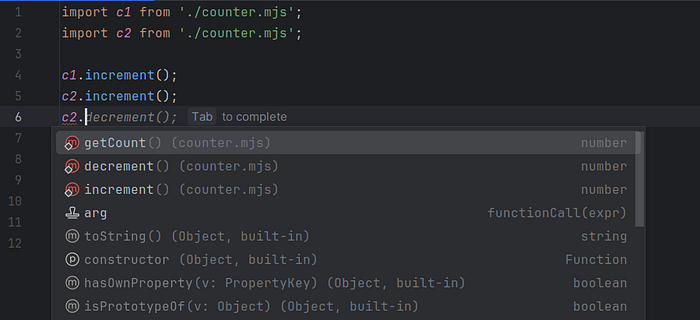

# The Right Way to Get a Singleton in ES6+

I often come across suggestions to use the Singleton pattern in `Singleton.getIntsance()` form. In my opinion, this is a thoughtless adoption of OOP practices from languages like Java, stimulated by the wide spread of TpeyScript. When we use TypeScript, we begin to think and code in [OOP style](https://refactoring.guru/design-patterns/singleton/typescript/example):

class Counter {

 private static instance: Counter;

 private count: number = 0;
private constructor() {}

public static getInstance(): Counter {

 if (!Counter.instance) {

 Counter.instance = new Counter();

 }

 return Counter.instance;

 }

public getCount(): number {

 return this.count;

 }

public increment(): number {

 return ++this.count;

 }

public decrement(): number {

 return --this.count;

 }

}

Example of usage:

const s1 = Counter.instance;

const s2 = Counter.instance;
But at the same time, we forget about the essence of JavaScript — that each ES module that we import has its own scope. And this scope is a singleton by design. ES modules allow us to create a singleton in a truly [JS style](https://javascriptpatterns.vercel.app/patterns/design-patterns/singleton-pattern):

let counter = 0;
export default Object.freeze({

 getCount: () => counter,

 increment: () => ++counter,

 decrement: () => --counter,

});

Here is an example of a singleton usage, made in the JavaScript style:

import c1 from './counter.mjs';

import c2 from './counter.mjs';
c1.increment();

c2.increment();

const x = c1.getCount(); 

const y = c2.getCount(); 

const same = (c1 === c2);

Modern IDEs understand code quite well and help developers with programming. This is how autocomplete looks in IDEA for example:

Autocomplete in IDEA

JavaScript, thanks to its unique module system, offers a more natural way of implementing singletons without resorting to classes and static methods. Using ES modules allows you to achieve the same goal, while maintaining the style and spirit of the language. Developers should take into account the characteristics of the JavaScript ecosystem and apply solutions that are consistent with its philosophy, avoiding blindly copying practices from other languages.
