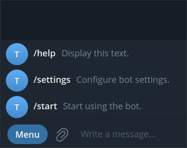
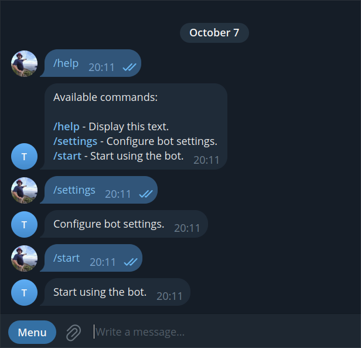

# Telegram Bots: The First Steps

Telegram bots have become [a popular tool](https://flancer32.com/what-is-a-telegram-bot-a-simple-introduction-for-new-users-9d9a675b27b9) for automating tasks, integrating services, and even creating new experiences for users. In this post, I’ll walk you through how to set up your first Telegram bot using the [_grammY_](https://grammy.dev/) library, a powerful and easy-to-use Node.js framework for building Telegram bots. This guide is for developers who want to get started with Telegram bot development using modern tools and frameworks.

## Why grammY?

_grammY_ is a lightweight, modern framework that allows developers to create bots quickly and efficiently. It supports modern JavaScript (ES6+), has excellent documentation, and provides flexibility for both simple and complex bots. Whether you’re creating a small bot for personal use or a scalable bot for thousands of users, _grammY_ has you covered.

Since _grammY_ primarily handles communication with the Telegram API, additional packages are needed to create a fully functional bot application. These packages could include tools for parsing command-line arguments, running the bot as a web server, loading configuration parameters, logging, and more. To address these needs, I use my own toolkit based on dependency injection (`@teqfw/di`). The entry point for this toolkit when building Telegram bots is the package `@flancer32/teq-telegram-bot`.

## Setting Up Your Development Environment

Before building your Telegram bot, ensure that you have the following:

*   **Node.js** and **npm** installed.
*   **Git** for version control.
*   A code editor of your choice (e.g., **VS Code** or **PhpStorm**).

You will also need to [register your bot](https://core.telegram.org/bots/tutorial#obtain-your-bot-token) with Telegram and obtain an access token for the Telegram API. The token will look something like this:

4839574812:AAFD39kkdpWt3ywyRZergyOLMaJhac60qc
## Initializing Your Bot Project

Now that your development environment is ready, it’s time to set up the project for your Telegram bot. In this section, we will create a new directory for your bot, initialize a Node.js project, configure some basic settings, and install the necessary dependencies. Follow the commands below to get started:

$ mkdir ./my-bot

$ cd ./my-bot

$ git init

$ git config --global init.defaultBranch main

$ npm init -y

$ npm pkg set name="my-bot"

$ npm pkg set version="0.1.0"

$ npm pkg set type="module"

$ npm pkg set description="Telegram Bots: The First Steps"

$ npm pkg set author="Your Name <your@email.com>"

$ npm install @flancer32/teq-telegram-bot --save
This will set the foundation for building your Telegram bot using the _grammY_ framework and other tools we will introduce later.

### Creating the Entry Point

Create the entry point for your application by adding the following content to the `./bin/tequila.mjs file`:

#!/usr/bin/env node

'use strict';

import {dirname, join} from 'node:path';

import {fileURLToPath} from 'node:url';

import teq from '@teqfw/core';
const url = new URL(import.meta.url);

const script = fileURLToPath(url);

const bin = dirname(script);

const path = join(bin, '..');

teq({path}).catch((e) => console.error(e));

Then, make the script executable:

$ chmod a+x ./bin/tequila.mjs
To verify that the application is working, run the script:

$ ./bin/tequila.mjs
Expected output:

10/07 10:30:09.627 (info TeqFw_Core_Back_App): Starting teq-app 

...

Usage: [options] [command]
Options:

 -h, --help display help for command

Commands:

 core-version get version of the application

 web-server-start [options] start the web server

 web-server-stop stop web server

 tg-bot-start start the bot in the long polling mode

 tg-bot-stop stop the bot has been started in the long polling mode

 help [command] display help for command

10/07 10:30:09.710 (info TeqFw_Core_Back_App): Stopping the teq-plugins for 

10/07 10:30:09.710 (info TeqFw_Core_Back_App): The teq-app

You can see the list of default commands, including starting and stopping the bot in [long polling](https://grammy.dev/guide/deployment-types) mode and managing the web server ([webhook](https://core.telegram.org/bots/webhooks) mode).

### Configuring the Bot

In my applications, I prefer loading configuration parameters through JSON files. JSON files (along with YAML and XML) have an internal structure, which is convenient for storing configuration data in modular architectures and when dealing with a large number of parameters.

For a basic bot, we only need to pass the Telegram API access token to the `@flancer32/teq-telegram-bot` package. Create the file `./cfg/local.json` with the following content:

{

 "@flancer32/teq-telegram-bot": {

 "apiKeyTelegram": "4839574812:AAFD39kkdpWt3ywyRZergyOLMaJhac60qc"

 }

}
### Configuring Git

It’s important to ensure that configuration files and npm packages are not included in version control. Let’s create a `./.gitignore` file with the following content:

/**/node_modules/

/**/package-lock.json

/**/tmp/

/.idea/

/.vscode/

/cfg/local.*
Now we can add our code to the project’s Git repository:

$ git add .

$ git status

On branch main
No commits yet

Changes to be committed:

 (use "git rm --cached <file>..." to unstage)

 new file: .gitignore

 new file: bin/tequila.mjs

 new file: package.json

$ git commit -m "Initial commit: setup project structure and configuration"

### Verifying the Initialization

If everything has been set up correctly, attempting to start the bot in long polling mode should display a message indicating that the corresponding methods need to be implemented:

$ ./bin/tequila.mjs tg-bot-start

...

10/07 13:15:21.223 (error Telegram_Bot_Back_Cli_Start): Please implement this method.

Error: Please implement this method.

 at Telegram_Bot_Back_Api_Setup.commands (file:///...)

 ...
## Customizing Your Bot

The `@flancer32/teq-telegram-bot` package provides the foundation for running your bot in both `long polling` and `webhook` modes, as well as basic bot configuration. However, adding commands to the bot and handling those commands is the responsibility of the developer. For this purpose, the package includes the `Telegram_Bot_Back_Api_Setup` interface (a standard JavaScript class where all methods throw an exception with the message “_Please implement this method._”).

Since I use IoC (Inversion of Control) for development, which involves creating and injecting dependencies into a container of objects, the task of customization involves implementing this interface and configuring the dependency container to use the implementation instead of the interface. This sounds more complicated than it actually is.

To add custom logic to your bot, you need to create an ES6 module that exports a class implementing the `Telegram_Bot_Back_Api_Setup` interface. Let’s create a directory `./src/Back/Bot` and a file `./Setup.js` within it:

$ mkdir -p ./src/Back/Bot

$ touch ./src/Back/Bot/Setup.js
Now, add the following content to the `./src/Back/Bot/Setup.js` file:

export default class MyBot_Back_Bot_Setup {

 constructor() {
this.commands = async function (bot) {

 return bot;

 };

this.handlers = function (bot) {

 return bot;

 };

 }

}

Next, you need to configure the IoC so that the dependency container can find and use the implementation of the interface. This configuration is part of the project code and is set up in the `./teqfw.json` file instead of the `./cfg/local.json` file. Both files (`./src/Back/Bot/Setup.js` and `./teqfw.json`) are part of the project’s codebase and should be included in version control.

Here is the content of the `./teqfw.json` file:

{

 "@teqfw/di": {

 "autoload": {

 "ns": "MyBot",

 "path": "./src"

 },

 "replaces": {

 "Telegram_Bot_Back_Api_Setup": {

 "back": "MyBot_Back_Bot_Setup"

 }

 }

 }

}
The `@teqfw/di` dependency container locates the source code in a manner similar to PHP’s [PSR-4 standard](https://www.php-fig.org/psr/psr-4/). In our case, the `MyBot` namespace maps to the `./src` directory. Additionally, there is an instruction for the container to replace the `Telegram_Bot_Back_Api_Setup` interface with its implementation `MyBot_Back_Bot_Setup`.

Now, when you start the bot, you will no longer receive error messages:

$ ./bin/tequila.mjs tg-bot-start

...

10/07 13:19:01.381 (info Telegram_Bot_Back_Mod_Bot): All command handlers are set for the bot.

10/07 13:19:01.381 (info Telegram_Bot_Back_Mod_Bot): The Telegram bot is initialized.

10/07 13:19:01.420 (info Telegram_Bot_Back_Cli_Start): The bot is started in the long polling mode.
### Creating Basic Bot Commands

There are three basic commands that should be present in every Telegram bot:

*   **/start**: Initiates the user’s interaction with the bot (connecting to the bot).
*   **/help**: Allows the user to request information on how to use the bot.
*   **/settings**: Lets the user configure the bot’s settings.

Let’s add these commands to our `MyBot_Back_Bot_Setup` class:

export default class MyBot_Back_Bot_Setup {

 constructor() {

 this.commands = async function (bot) {

 await bot.api.setMyCommands([

 {command: 'help', description: 'Display this text.'},

 {command: 'settings', description: 'Configure bot settings.'},

 {command: 'start', description: 'Start using the bot.'},

 ]);

 return bot;

 };

 }

}
In this code, the `bot` parameter in the `commands` method is a [_grammY_ object](https://github.com/grammyjs/grammY/blob/v1.29.0/src/bot.ts#L151) with the [appropriate API](https://grammy.dev/guide/api). This method is called when the bot starts (both in long polling mode and webhook mode) and creates the list of commands for the user.

The commands in desktop Telegram

The commands in Telegram will appear as a quick-access menu, making it easier for users to interact with your bot.

### Creating Command Handlers for Your Bot

In this example, we’ll consider the simplest case where the command handler simply sends a message to the user. Let’s add handlers for all three commands to our `MyBot_Back_Bot_Setup` class:

export default class MyBot_Back_Bot_Setup {

 constructor() {

 this.handlers = function (bot) {

 bot.command('help', (ctx) => {

 const msg = `

Available commands:
<b>/help</b> - Display this text.

<b>/settings</b> - Configure bot settings.

<b>/start</b> - Start using the bot.

`

;

 ctx.reply(msg, {

 parse_mode: 'HTML',

 });

 });

 bot.command('settings', (ctx) => {

 ctx.reply('Configure bot settings.');

 });

 bot.command('start', (ctx) => {

 ctx.reply('Start using the bot.');

 });

 return bot;

 };

 }

}
Here you can see all three commands in action:

All commands in action

## Conclusion

Congratulations! You’ve successfully set up a basic Telegram bot using the _grammY_ framework. With this solid foundation, you can continue to expand your bot’s capabilities, adding new features and commands to enhance user interaction.

You can find the code for this project in the `@flancer64/tg-demo-base` repository.

Happy coding!

If you enjoyed this article, please give it a clap and follow me for more content!

Stay connected:

*   [GitHub](https://github.com/flancer64)
*   [LinkedIn](https://www.linkedin.com/in/aleksandrs-gusevs-011ba928/)
*   [Upwork](https://www.upwork.com/freelancers/~0181de0a64c6981497)

Thank you for your support!
