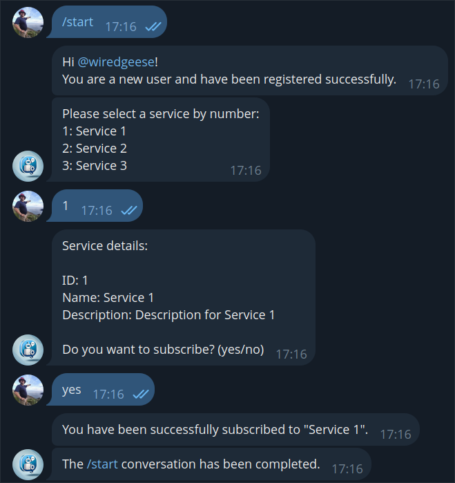

# Telegram Bot with Node.js: Conversations

In this article, I continue to share the results of studying the creation of Telegram bots in Node.js, as I began in previous publications ([one](https://flancer32.com/telegram-bots-the-first-steps-c1688e572abe), [two](https://flancer32.com/telegram-bot-with-node-js-implementing-crud-l-operations-using-command-arguments-fcfb38991efa)). This time, I will show you how to organize interactive conversations with users using the [conversations](https://grammy.dev/plugins/conversations) plugin from the [grammY](https://grammy.dev/) library. We’ll explore how to set up the library to work with conversations, manage their completion, and implement branching and looping. This approach will serve as a foundation for more complex projects where user interaction is crucial.

## Introduction

In the developed conversation, the bot, upon receiving the `/start` command, first checks whether the user is registered in the database. If the user is not registered, the bot prompts them to register. Then, a list of available subscription services is displayed, and the bot requests the service number, repeating the request until a valid number is received. After that, the bot shows the details of the selected service and asks to confirm the subscription. If the user agrees, a new subscription is created, and the conversation ends; if the user declines, the conversation simply ends.

The sample conversation

The source code for implementing the conversation is available in the repository [flancer64/tg-demo-all](https://github.com/flancer64/tg-demo-all) (branch _conversation_), and the bot itself can be found at [f64_demo_conversation_bot](https://t.me/f64_demo_conversation_bot).

## Conversations in grammY

The _grammY_ library provides a _conversations_ plugin for creating conversations between the bot and users. Unlike other frameworks that require bulky configuration objects, this plugin allows you to define conversations using regular JavaScript functions, making the code more understandable and flexible. Each state of the conversation is managed through simple functions that execute sequentially during interaction.

It is recommended to follow [three main rules](https://grammy.dev/plugins/conversations#three-golden-rules-of-conversations) when writing code inside conversation-building functions:

1.   All operations dependent on external systems should be wrapped in special calls to avoid errors and data loss.
2.   Avoid using random values directly; instead, use the provided functions to handle randomness.
3.   Use the helper functions provided by the library that simplify working with states and variables, ensuring more reliable conversations (form, wait…, sleep, now, etc.).

It’s also important to note that the _conversations_ plugin supports parallel conversations, allowing interaction with multiple users simultaneously. This is especially useful in group chats where the bot can conduct conversations with multiple participants. This approach makes developing interactive applications easier and more efficient.

## Conversation Initialization

The initialization of the _conversation_ plugin happens in the `Demo_Back_Bot_Setup` module and boils down to the following:

import {session} from 'grammy';

import {conversations} from '@grammyjs/conversations';
bot.use(session({initial: () => ({})}));

bot.use(conversations());

It’s important to consider the order in which middleware is connected — _conversations_ should be connected after _session_ since the middlewares are processed in the order they are connected, and conversations won’t work without sessions.

## Connecting and Starting the Conversation

The typical handler code receives two parameters:

const conv = async (conversation, ctx) => {

 

}
*   `conversation`: an object that manages the state of the current conversation.
*   `ctx`: the standard _grammY_ context corresponding to the current interaction between the user and the bot (the message).

Registering handlers is done in the same place as other middleware registration:

import {createConversation} from '@grammyjs/conversations';
bot.use(createConversation(conv, 'conversationStart'));

Calling the conversation handler from the command handler:

const cmd = async (ctx) => {

 await ctx.conversation.enter('conversationStart');

}
## Ending the Conversation

The conversation ends when the handler finishes its work (reaches `return`):

const conv = async (conversation, ctx) => {

 

 return;

};
If for some reason the conversation cannot end properly (for example, the user enters another command instead of following the conversation script), you can forcibly terminate the conversation through `ctx.conversation.exit()`. For example:

bot.use(async (ctx, next) => {

 if (ctx?.chat && (typeof ctx?.conversation?.active === 'function')) {

 const {start} = await ctx.conversation.active();

 if (start >= 1) {

 logger.info(`An active conversation exists.`);

 const commandEntity = ctx.message?.entities?.find(entity => entity.type === 'bot_command');

 if (commandEntity) {

 await ctx.conversation.exit('conversationStart');

 await ctx.reply(`The previous conversation has been closed.`);

 }

 }

 }

 await next();

});
## Repeating Messages at Each Step

As mentioned earlier, _grammY_ “glues” individual messages from the user into one continuous flow. So, if the conversation script involves processing, say, three consecutive messages, the conversation handler will be triggered three times — once for each message:

const conv = async (conversation, ctx) => {

 const username = ctx.from.username;

 const sess = conversation.session;

 sess.count = sess.count ?? 0;

 sess.count++;
logger.info(`username: ${username}, count: ${sess.count}`);

 

};

That is, if the bot has started executing the conversation script, the `conv` handler will be triggered for every new message. Moreover, with each new trigger, _grammY_ will pass all previous messages to the handler, transitioning the conversation handler to the appropriate state. This is why _conversation_ provides its own random number [generator](https://grammy.dev/ref/conversations/conversationhandle#random) (the random value is remembered and given every time for the current conversation).

Here is [the code](https://github.com/flancer64/tg-demo-all/blob/conversation/src/Bot/Conv/Start.js#L59) for checking the existence of the service selected by the user:

await ctx.reply(`Please select a service by number:\n${list}`);

let selected;

do {

 const response = await conversation.wait();

 const id = parseInt(response.message.text);

 selected = await modService.read({id});

 if (!selected) await ctx.reply(`Invalid selection. Please enter a valid service number.`);

} while (!selected);
The bot has only three services (id: 1, 2, 3), but the user incorrectly enters numbers 4, 5, and only then 3. At each iteration, the bot checks the existence of all previously entered IDs, and the services log the results:

10/21 17:34:49.537 (info Demo_Back_Mod_User): User wiredgeese read successfully (id:1383581234).

10/21 17:34:49.540 (info Demo_Back_Mod_Service): Service with ID 4 not found.

10/21 17:34:50.794 (info Demo_Back_Mod_User): User wiredgeese read successfully (id:1383581234).

10/21 17:34:50.797 (info Demo_Back_Mod_Service): Service with ID 4 not found.

10/21 17:34:50.798 (info Demo_Back_Mod_Service): Service with ID 5 not found.

10/21 17:34:53.290 (info Demo_Back_Mod_User): User wiredgeese read successfully (id:1383581234).

10/21 17:34:53.292 (info Demo_Back_Mod_Service): Service with ID 4 not found.

10/21 17:34:53.293 (info Demo_Back_Mod_Service): Service with ID 5 not found.

10/21 17:34:53.294 (info Demo_Back_Mod_Service): Service 'Service 3' read successfully (id:3).
## Side Effects

Let’s assume there is a call to an external service in our dialogue code that creates a record in the database.

user = await modUser.create({dto});
If the database record is created at the first step of a three-step dialogue, the first step will be repeated three times, with the same parameters each time. This means the service for creating the same record will be called three times.

To handle such “side effects,” the _conversation_ plugin provides the `external` method:

const user = await conversation.external(

 () => {

 const dto = modUser.composeEntity();

 ...

 dto.telegramId = telegramId;

 modUser.create({dto});

 }

);
In this case, the user creation will only be executed once, during the very first call to the `external` method. On subsequent steps of the dialogue, the result of the first execution will be returned, and the external service won't be called again.

If the execution of an external service depends on user input (e.g., searching for a service by ID), the `external` method can be used like this:

let service = await conversation.external({

 task: (id) => modService.read({id}),

 args: [id]

});
In this case, the “argument-result” pairs are saved and reused. The previous example with service lookup can be rewritten as follows:

let selected;

do {

 const response = await conversation.wait();

 const id = parseInt(response.message.text);

 selected = await conversation.external({

 task: (id) => modService.read({id}),

 args: [id]

 });

 if (!selected) await ctx.reply(`Invalid selection. Please enter a valid service number.`);

} while (!selected);
As you can see, the external service (_Demo\_Back\_Mod\_Service_) is no longer called repeatedly for incorrect values (4 and 5), while the _Demo\_Back\_Mod\_User_ service is invoked every time (since it is not wrapped in `external`):

10/21 17:46:58.668 (info Demo_Back_Mod_User): User wiredgeese read successfully (id:1383581234).

10/21 17:46:58.672 (info Demo_Back_Mod_Service): Service with ID 4 not found.

10/21 17:46:59.817 (info Demo_Back_Mod_User): User wiredgeese read successfully (id:1383581234).

10/21 17:46:59.822 (info Demo_Back_Mod_Service): Service with ID 5 not found.

10/21 17:47:01.758 (info Demo_Back_Mod_User): User wiredgeese read successfully (id:1383581234).

10/21 17:47:01.764 (info Demo_Back_Mod_Service): Service 'Service 3' read successfully (id:3).
## Branching

Branching is straightforward, and if the dialogue code doesn’t create any side effects, it’s even simpler:

const confirmation = await conversation.wait();

const confirmationText = confirmation.message.text.toLowerCase();

if (confirmationText === 'yes') {

 

} else if (confirmationText === 'no') {

 

} else {

 

}
Without side effects (including state persistence), the code can be executed as many times as necessary and will produce the same result for the same input (the benefits of functional programming!).

However, if there are side effects in the code, they need to be wrapped in `external`.

## Loops

In principle, this is practically the same as branching:

let confirmed = false;

while (!confirmed) {

 const confirmation = await conversation.wait();

 const confirmationText = confirmation.message.text.toLowerCase();

 if (confirmationText === 'yes') {

 

 confirmed = true;

 } else if (confirmationText === 'no') {

 

 confirmed = true;

 } else {

 await ctx.reply(`Please respond with "yes" or "no".`);

 }

}
However, consider the following: if the loop is at, say, the second step, and the user enters unexpected responses three times (for example: “ok”, “sure”, “of course”) before finally typing “yes”, then when moving to the next steps (third, fourth, etc.), when the entire dialogue is replayed from the first step to the current one, the loop on the second step will replay all those iterations — for “ok”, “sure”, “of course”, and “yes.”

Well, that’s how the _conversation_ in _grammY_ works. It’s a small price to pay for the convenience it offers.

## Conclusion

In this article, we explored how to organize interactive conversations with users in Telegram bots using Node.js and the _grammY_ library with its _conversations_ module. We covered the basic principles of working with conversations, including initialization, completion, branching, and loops, as well as handling side effects. Thanks to the simplicity and flexibility of this approach, you can create more complex and responsive applications that effectively interact with users. I hope the knowledge gained here will assist you in developing your own Telegram bots and expanding their functionality.

Happy coding!

If you enjoyed this article, please give it a clap and follow me for more content!

Stay connected:

*   [GitHub](https://github.com/flancer64)
*   [LinkedIn](https://www.linkedin.com/in/aleksandrs-gusevs-011ba928/)
*   [Upwork](https://www.upwork.com/freelancers/~0181de0a64c6981497)
*   [Fiverr](https://www.fiverr.com/wiredgeese)

Thank you for your support!
