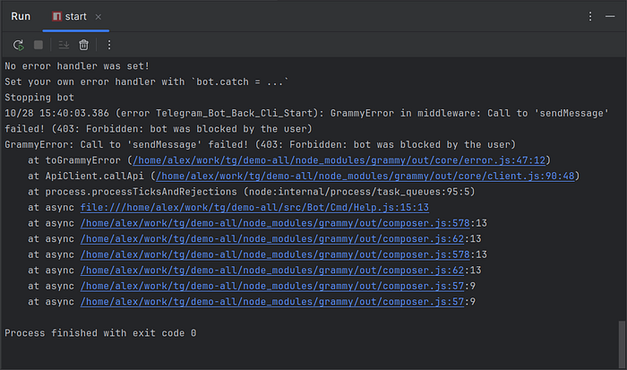

# Telegram Bot with Node.js: Using Error Handling to Boost Resilience

In this article, I’ll share my experience in developing Telegram bots on Node.js with the [grammY](https://grammy.dev/) library. Bot development often requires robust error handling to avoid breakdowns and improve application resilience. Using a [demo bot](https://github.com/flancer64/tg-demo-all) as an example, I’ll explain how such errors may arise and how to address them.

## Problem Description

In a [previous project](https://flancer32.com/telegram-bot-with-node-js-conversations-6d03ffb4059c), I encountered a frustrating issue that disrupted my bot’s stability. The database required a `name_last` field for users, but some Telegram profiles didn’t include a last name. Attempting to register such users caused a failure, and the bot would terminate with an error.

The situation worsened as Telegram continued to queue commands from users even when the bot was down. Eventually, frustrated users removed the bot and restricted its access to their accounts. Upon restarting, the fixed bot correctly handled the missing `name_last` field error. However, the issue arose because Telegram sent commands from users who had already blocked the bot but refused to accept replies to those commands. As a result, the bot crashed again due to the inability to deliver a response.

The exception

This article explores solutions to such issues, aiming to enhance the bot’s reliability and resilience.

## Template for Bot Command Handlers

Let’s start by examining a basic structure for command handlers in grammY. Below is an interface description for command handlers using JSDoc annotations:

Based on this interface, we can create a simple command handler factory:

export default class Demo_Back_Bot_Cmd_Demo {

 

 constructor({TeqFw_Core_Shared_Api_Logger$$: logger}) {

 return async (ctx) => {

 await ctx.reply(`This is a demo command!`);

 };

 }

}
This code provides a minimal command handler without error handling. For instance, if a user has blocked the bot, the `ctx.reply` command will fail. In `long polling` mode, this error causes the bot to terminate. Here’s an example of the error message you might see:

Error in middleware while handling update 245088998 GrammyError: Call to 'sendMessage' failed! (403: Forbidden: bot was blocked by the user)
In `webhook` mode, a web server may handle these exceptions, preventing the bot from crashing entirely. However, in `long polling` mode, the bot will simply stop.

## Centralized Error Handling for the Bot

To prevent the bot from crashing due to such errors, you can set a global error handler using the [bot.catch](https://grammy.dev/guide/errors#catching-errors) method. This method allows you to catch exceptions, log them, and even take action depending on the type of error:

bot.catch((err) => {

 const ctx = err.ctx;

 const e = err.error;
logger.error(`Error while handling update ${ctx.update?.update_id}:`);

if (e instanceof GrammyError && e.error_code === 403) {

 logger.error(`User blocked the bot while sending a message to chat_id ${e.parameters?.chat_id}.`);

 

 return; 

 }

if (e instanceof GrammyError) {

 logger.error(`Error in request: ${e.description}`);

 } else if (e instanceof HttpError) {

 logger.error('Could not contact Telegram:');

 } else {

 logger.error('Unknown error:');

 }

logger.exception(e);

});

Here, the handler logs exceptions to prevent the bot from stopping and records error details in the log. Using a centralized error handler like `bot.catch` ensures that the bot remains resilient and continues running even in the face of unexpected errors.

## Extending Functionality with Middleware

To improve error management, I implemented two classes in my `flancer32/teq-telegram-bot` plugin:

*   `Telegram_Bot_Back_Mod_Bot_Catch` – a bot-wide exception handler that automatically connects when the bot starts, regardless of mode (`long polling` or `webhook`).
*   `Telegram_Bot_Back_Mod_Mdlwr_Log` – middleware for logging and catching exceptions, which can be added manually in each application as needed by implementing the `Telegram_Bot_Back_Api_Setup` interface.

These classes can be replaced with custom implementations through the `./teqfw.json` file:

{

 "@teqfw/di": {

 "replaces": {

 "back": {

 "Telegram_Bot_Back_Api_Setup": "Demo_Back_Bot_Setup",

 "Telegram_Bot_Back_Mod_Bot_Catch": "Demo_Back_Di_Catch",

 "Telegram_Bot_Back_Mod_Mdlwr_Log": "Demo_Back_Di_MdlwrLog"

 }

 }

 }

}
This configuration enables flexible substitution of the original classes from the `flancer32/teq-telegram-bot` plugin with custom ones adapted to the specific bot's needs.

## Conclusion

Effective error handling is essential for building reliable Telegram bots. Implementing well-configured global and local handlers not only prevents unexpected bot crashes but also enhances overall resilience. Additionally, comprehensive logging allows for timely monitoring and response to issues, ensuring a more robust and user-friendly bot experience.

If you enjoyed this article, please give it a clap and follow me for more content!

Stay connected:

*   [GitHub](https://github.com/flancer64)
*   [LinkedIn](https://www.linkedin.com/in/aleksandrs-gusevs-011ba928/)
*   [Upwork](https://www.upwork.com/freelancers/~0181de0a64c6981497)
*   [Fiverr](https://www.fiverr.com/wiredgeese)

Thank you for your support!
